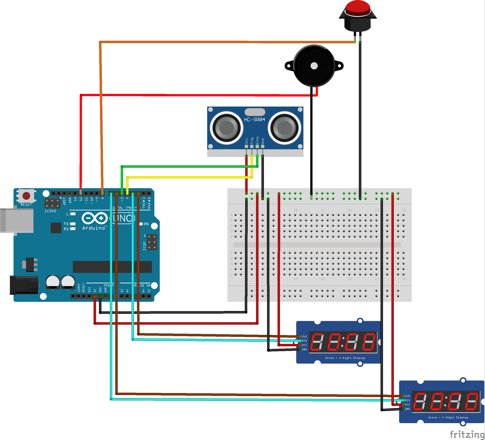
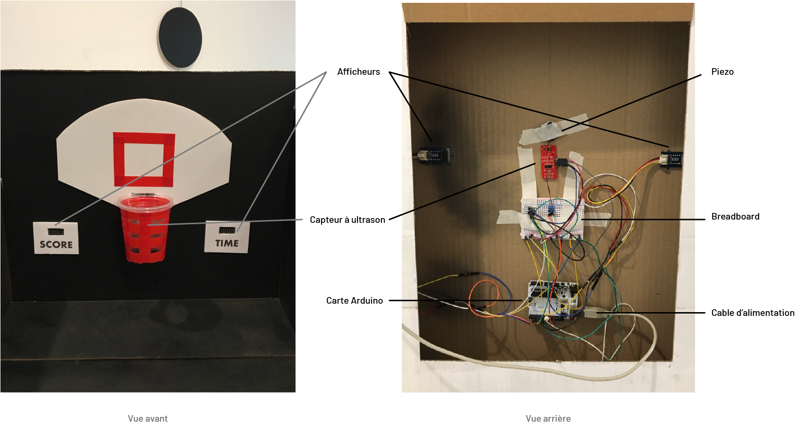
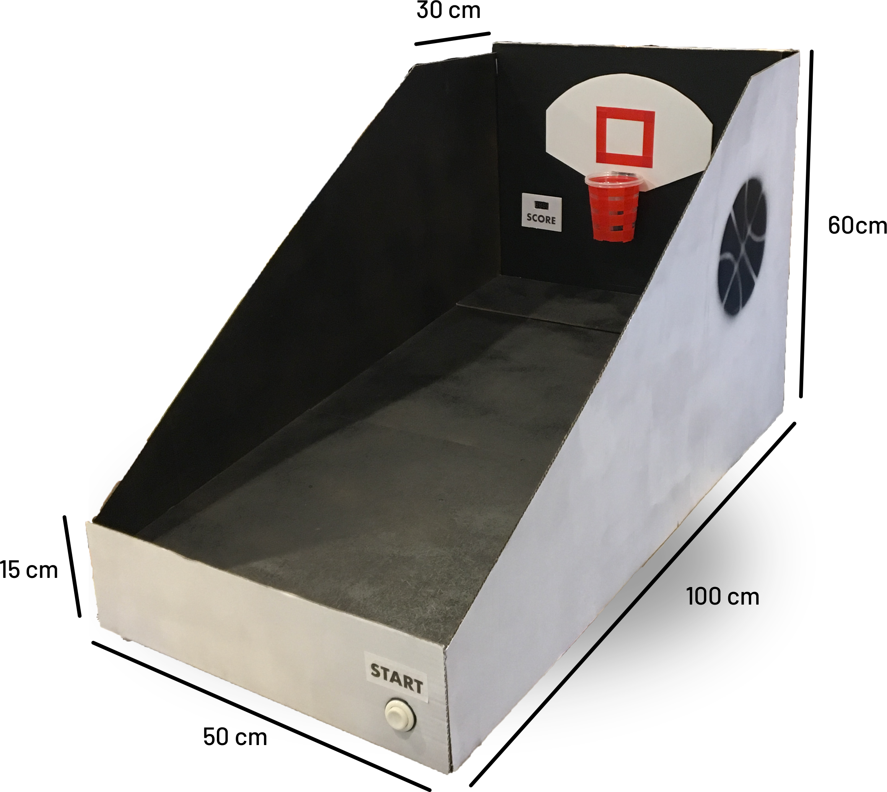

[**home**](../README.md)

# ARKAD'BASKET

#### Réalisé par Bastien Adam et Théo Monnin
---
## Le principe
Arkad'Basket est un jeu inspiré des bornes de basket-ball aussi appelées hoops que l'on peut trouver dans les salles d'arcade et qui sont notamment très populaire aux USA. Nous avons choisi un gameplay impliquant une action physique et non virtuelle de la part du joueur afin d'offrir un gameplay compréhensible et de pouvoir se concentrer sur l'expérience de jeu en elle-même.

 

 

(Voir également la vidéo **Arkad'Basket.mov** fournie dans le dossier).

--

 

## LES COMPOSANTS :

#### - LE BOUTON -

Le bouton "start" sert à lancer ou relancer une partie. Il déclenche un décompte "3, 2, 1, GO !" avant le début d'une partie de 30 secondes.

--

#### - LE CAPTEUR À ULTRASON -

Le capteur permet de compter les points marqués par le joueur. Il est situé à l'intérieur du panier de basket. Lorsque que ce dernier capte une présence d'une distance inférieure à 5cm (donc lors du passage du ballon) il compte +1.

--

#### - LES AFFICHEURS -

Il y a deux afficheurs. Celui de droite affiche un premier décompte "3, 2, 1, GO !" au début de la partie puis il affiche après ceci un second décompte de 30 secondes, ici la durée de la partie.
L'afficheur de gauche compte les points marqués en partie et se remet à 0 lorsque le bouton "start" est pressé.

--

#### - LE PIEZO -

Le piezo a pour rôle d'apporter une dimension auditive au jeu. En effet lors du premier décompte "3, 2, 1, GO !" il joue 3 fois la note do puis une quatrième fois avec un do un ton plus bas. Puis pour finir à la fin des 30 secondes de partie le piezo joue une note grave et plus longue pour reproduire l'effet d'un buzzer que l'on retrouve dans les matchs de basket.

--

 

## ARKAD'BASKET

### LE MATÉRIEL
###### L'électronique
* 1 carte Arduino
* 1 cable USB
* 1 breadbord et des câbles
* 1 piezo
* 1 bouton poussoir
* 2 afficheurs TM 1637
* 1 capteur à ultrason (HC-SR04)

###### La maquette
* Des plaques de carton
* Colle chaude
* Skotch double face
* Verre en plastique
* Balles en mousse

### LE MONTAGE

--

### LA MAQUETTE

 

 

--

### LE CODE
Voir le code arduino commenté ci-joint dans le dossier "**arkad_basket.ino**"

[**home**](../README.md)