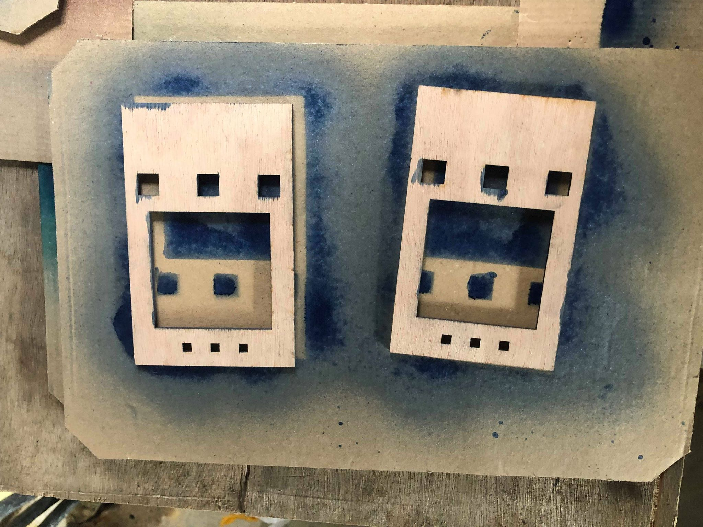

# ASTRO

#### Petit jeu électronique basé sur Arduino

Réalisé par **Maxime Thureau** et **Noé Martineau** à L'Ecole de Design Nantes Atlantique


### Le matériel :

* 1 carte Arduino Uno
* 1 cable USB
* 1 breadbord et des câbles
* 3 boutons poussoir
* 4 résistances (3 x 1K et 1 x 10K)
* 1 Matrice de Leds 8 x 8 (64 Leds)
* 1 compteur digital (1 alimentation 5v)


## Le principe :

ASTRO est un jeu électronique principalement inspiré des jeux Flappy bird ou le gameplay repose sur l'agilité du joueur, qui doit faire avancer un oiseau dans un environnement à défilement horizontal en tapotant sur l'écran tactile, tout en évitant des tuyaux présents en haut et en bas de l'écran. Le but est donc d’éviter les tuyaux et d’aller le plus loin possible. L’autre inspiration qui nous a également servi est un jeu plus ancien qui se prénomme Space Invaders ou le principe du jeu est de détruire des vagues d'Aliens au moyen d'un canon laser en se déplaçant horizontalement sur l’écran qui descende petit à petit.  Il y a également le jeu Frogger qui a pour but de diriger des grenouilles jusqu'à leurs maisons. Pour cela, le joueur doit d'abord traverser une route en évitant des voitures qui roulent à différentes vitesses puis une rivière aux courants changeants en passant d'objets en objets. La grenouille meurt si elle touche une voiture ou si elle tombe dans la rivière.

<h2>L'histoire</h2>

Votre planète est sur le point d'exploser. Vous devez vous enfuir à bord de votre vaisseau spacial mais un gros obstacle vous fait face... En effet la ceinture d'astéroïdes ne vous laissera pas passer si facilement. Visiteur de l'espace je vous souhaite bonne chance. Over.

Ici le joueur doit déplacer son vaisseau horizontalement grâce à deux boutons (droite et gauche) et doit éviter des murs d’astéroïdes en passant par le ou les trous disponibles. Le but est donc de bien réfléchir à son déplacement qui sera de plus en plus dynamique pour passer dans l’entrée des murs. Il faudra faire preuve d’agilité et de bon raisonnement. Le vaisseau a 2 barrières de bouclier s'il est touché une troisième fois par un astéroïde, il explose, ce qui arrivera inéluctablement.

## Quelques codes de test :

Pour réaliser ce projet, on va employer 5 bibliothèques qui vont nous faciliter l'usage des boutons,  du buzer piezo, d’une matrice Leds de 8 x 8 et d’un ruban de 3 leds.

On installe tout d'abord les 3boutons, un pour aller à gauche, un à droite et le dernier que l'on positionne au milieu pour reset et recommencer le jeu.


### Les bibliothèques NeoPixel, NeoMatrix et GFX

Concernant le ruban de leds, nous allons utiliser un ruban NeoPixel proposé à la vente par Adafruit. Le produit et la bibliothèque sont abondamment documentés sur [learn.adafruit.com](https://learn.adafruit.com/adafruit-neopixel-uberguide/the-magic-of-neopixels) : on y trouve des indications de montage et des explications concernant l'usage de la bibliothèque. Celle-ci est également disponible dans le gestionnaire de bibliothèques.

Concernant la matrice Led 8 x 8, nous allons utiliser les bibliothèques **Adafruit_Neopixel**,  **Adafruit_GFX**, **Adafruit_NeoMatrix**. Elles sont disponibles dans le gestionnaire de bibliothèques de l'IDE d'Arduino et incorporent des exemples de base. 

Il s'agit de bibliothèques permettant de contrôler facilement et efficacement une grande variété de Matrice Led.


Pour nous familiariser avec, nous allons écrire notre propre code de test :

##### Le code :

Comme toutes bibliothèques dans Arduino, on commence par l'inclure au début du programme, donc avant le `setup()` :

include `<Adafruit_NeoPixel.h>`
Puis toujours avant le `setup()`, on déclare l’ objet Adafruit_NeoPixel nommé pixel en précisant le nombre de leds et la pin à laquelle elles sont connectées.  :

```
define PIN            2
define NUMPIXELS      64
Adafruit_NeoPixel pixels = Adafruit_NeoPixel(NUMPIXELS, PIN, NEO_GRB + NEO_KHZ800);
```

On fait pareil pour la bibliothèque **NeoMatrix**:

```
Adafruit_NeoMatrix matrix = Adafruit_NeoMatrix(8, 8, PIN,
NEO_MATRIX_TOP     + NEO_MATRIX_LEFT +
NEO_MATRIX_ROWS + NEO_MATRIX_PROGRESSIVE,
NEO_GRB            + NEO_KHZ800);
```

Tout en initialisant les couleurs du ruban:

```
const uint16_t colors[] = {
  matrix.Color(255, 0, 0), 
  matrix.Color(0, 255, 0), 
  matrix.Color(0, 0, 255) };
```


Dans le `setup()` :

```
pixel.begin(); // Initialisation du ruban
pixel.setBrightness(255); // Configuration de la luminosité (entre 0 et 255)
```

On initialise aussi la partie pour la bibliothèque **NeoPixel**:

```
matrix.begin();
  matrix.setTextWrap(false);
  matrix.setBrightness(40);
  matrix.setTextColor(colors[0]);
```

**Attention**, il est vivement déconseillé de jouer avec `setBrightness()` pour faire varier l'intensité lumineuse de led dans le `loop()`. La luminosité est à définir une seule fois, dans le `setup()`.

Par exemple pour allumer une led bleue :

```
pixel.setpixelColor(0, 0, 0, 255); // La 1ère led (n°0) en bleue
pixel.show(); // Envoi des données dans le ruban 

```

Ou encore, pour toutes les allumer toutes en rouge :

```
//pixel.numPixels() renvoie le nombre de leds dans le ruban :
for (int i = 0; i < strip.numPixels(); i++) {
	strip.setPixelColor(i, 255, 0, 0);
}
pixel.show(); // Envoi des données dans le ruban 
```
Et pour toutes les éteindre :

```
strip.clear();
strip.show(); // Envoi des données dans le ruban 
```
Par défaut, on essaye d'employer le moins possible `strip.show`, généralement on le place tout à la fin du `loop()`.

!Leds_bb](/Users/maxime/Desktop/arduino/Leds_bb.jpg)

### La bibliothèque FastLED

Quand on appuie une fois sur un bouton, cela incrémente une valeur propre à chaque bouton. Les valeurs s'affichent dans le moniteur série.

Concernant la matrice Led 8 x 8 pour la création de murs qui descendent, nous allons utiliser la bibliothèque [FastLED](https://github.com/FastLED/FastLED). Elles sont disponibles dans le gestionnaire de bibliothèques de **l'IDE d'Arduino** et incorpore des exemples de base. 

Il s'agit de bibliothèques permettant de contrôler facilement et efficacement une grande variété de Matrice Led. En plus d'écrire sur les voyants, cette bibliothèque comprend également un certain nombre de fonctions permettant d'effectuer des calculs 8 bits très performants pour manipuler les valeurs RVB. Testé avec Arduino jusqu'à 1.6.5 à partir de [arduino.cc](arduino.cc).

Elles permettent entre autres de gérer facilement de faire défiler les Leds sur la matrices 8x8 soit 64 Leds.

##### Le code :

Comme toutes bibliothèques dans Arduino, on commence par l'inclure au début du programmme, donc avant le `setup()`

```
CRGBArray<NUM_LEDS> leds; // définir un tableau de données chaque entrée du tableau représentera une led.
CRGBArray<NUM_LEDS2> leds2; // définir un tableau de données chaque entrée du tableau représentera une led.
float  inc = 0; // un variable que l'on va utiliser pour créer une animation.
Pour le ruban Led qui représente les vies, on initialise le nombre de vies pour le joueur :
 for (int i = 0; i < 3; i++) {
    leds2[i] = CHSV(250, 240, 60);
  }
```


La bibliothèque **notes.h**:

La bibliothèque permet de définir toutes les notes pour réaliser une mélodie.
Comme toutes bibliothèques dans Arduino, on commence par l'inclure au début du programmme, donc avant le `setup()`

`include « notes.h »`

Puis toujours avant le `setup()`, on déclare la `Pin` sur laquelle est le **buzer piezo** et on vient définir le nombre de notes, la durée des notes et les notes à jouer dans la mélodie:

```
define BROCHE_HP   7
int nombre_notes = 1;
int nombre_notes2 = 8;
```

Dans le `setup()` on initialise le piezo
```
pinMode(BROCHE_HP,     OUTPUT);
```


## Le montage final:

## 

## L'armature du jeu:

Afin de bien finir notre jeu, nous avons decidé de créer une boite en bois qui ressemble de première apparence à une Gameboy. La boites est inclinée pour faire en sorte d'aussi bien jouer directement sur la table ou dans les mains. Nous avons également nommer notre jeu "ASTRO" car à premiere vu on la led que l'on dirige peu se rapprocher d'un vaisseau et donc qui doit eviter les astéroides qui tombent. C'est également pourquoi la boite est peinte en bleu nuit.


# PHOTO CONCEPTION BOITE




<h1>GIF</h1>

