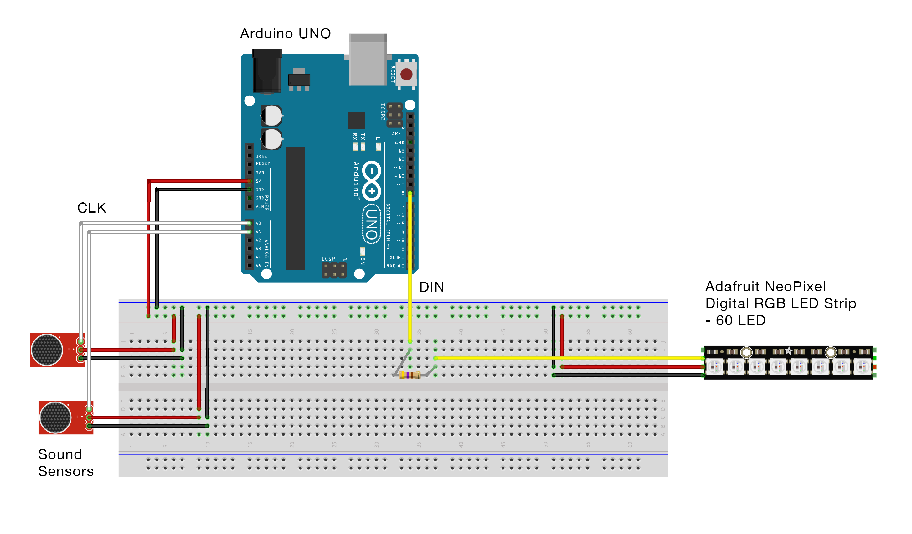
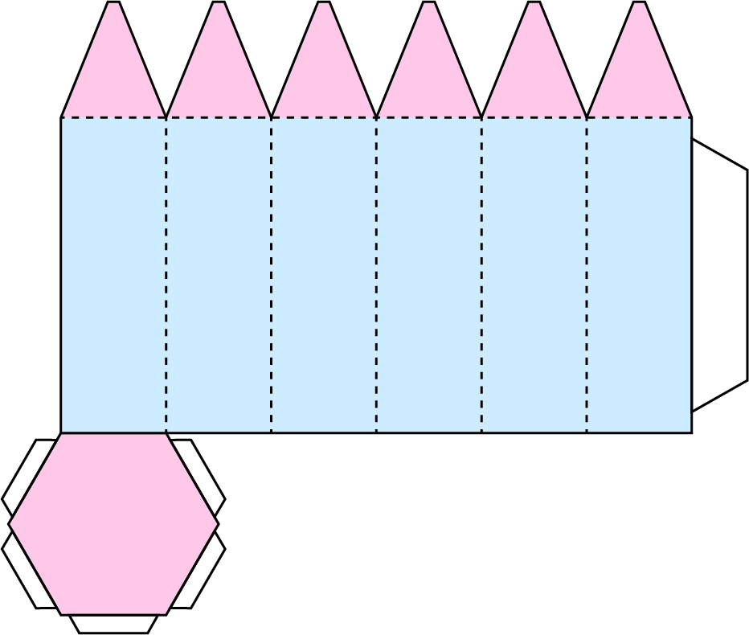
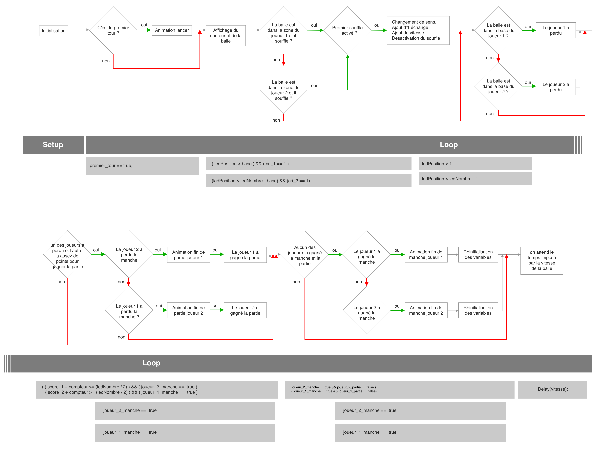

[**home**](../README.MD)

# BLOW
*Petit jeux électronique basé sur Arduino, réalisé par Martin Lamire et François Arnaud* 

### Principe
2 joueurs, l’un en face de l’autre. Le but est de se renvoyer un projectile grâce au souffle, le projectile étant figuré par une LED sur un bandeau. À chaque échange le projectile prend de la vitesse. Si le projectile touche la dernière LED (« la base ») de l'un des deux joueurs celui-ci a perdu la manche. Le joueur qui gagne la manche emporte autant de points qu’il y a eu d’échanges ; s'il y a eu 20 échanges à cette manche le joueur emporte 20 points. Le premier joueur à X points emporte la partie. Pour renvoyer le projectile des joueurs doivent souffler dans un réceptacle. Il y a une marge de 9 LEDs pour renvoyer le projectile. Au-delà de cette zone, soufflé n’aura aucun effet, si le projectile touche la dernière LED le joueur à perdu la manche. 


### Matériel
* 1 bandeau de 60 LED/m
* 2 capteurs de son
* Une carte arduino UNO
* Une resistance entre 300 et 500 Ohms
* (Des poumons)

### Montage


### Librairies 
Pour animer le bandeau de LEDs nous avons utilisé la librarie **Fast LED**. Cette librarie permet de gérer différents éléments composés de LEDs dont les bandeaux Adafruit Neopixel.

#### Installation
Pour faire marcher le bandeau de leds il faut d'abord inclure la librairie. Il est conseillé de définir le nombre de leds du bandeau ainsi que la PIN sur laquelle il est branché pour la suite des opérations. Le code en sera plus lisible et si vous opérez des changements vous aurez juste à les effectuer à cet endroit.

Cela étant dit, voici les premières lignes à intégrer à votre ficher .ino ;

    #include <FastLED.h>
    #define NUM_LEDS 60
    #define LEDS_PIN 6
    
Maintenant, vous devez mettre en place le bloque mémoire qui sera utilisé pour stocker et manipuler les données des leds :

    CRGB leds[NUM_LEDS];
    
Ceci met en place un tableau que vous pouvez manipuler pour définir/effacer les données des leds. Maintenant, installez vos leds, qui sont une seule ligne de code dans votre *void setup()* :

   	void setup() { 
       FastLED.addLeds<NEOPIXEL, LEDS_PIN>(leds, NUM_LEDS);
    }
       
Ceci indique à la bibliothèque qu'il y a un bandeau NEOPIXEL branché sur la broche 6, et ces leds utiliseront les leds du tableau de leds, et il y en a NUM_LEDS (soit 60).

#### Allumer une led
Avec cette bibliothèque, allumer une led se fait en deux parties. Tout d'abord, vous définissez les valeurs des entrées dans le tableau de leds aux couleurs que vous voulez. Ensuite, vous dites à la bibliothèque d'afficher vos données. Votre code se composera en grande partie de ce schéma. Déterminez ce que vous voulez afficher, réglez-le, puis dites au bandeau de l'afficher. 

Par exemple pour allumer une led d'une couleur :

    void loop() { 
        leds[0] = CRGB::Red; 
        FastLED.show(); 
        delay(30); 
    }
    
Plutôt simple non ? Maintenant vous avez un programme qui allumera la première led de votre bandeau en rouge.

La librairie offre de nombreuses possibilités quant à la gestion des couleurs (HSV, RGB, couleurs prédéfinies - HTML et XHTML), pour plus de détails à ce sujet consultez ce document : https://github.com/FastLED/FastLED/wiki/Pixel-reference

### Animations du jeu
#### Début de manche
Lorsque une manche débute une animation indiquant dans quel sens la LED va aller se déclenche. Cela permet aux joueurs de se préparer en début de manche.


#### Fin de manche
Lorsque l'un des deux joueurs gagne une manche une animation se déclenche. Les points accumulés au centre du bandeau durant la partie se dirigent vers le gagnant et s'ajoutent à son nombre de points.


#### Fin de partie
Lorsque l'un des deux joueurs gagne et que la partie est fini une animation se déclenche. Le bandeau de LED se remplit progressivement de la couleur du gagnant en partant de sa base jusqu'a la base adverse.


### Construction
Voici le patron du réceptacle, il a pour but de recevoir le souffle et de contenir tous les composants nécessaires au fonctionnement du jeu (carte ardue , capteurs, câbles, batterie, etc.). Le fait que la boîte soit hexagonale permet de coller les éléments sur différentes faces : la carte en bas, la batterie en haut et le bread board sur un des côtés. Ce réceptacle pourrait aussi être carré mais l'hexagone offre une meilleure prise en main.




### Détournements
Les jeux et le principe du souffle peuvent être détournés de mille et une façons. Le capteur pour renvoyer le projectile étant un micro, il existe différentes manières de l'activer :

* En criant
* En parlant
* Avec des onomatopés
* En claquant des doigts
* En tapant sur le receptacle
* ...

### Améliorations
Nous avons imaginé diverses améliorations possibles de ce jeu.

* Intégrer un mode multijoueur avec plusieurs bandeaux et plusieurs réceptacles.
* Imaginer différents modes pour proposer diverses expériences de jeux : mode où il faut claquer des doigts, mode où il faut crier, mode où il faut souffler, mode où il faut faire du bruit avec un objet, etc.
* Ajouter un boost lorsque le joueur souffle au dernier moment (si le joueur se met en danger il a la possibilité de mettre son adversaire en difficulté).


### Explication du code

Le code du jeu est divisé en plusieurs parties. Certaines d'entre elles en activent d'autres ou sont activés par d'autres.

Nous allons détailler ici seulement les parties les plus compliquées du code. Le reste est expliqué par le schéma suivant.



Avant et dans le setup, les variables nécessaires au fonctionnement du programme sont initialisées. Le programme utilise une bonne quantité de variables globales. 

Le Loop inclue tout le code nécessaire pour faire plusieurs parties d'affilée. Chaque partie est composée d'autant de manches nécessaires à ce qu'un des joueurs gagne. Ceci permet d'enchainer plusieurs parties sans devoir débrancher le jeu.


#### Gestion de la LED
Chaque itération du Loop fait avancer la balle d'une LED si la partie est en cours. Si un joueur gagne, le loop passera par des animations plus longues permettant aux joueurs de comprendre la progression du jeu.
Quand une partie est en cours, la vitesse de la balle est donc gérée par le Delay à la toute fin du code (ligne 362). Plus le Delay est court plus la balle va vite. (nous abordons ce point ici car bien qu'il soit à la fin du code il est essentiel à la compréhension du programme)

```

  delay(vitesse);


```

À chaque tour la position de la balle est incrémenté par la variable "sens" qui indique dans quel sens va la balle : 1 si elle va du joueur 1 au joueur 2 et -1 si elle va du joueur 2 au joueur 1. Cette action est exécutée ligne 147 : 

```    

 //---GESTION DU SENS DU PROJECTILE---//
 ledPosition += sens;


```


La variable premier tour indique au programme s'il doit jouer l'animation de début de manche (ligne 92) :

```

//-----ANNONCE DE LA DIRECTION DE LA BALLE EN DEBUT DE TOUR-----//
if ( ( premier_tour == true ) && sens == -1 ) {
  envoi_Player_1();
  Serial.println("Premier tour");
}

if ( ( premier_tour == true ) && sens == 1 ) {
  envoi_Player_2();
  Serial.println("Premier tour");
}
 
```


#### Détection du son.


Afin de savoir si les joueurs soufflent dans leur microphone, nous exécutons un cours morceau de code (ligne 116) : 


```

//-----ANALYSE DU SON-----//
    //Player 1//
    for (int i = 0; i < 32; i++)
    {
      sum_1 += analogRead(pinMicroJoueur1);
    }

    sum_1 >>= 5;

    if (sum_1 > threshold) {
      cri_1 = 1;
    } else {
      cri_1 = 0;
    }


```

Pour détecter le son et avoir une valeur stable nous additionnons la valeur du micro 32 fois. Ceci force le joueur à faire un son assez constant pour renvoyer la balle.
 
la ligne …

```

   sum_1 >>= 5;


``` 

… permets d'effectuer un bitshift sur la valeur sum_1 (ou sum\_2) de manière à manipuler des valeurs plus petites que la valeur des sum en sortie de la boucle. 


Les variables cri\_1 et cri\_2  sont utilisés comme des booléens pour indiquer si du son est détecté par le micro de chacun des joueurs.
Ces variables sont utilisées lorsque l'on détecte si la balle est dans la zone du joueur et si du son entre dans leur micro pour renvoyer la balle (ligne 150) : 

```

//---GESTION DU SENS DU PROJECTILE---//
ledPosition += sens;

//Player 1
if ( ( ledPosition < base ) && ( cri_1 == 1 ) ) {
  sens = 1;
  Serial.println("Renvoie de 1 vers 2");
}

//Player 2
if ( (ledPosition > ledNombre - base) && (cri_2 == 1) ) {
  sens = -1;
  Serial.println("Renvoie de 2 vers 1");
}
    
```


#### premier_souffle

La variable "premier\_souffle" indique (quand elle est de valeur 1), que la balle a déjà été renvoyé vers l'autre joueur. Ceci permet de ne pas ajouter plusieurs échanges au compteur et de ne pas augmenter la vitesse plusieurs fois si le joueur souffle longtemps sur le micro. La variable est définie sur false lorsque la balle est renvoyée (ligne 166) :

```

  //Si le projectile change de sens on augmente sa vitesse et on ajoute un échange au compteur
if ( (ledPosition > ledNombre - base) && (cri_2 == 1) && ( premier_souffle == true ) || (ledPosition < base) && (cri_1 == 1) && ( premier_souffle == true ) ) {
  compteur += 2;
  vitesse *= 0.60;
  premier_souffle = false;
  //Serial.println(vitesse);
  Serial.println("Renvoie donc ajout vitesse et compteur");
  Serial.print("compteur : ");
  Serial.println(compteur);
}


```

La variable est définie sur true lorsque la balle passe au centre du bandeau de LED de manière à permettre au joueur suivant de souffler à son tour (ligne 174) 

```

//Lorsque la LED est dans la base il est possible que le son atteigne plusieurs fois “threshhold" ce qui additionnerait plusieurs échanges et augmenterait la vitesse plusieurs fois.
//permet d'empêcher que l'on rentre plusieurs fois dans la boucle au dessus.
if ( ( ledPosition == ledNombre / 2 ) ) {
  premier_souffle = true;
}


``` 


#### joueur x manche

Les variables joueur_1_manche et joueur_2_manche permettent au programme de savoir que la balle est allé dans la zone d'un des joueurs. 
joueur_1_manche = "le joueur 1 à perdu la manche"
joueur_2_manche = "le joueur 2 à perdu la manche"


```

//---DETECTION DE BALLE DANS BASE---//

//Correspond au moment où la LEDs touche la base de l'un des deux joueurs
//Player 1
if ( (ledPosition < 1) ) {
	joueur_1_manche = true;
	}
	
//Player 2
if ( (ledPosition > ledNombre - 1) ) {
	joueur_2_manche = true;
	}
 
```


#### fin de partie et fin de manche

Nous effectuons la détection de fin de partie avant celle de fin de manche pour éviter de faire l'animation de fin de manche ET de faire l'animation de fin de manche lorsqu'un joueur a perdu la partie. 

Pour détecter la fin de partie, nous additionnons directement dans la condition le nombre de points actuels du gagnant et les points en jeu dans cette manche pour les comparer au nombre de points nécessaires pour gagner la partie. Voici la condition en question (ligne 219) : 

```

 if ( ( score_1 + compteur >= (ledNombre / 2) ) && ( joueur_2_manche ==  true ) || ( score_2 + compteur >= (ledNombre / 2) ) && ( joueur_1_manche ==  true ) )
 
```

Dans cette condition nous activons donc la variable "joueur_1_partie" ou "joueur_2_partie" qui indiquera à la détection de fin de manche de ne pas jouer d'animation car l'animation de fin de partie a déjà été jouée.

Après avoir détecté la fin de partie et avoir effectué l'animation de fin de partie (voir plus bas pour des précisions sur les animations) nous réinitialisons les variables nécessaires au bon déroulement d'une nouvelle partie (ligne 274) : 

```

//On réinitialise les paramètres pour la nouvelle partie
ledPosition = ledNombre / 2;
premier_souffle = true;
vitesse = vitesse_initiale;
joueur_1_partie = false;
joueur_1_manche = false;
joueur_2_partie = false;
joueur_2_manche = false;
compteur = 0;
score_1 = 0;
score_2 = 0;
sens = 1;
premier_tour = true;


```


Nous effectuons un code similaire si un des joueurs a perdu la manche mais que l'autre n'a pas gagné la partie.
Néanmoins nous devons ajouter le nombre d'échanges au bon joueur grâce à une condition simple (ligne 306) : 


```

if ( joueur_1_manche == true ) {
  Serial.println("anim fin de manche joueur 2 winner");
  animation_manche_win_2();
  score_2 += compteur;
}
 
```


#### animations

À la fin du programme se trouve plusieurs voids dédiés aux animations. Ces Void sont exécutés par le code principal plus haut. 

Le void black() efface toutes les leds en passant sur chacune d'elles et en définissant leur luminosité à 0 (cela permet de ne pas avoir de trainer lorsque la balle se déplace ; une seule led, les leds précédemment allumées sont éteintes).

```

void black() {
  for (int i = 0; i < ledNombre; i++) {
    leds[i] = CHSV(0, 0, 0);
  }
}
 
```


Le void envoi_Player_1 (ligne 374) gère l'animation de lancement de manche dans la direction du joueur 1. Ce void a un homonyme dans l'autre sens appelé envoi_Player_2. Nous ne détaillerons pas cette animation car elle est assez simple pour être comprise. 

De même pour affichage_points() (ligne 412), affichage_compteur() (ligne 496) et affichage_bases() (ligne 510) qui affichent respectivement le score, le nombre d'échanges en cours et les bases.  
 


Cependant animation\_manche\_win\_1() (ligne 430) et animation_manche_win_2() (ligne 449) sont plus complexes. Ces voids affichent l'ajout des échanges au score du joueur qui a gagné la manche.
Pour simplifier l'explication nous n'expliquerons que animation\_manche\_win\_1(). animation\_manche\_win\_2() est uniquement une version inversée de l'animation\_manche\_win\_1().
Le but de cette animation est donc de décaler les points d'échanges vers le score du joueur 1. Nous allons donc afficher les échanges en décrementant leur position à chaque itération de manière à donner l'impression de mouvement. La variable "départ" indique la position de la première led affichant les échanges. En décrémentant cette variable nous décrementons la position de toutes les leds.


```
 
void animation_manche_win_1() {
  affichage_compteur();
  //quand on est juste à la fin d'une manche normale
  for (int depart = ( ( ledNombre / 2 ) - ( compteur / 2 ) ); depart > score_1 - 1; depart--) {
    FastLED.clear();
    // Serial.print("depart = ");
    //Serial.println(depart);
    for (int i = 0; i < compteur; i++) {
      //Serial.print("i = ");
      //Serial.println(i);
      //   map( depart, ( ( ledNombre / 2 ) - ( compteur / 2 ) ),score_1 - 1,0,255)
      leds[depart + i] = CHSV(0, map( depart, ( ( ledNombre / 2 ) - ( compteur / 2 ) ), score_1 - 1, 0, 255), 255);
    }
    affichage_points();
    FastLED.show();
  }
}
 
```

À vous de jouer !
-

N'hésitez pas à nous contacter à ces adresses pour toutes informations complémentaires :

* m.lamire@lecolededesign.com
* f.arnaud@lecolededesign.com

Merci ! 

[**home**](../README.MD)
