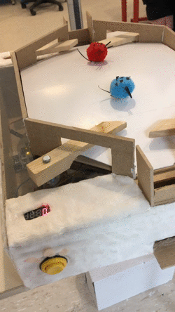
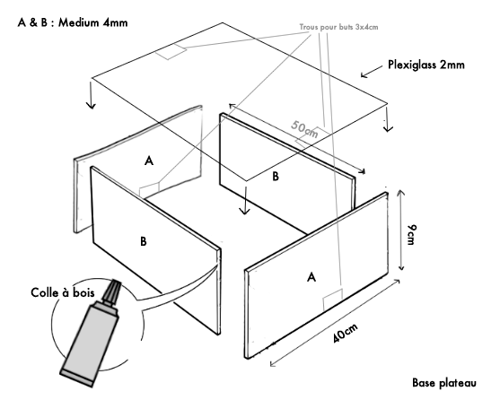
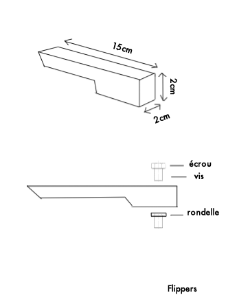
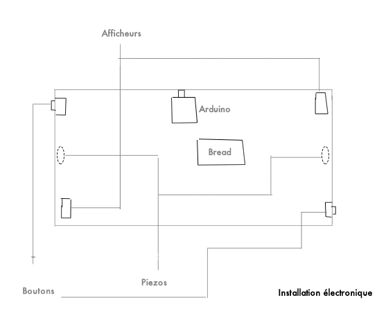
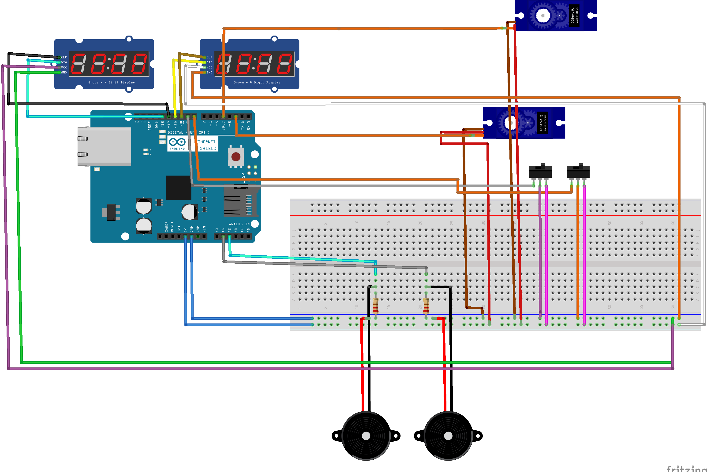
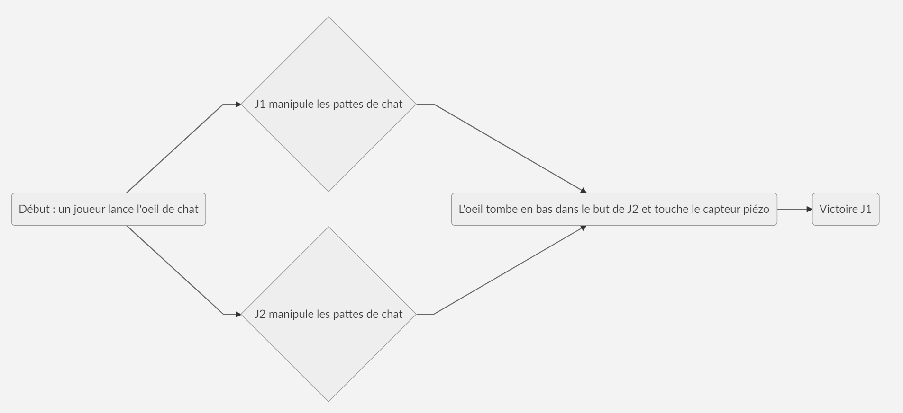

[**home**](../README.md)

# BattleStar Galacticat
*par Paul Poirier et Seohee Park *

# A propos

BattleStar Gallacticat est un jeu de flipper inspiré d'un fameux pinball game Full Tilt!. Mais Ici, l'expérience est augmentée, BattleStar Galacticat vous permet de jouer au Pinball en 1V1 !

# Le principe

Un joueur lance une bille oeil de chat pour démarrer la partie. L'objectif est de mettre l'oeil de chat dans le but adverse, en utilisant les pattes en bois et de le faire plus souvent que l'autre joueur. Le bouton pour manipuler le Servo moteur camouflé en mode souris est à votre disposition ! Utilisez-le à votre avantage pour détourner la trajectoire de la balle. A vous de jouer !

# Le matériel

|Electronique Composant|nombre     |
|----------------|-------------------------------|
|Capteur piezo-electrique|2
|Carte Arduino uno|1
|Résistance  100kΩ      |2|
|Condansateur            |2
|breadbord et des câbles         |1
|4digit 7segment led display        |2
|Planches de médium 60x40       |0
|Servo moteur continus       |2
|Boutons type arcade trois broches      |2
|Bandes de tissu type "pilou"      | ∞
|Planches de Medium 60x40      | 3

# Code du jeu

Le code :

Commençons par inclure au début du programme, la bibliothèque "SevenSegmentTM1637.h", "SevenSegmentExtended.h" qui nous permettra d'afficher le score de deux joueurs.

    #include "SevenSegmentTM1637.h"
    #include "SevenSegmentExtended.h"

Ensuite, on déclare un objet afficheur_jouer(n) en lui donnant un nom et en précisant la pin à laquelle est connectée l'afficheur adversaire de deux joueurs :

    SevenSegmentExtended afficheur_joueur1(9, 10);
    SevenSegmentExtended afficheur_joueur2(12, 13);

L'élément piézoélectrique le capteur de choc est connecté en broche analogique 1 et 2

    const char piezo1 = 1;
    const char piezo2 = 2;

Ici, nous déclarons le seuil_detection par défaut pour tester la sensibilité de capteur piézo, plus le chiffre baisse, plus il sera sensible.

    const float seuil_detection = 2;

Nous mettons ensuite le variable qui va contenir la valeur lue en broche analogique 0

    float lecture_capteur1 = 0;
    float lecture_capteur2 = 0;

Et variable qui va contenir le résultat du calcul de la tension

    float tension1 = 0;
    float tension2 = 0;
    
 
   
   
On commence ensuite la partie Servo moteur qui va nous servir à empêcher le passage de l'oeil lorsqu'on appuie sur le bouton. Pour ça, on commence par l'inclure la bibliothèque Servo.h

    #include <Servo.h>

    Servo servo1;
    Servo servo2;

Button sur la broche 7 et 8.

    int buttonPin1 = 7;
    int buttonPin2 = 8;
    int buttonState1 = 0;
    int buttonState2 = 0;

    void setup() {
       /* pinMode(led, OUTPUT); // déclaration de la broche 2 en sortie

      */
      afficheur_joueur1.begin();            // initializes the display
      afficheur_joueur1.setBacklight(100);  // set the brightness to 100 %
      afficheur_joueur2.begin();            // initializes the display
      afficheur_joueur2.setBacklight(100);  // set the brightness to 100 %

      afficheur_joueur1.print(score_joueur1);      // display INIT on the display
      afficheur_joueur2.print(score_joueur2);      // display INIT on the display
      delay(1000);                // attendrre 1000 ms

On définit ensuite les deux pin des servos

    servo1.attach(2);
    servo2.attach(4);

On initialise le button comme un input

    pinMode(buttonPin1, INPUT);
    pinMode(buttonPin2, INPUT);
    Serial.begin(9600); }

    void loop() {

    // on lit la valeur du bouton
    //Serial.println(digitalRead(buttonPin1));
    //Serial.println(digitalRead(buttonPin2));
    afficheur();
    if ((digitalRead(buttonPin1) == 0) && (digitalRead(buttonPin2) == 0)) {
    // on définit les cycles de mouvement du servo1
    servo1.write(90);
    //servo1.write(0);
    // on définit les cycles de mouvement du servo2
    servo2.write(90);
    //servo2.write(180);
    }
    else {
    servo1.write(0);
    servo2.write(0);
       }
    }

    void afficheur(){

Lecture de la valeur en sortie du capteur

    lecture_capteur1 = analogRead(piezo1);
    lecture_capteur2 = analogRead(piezo2);

Conversion de cette valeur en tension

    tension1 = (lecture_capteur1 * 5.0) / 1024;
    tension2 = (lecture_capteur2 * 5.0) / 1024;

Ensuite, pour gérer  la partie capteur piézo, nous reprenons l'objet "afficheur_joueur" qui est relié à l'afficheur. On détermine d'abord le message que l'on veut afficher sur le moniteur série. Par exemple pour le joueur1 le message sera "Toc !". Cette étape est nécéssaire pour bien différencier le choc que reçoit le piézo de chaque joueur. L'objet score_joueur permet de faire +1 sur l'afficheur lorsqu'un joueur marque le but. Pour le deuxième joueur, on recopie le code entière en bas et on modifie le joueur1 par joueur2.

    if (tension1 >= seuil_detection)
    {
    Serial.println("Toc !");
    Serial.print("Tension = ");
    Serial.print(tension1);
    Serial.println(" V");
    score_joueur1 ++;
    afficheur_joueur1.print(score_joueur1);
    delay(200);
     }
    }

# Le code
Retrouvez le code entier commenté en format ino dans le fichier zip.

# Construction de la maquette
Un travail conséquent à été effectué pour que le flipper obtienne une allure de boitre de jeu identifiable:

Voici le manuel de fabrication des pièces en médium qui forment la boite, ainsi que de la plaque de plexiglas posée sur le dessus.

Ensuite il faut construire les murs et le plateu de jeu qui constitue la partie la plus visible de notre jeu. Sur ce terrain s'affrontent les deux jouers :

N'oublions pas la construction des filippers, accrochés au plateau par un système de vis qui travèrse le plateau ainsi que la plaque de plexiglas :

Dans un soucis d'organisation, on gère l'organisation de l'électronique dans la boite de la manière suivante : 

# Schéma du circuit électronique 

Ci dessous le schéma du montage électronique de la carte Arduino, la breadboard, les deux servos moteurs continus, les deux piezos et les deux 7 digits.

# Scénario
Ci dessous le déroulé d'un point de BAttlestar Galacticat. A noter que la partie peut durer une longue période si les deux joueurs décident de s'affronter sur une partie à 10 buts. 

[**home**](../README.md)
