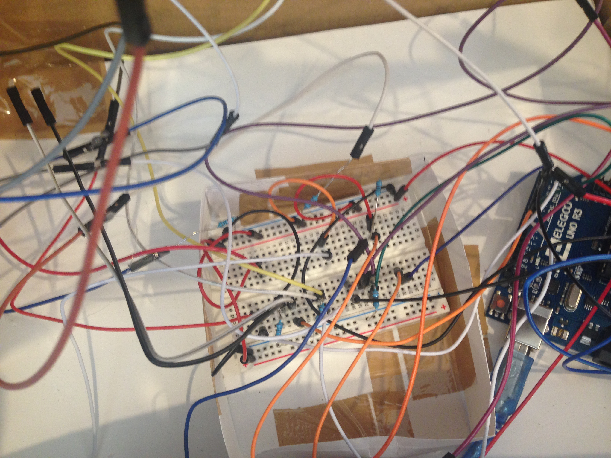
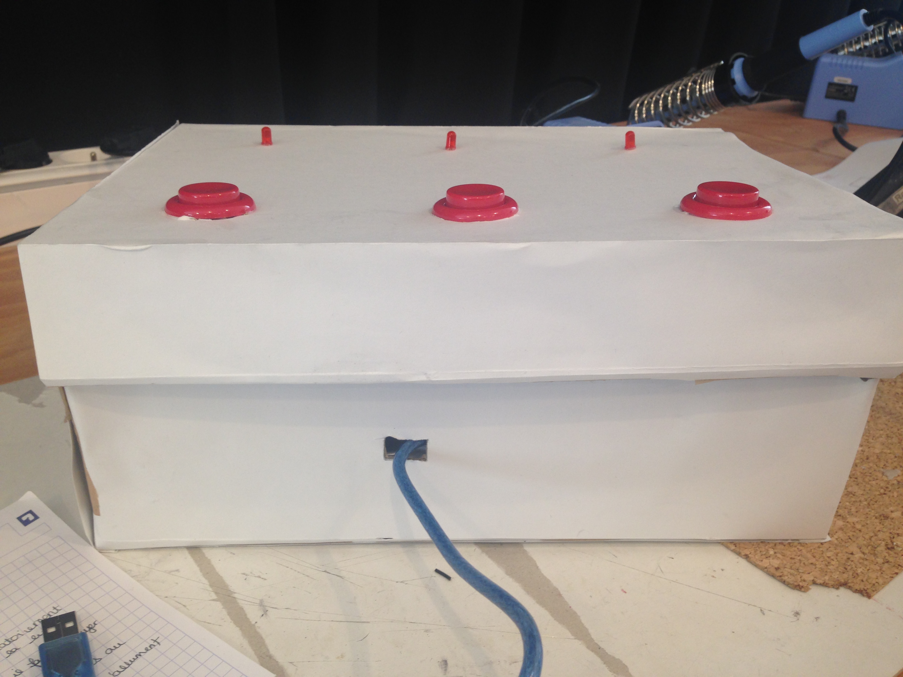
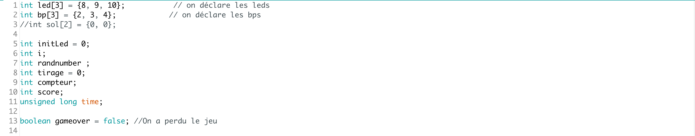
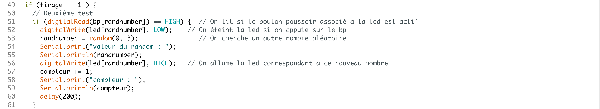
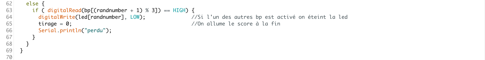
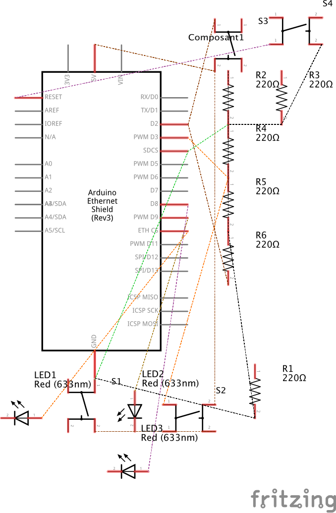
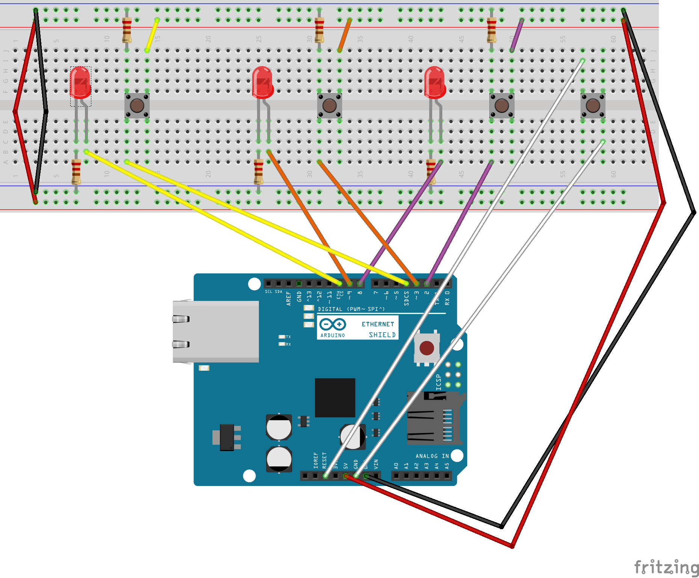

[**home**](../README.md)

# Projet Arduino : Jeu électronique 

*Lúna Azibeiro _ Giulia Savelli _ I3B*

## Scénario du jeu : Bipeur
Nombre de joueur : 1 joueur 
Temps d'une partie : 5 secondes 

Un boitier avec trois lumières, chacunes reliées à un bouton. Les lumières s'allument aléatoirement chacune leur tour. Dès qu'une lumière s'allume, il faut appuyer le plus rapidement possible sur le bouton correspondant pour éteindre la led en question. Pour gagner la partie, le but est de parvenir à éteindre plus de 25 fois les lumières en moins de 5 secondes. Si on gagne la partie, toutes les leds s'éteignent. Mais si on se trompe de bouton, on perd la partie et toutes les leds s'allument, le jeu s'arrête. Le résultat s'affiche sur l'ordinateur. Pour recommencer une partie, il suffit d'appuyer sur le bouton reset. 

## Notice de montage 

Liste du matériel : 

- Une carte Arduino  
- Une breadboard  
- 3 résistances de 10k  
- 3 résistances de 1k  
- 3 leds  
- 3 boutons d'arcade  
- Un bouton poussoir 
- Des câbles 
 
## Assemblage : 

1_ Branchement des leds sur la breadboard. Une résistance à été associé à chacune d'entre elles, que nous avons ensuite mis en entrée sur la carte Arduino. 

2_ Branchement des boutons poussoirs à la breadboard. Nous avons relié un bouton à chaque led. Nous avons là aussi rajouter des resistances. Les boutons ont été branché en sortie. 

3_ Branchement du bouton "reset". Que nous avons branché au reset et à la masse. 

4_ Nous avons ensuite rajouter des câbles pour pouvoir ouvrir et fermer correctement à la maquette. 

5_ Nous avons ensuite remplacé les boutons poussoirs par des boutons d'arcade que nous avons ajouté à la maquette et relié à la carte Arduino. 

6_ Pour finir, nous avons rajouté des câbles au bouton reset pour l'incruster dans notre maquette. 
 

## Maquette :  

1_ Nous avons construit une boite. Puis positionner notre circuit à l'intérieur. 

2_ Nous avons fait des trous sur le dessus de la boîte afin de pouvoir y positionner les boutons d'arcade ainsi que les leds. 

3_ Nous avons fait un trou sur le côté de la boîte afin d'y placer le bouton reset. 

4_ Enfin, nous avons fait un trou sur le devant de la boîte dans le but de faire ressortir le câble USB qui devra être connecté à l'ordinateur afin de pouvoir lancer le jeu. 
 

## Côtes :  

## Code Arduino commenté 

Au début du code on initialise toutes les variables pour déclarer les leds et les boutons poussoirs qui sont reliés à la carte Arduino. 
 

On définit que les boutons poussoirs sont des entrées et que les leds sont des sorties, et que les lumières sont initialement éteintes. 
 

On déclare un nombre aléatoire, qui va allumer une première led 
Première boucle réaliser on peut passer au test suivant.  
 

Deuxième test, on lit si le bouton où l’on tape est associé à la led allumée si c’est vérifié la lumière s’éteint. 
Un autre random s’éxecute pour allumer une autre ou la même led aléatoirement.   
 

Si on n’appuie pas sur le bon bouton toutes les leds s’allument, et le jeu est fini.  
 

## Schémas du circuit électronique

 
 

[**home**](../README.md)
