[**home**](../README.MD)

# CIRCLE SPEED 
### par Camille Campo & Raphaëlle Gorenbouh
***
***


## Contexte
Réalisé dans le cadre d'un cours de Connectivité en 3e année de cylcle bachelor Interactivité, il nous a été demandé de réaliser un petit jeu original et amusant, sans écran à partir d'un minimum de composants. Par la suite nous avons réalisé des binômes et réfléchi à des premières idées de jeux.

Encadré par Bérenger RECOULES,  Clément GAULT et  Pierre COMMENGE

## CIRCLE SPEED

Le principe de notre jeu se base sur la rapidité, et la reconnaissance de motifs et de formes. Le but étant d'être plus rapide que ses adversaires. Le jeu peut se jouer jusqu'à 3 joueurs. Jouer seul avec les 3 cercles est possible, randant ainsi le challenge plus complexe.

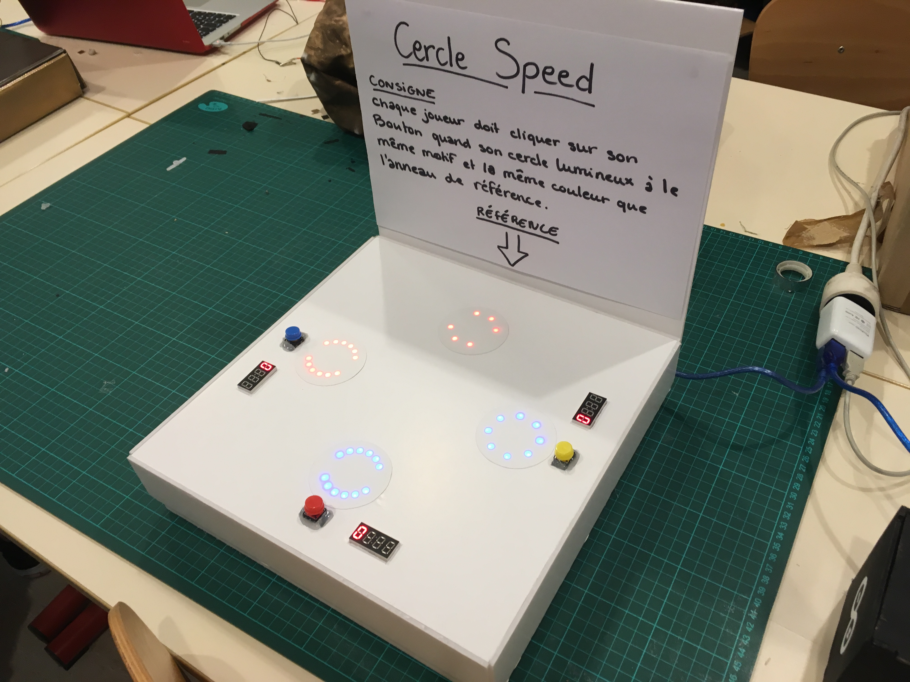


## Règles du jeu
Chaque joueur a un anneau de led. Un anneau supplémentaire est disposé de sorte à servir de référence. 

* Les leds des anneaux s'allument pour former différents motifs colorés.
* Dès qu'un joueur a le même motif de la même couleur que celui de l'anneau de référence, il doit appuyer sur un bouton pour venir marquer un point. 
* Si celui-ci s'est trompé, il perd un point (-1). 
* Si la personne a juste, elle marque un point (+1). 
* L'objectif du jeu étant d'obtenir plus de points que ses adversaires.

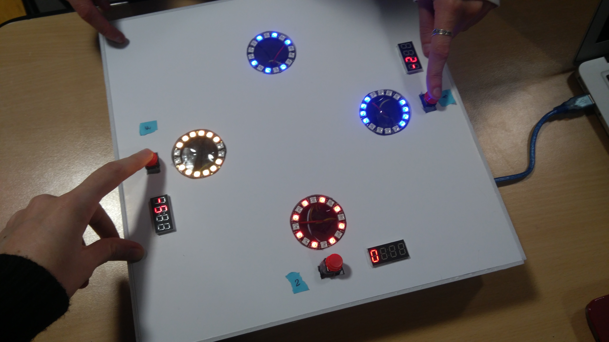


## Matériels utilisés

* 4 anneaux de 16 leds chacun : ici nous utiliserons les AdaFruit NeoPixel Ring
* 3 boutons : Ici nous utilisons la biliothèque EasyButtom
* 3 compteurs/afficheurs 7 segments : ici nous utilisons les Digit Display
* une carte Arduino et son cable usb
* un breadboard
* 3 résistances : 10k pour les boutons
* 4 résistances : 400k pour les anneaux lumineux
* et un plein de fils


## Structure du jeu
* Les anneaux et les compteurs s'allument.
* Chaque 3 secondes le motif et la couleur affichée sur les anneaux changent.
* Au clic d'un joueur : Le joueur marque ou perd le point en fonction de la cohérence avec l'anneau de référence.
* Les anneaux changent aussitôt de motif et de couleur.
* L'expérience se réitère indéfiniment.

## Motifs et couleurs
* 3 couleurs possibles : Rouge / Jaune / Bleu
* 3 motif différents
* 9 combinaisons en tout sont possibles


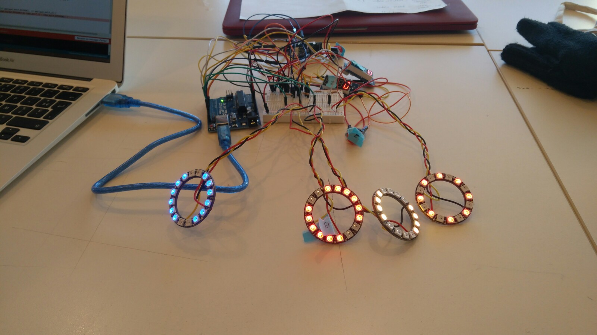


## Déroulement du projet
Nous avons découpé la réalisation du projet en plusieurs étapes : l'une d'entre nous s'occupait de faire fonctionner les anneaux de LED, et modifier les motifs, pendant que l'autre s'occupait de créer le système de compteur avec les boutons. À la fin nous avons fusionné l'ensemble du code et créé la vérification des motifs et des couleurs lors de l'appuie d'un bouton pour le calcul des scores.


# Etapes pas à pas pour réaliser le jeu
## Notice du montage électronique

Branchement d'un bouton seul :
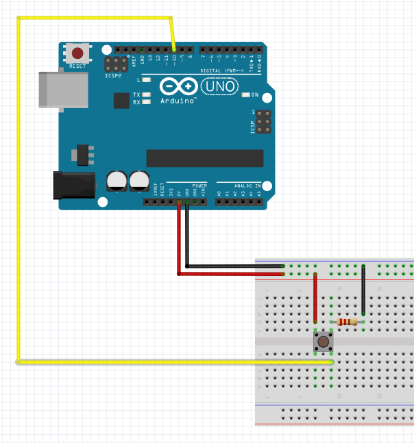

Branchement d'un bouton avec un compteur :
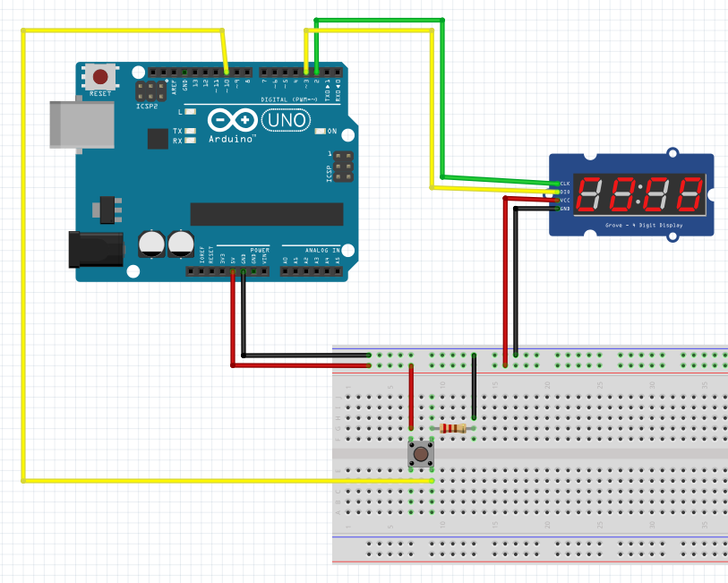

Branchement d'un anneau de led Adafruit Neopixel seul :
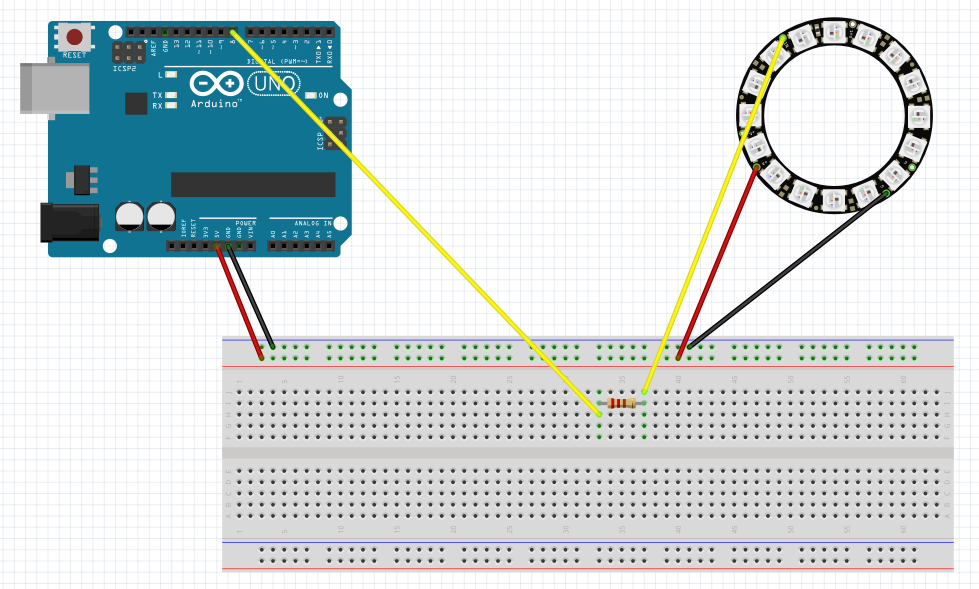

Montage éléctronique complet de notre jeu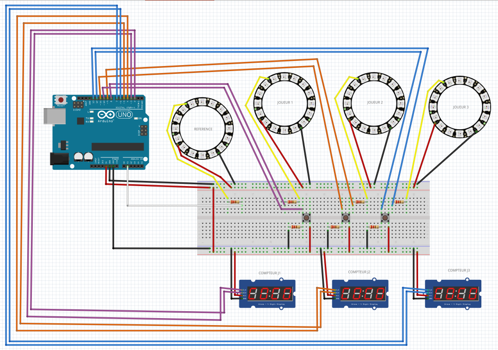


### 1- Avant le setup, déclarer l'ensemble des bibliothèques utiles au projet

* EasyButton (ajouter la bibliothèque pour faire fonctionner les boutons)
* Adafruit (ajouter la bibliothèque pour faire fonctionner les boutons)
* SevenSegmentTM1637.h (ajouter la bibliothèque pour faire fonctionner les compteurs)


```
#include <EasyButton.h> // Ajouter une bibliothèque pour les boutons
#include <Adafruit_NeoPixel.h> // Ajouter une bibliothèque pour les anneaux de led
#ifdef __AVR__
#include <avr/power.h>
#include "SevenSegmentTM1637.h" //on fait appel à la bibliothèque SevenSegmentTM1637.h

```
### 2- Avant le setup, définir les compteurs pour chaque joueur

```
//BOUTON & COMPTEUR
//Définition des compteurs associés à chaque joueur
//SevenSegmentTM1637 afficheur(BROCHE_CLK, BROCHE_DIO);
SevenSegmentTM1637 afficheur_joueur1(2, 3);
SevenSegmentTM1637 afficheur_joueur2(4, 5);
SevenSegmentTM1637 afficheur_joueur3(6, 7);
```

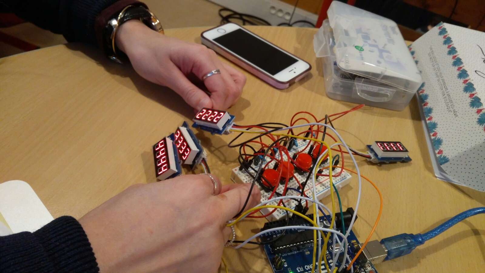


### 3- Avant le setup, définir les boutons associés à chaque joueur
```
#define BROCHE_BOUTON_JOUEUR1  10 // 10 Correspond a la broche 10 sur la carte arduino
#define BROCHE_BOUTON_JOUEUR2  11 // 11 Correspond a la broche 11 sur la carte arduino
#define BROCHE_BOUTON_JOUEUR3  12 // 12 Correspond a la broche 12 sur la carte arduino

EasyButton boutonJ1(BROCHE_BOUTON_JOUEUR1);
EasyButton boutonJ2(BROCHE_BOUTON_JOUEUR2);
EasyButton boutonJ3(BROCHE_BOUTON_JOUEUR3);
```

### 4- Avant le setup, créer une variable pour le calcul des scores et les boutons détectés

```
int score_joueur[3] = {0, 0, 0}; // initialiser tous les scores à 0
int bouton_detecte = 0; // au départ aucun bouton n'est détecté 
```
### 5- Avant le setup, définir tous les Anneaux de Néopixels
```
#define BROCHE_LED_J1      8 // Correspond à la broche 8 carte arduino
#define BROCHE_LED_J2      9 // Correspond à la broche 9 carte arduino
#define BROCHE_LED_J3      13 // Correspond à la broche 13 carte arduino
#define BROCHE_LED_REFERENCE      A1 //analog 
#define NUMPIXELS  16 /*nombre de led qu'on a sur notre anneau*/
```

### 6- Avant le setup, définir les couleurs et les motifs sur chaque anneaux (joueurs 1/2/3 + anneaux de référence)
```
int index_couleur_J1;
int index_couleur_J2;
int index_couleur_J3;
int index_couleur_REFERENCE;

int index_motif_J1;
int index_motif_J2;
int index_motif_J3;
int index_motif_REFERENCE;
```

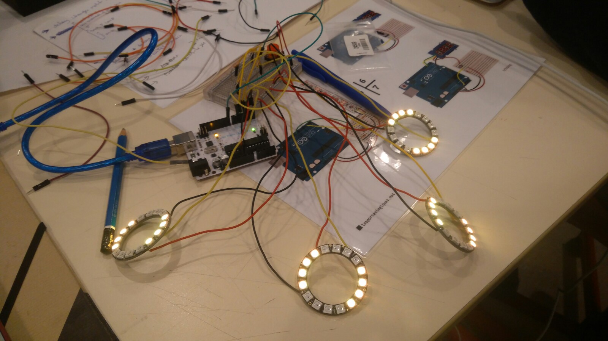
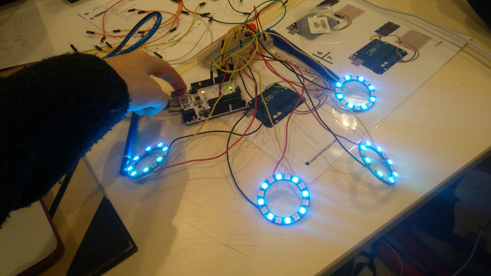


### 7- Avant le setup, définir l'apparence de chaque motifs, tableaux à deux entrées

```
int motifs[9][16] = {
  {0, 0, 1, 1, 0, 0, 1, 1, 0, 0, 1, 1, 0, 0, 1, 1},
  {1, 1, 1, 1, 1, 1, 0, 0, 1, 1, 1, 1, 1, 1, 0, 0},
  {1, 1, 0, 0, 1, 1, 1, 1, 1, 1, 0, 0, 1, 1, 1, 1},
  {0, 1, 0, 1, 0, 1, 0, 1, 0, 1, 0, 1, 0, 1, 0, 1},
  {1, 0, 1, 0, 1, 0, 1, 0, 1, 0, 1, 0, 1, 0, 1, 0},
  {1, 1, 1, 0, 0, 0, 1, 1, 1, 0, 0, 0, 1, 1, 1, 0},
  {1, 1, 0, 0, 0, 0, 1, 1, 1, 1, 0, 0, 0, 0, 1, 1},
  {1, 0, 0, 0, 0, 0, 1, 1, 1, 0, 0, 0, 0, 0, 1, 1},
  {0, 1, 0, 0, 0, 1, 0, 1, 0, 1, 0, 0, 0, 1, 0, 1}
};

// [9] correspond aux nombres de motifs différents total
// [16] correspond aux nombres de leds sur chaque anneaux
```

### 8- Avant le setup, définir les couleurs pour chaque anneaux (ici trois couleurs). Chaque couleurs sera appelée aléatoirement selon le motif et le joueur
```
int couleurs[3][3] = { // le premier 3 correspond aux lignes, le second aux éléments de la ligne
  {0, 255, 255},
  {255, 120, 0},
  {250, 0, 3}
};

```

### 9- Avant le setup, on fait appel à chaque anneaux de led pour les trois joueurs + anneaux de référence
```
Adafruit_NeoPixel pixels_J1 = Adafruit_NeoPixel(NUMPIXELS, BROCHE_LED_J1, NEO_GRB + NEO_KHZ800);
Adafruit_NeoPixel pixels_J2 = Adafruit_NeoPixel(NUMPIXELS, BROCHE_LED_J2, NEO_GRB + NEO_KHZ800);
Adafruit_NeoPixel pixels_J3 = Adafruit_NeoPixel(NUMPIXELS, BROCHE_LED_J3, NEO_GRB + NEO_KHZ800);
Adafruit_NeoPixel pixels_REFERENCE = Adafruit_NeoPixel(NUMPIXELS, BROCHE_LED_REFERENCE, NEO_GRB + NEO_KHZ800);
```

### 10- Dans le void setup

Tout ce qui est écrit là sera lu pour le premier tour d'initialisation du jeu.


```
void setup() {
  boutonJ1.begin();
  boutonJ2.begin();
  boutonJ3.begin();

  //Initialisation et vérification des COMPTEURS (1er lancement)
  pinMode (BROCHE_BOUTON_JOUEUR1, INPUT);
  afficheur_joueur1.begin();
  afficheur_joueur1.setBacklight(100); // %
  afficheur_joueur1.print("1111");

  pinMode (BROCHE_BOUTON_JOUEUR2, INPUT);
  afficheur_joueur2.begin();
  afficheur_joueur2.setBacklight(100); // %
  afficheur_joueur2.print("2222");

  pinMode (BROCHE_BOUTON_JOUEUR3, INPUT);
  afficheur_joueur3.begin();
  afficheur_joueur3.setBacklight(100); // %
  afficheur_joueur3.print("3333");

  delay(1000);

  afficheur_joueur1.clear();
  afficheur_joueur1.print(score_joueur[1]);
  afficheur_joueur2.clear();
  afficheur_joueur2.print(score_joueur[2]);
  afficheur_joueur3.clear();
  afficheur_joueur3.print(score_joueur[3]);

  // Initialisation et vérification des ANNEAUX
  Serial.begin(9600);

  pinMode(8, OUTPUT);
  pinMode(9, OUTPUT);
  pinMode(13, OUTPUT);
  pinMode(A0, OUTPUT);

  pixels_J1.begin();
  pixels_J1.setBrightness(20); //intensité lumineuse des leds

  pixels_J2.begin();
  pixels_J2.setBrightness(20);

  pixels_J3.begin();
  pixels_J3.setBrightness(20);

  pixels_REFERENCE.begin();
  pixels_REFERENCE.setBrightness(20);

// button.onPressed(mafonction); quand le bouton est appuyé la fonction s'exécute
  boutonJ1.onPressed(calcul_score_joueur1); 
  boutonJ2.onPressed(calcul_score_joueur2);
  boutonJ3.onPressed(calcul_score_joueur3);

  randomSeed(analogRead(0));
}
```

### 11- Dans le void Loop

Tout ce qui est écrit dans le Loop sera lu à chaque tour.

```
void loop() {
  // on lit l'état des BOUTONS
  boutonJ1.read();
  boutonJ2.read();
  boutonJ3.read();


  //on utilise millis() pour que les motifs changent automatiquement si aucun bouton n'est appuyé
  unsigned long currentMillis = millis();

  if (currentMillis - previousMillis >= interval) {
    previousMillis = currentMillis;
    generate_new_config();

  }

// Au départ aucun bouton n'est détecté
  bouton_detecte = 0;

  // Détection des boutons, qui appuye en premier ?
  // if (digitalRead(BROCHE_BOUTON_JOUEUR1) == HIGH) {
  // bouton_detecte = 1;
  //}
  //if (digitalRead(BROCHE_BOUTON_JOUEUR2) == HIGH) {
  // bouton_detecte = 2;
  //}
  //if (digitalRead(BROCHE_BOUTON_JOUEUR3) == HIGH) {
  // bouton_detecte = 3;
  // }


  // Qui marque des points ?
  //if (bouton_detecte > 0) {

  // score_joueur[bouton_detecte - 1] ++;
  // affichage des scores
  afficheur_joueur1.clear();
  afficheur_joueur1.print(score_joueur[0]);
  afficheur_joueur2.clear();
  afficheur_joueur2.print(score_joueur[1]);
  afficheur_joueur3.clear();
  afficheur_joueur3.print(score_joueur[2]);


```
À chaque tour on applique un motif à l'anneau de chaque joueur avec comme coordonnées un index de couleur et un index de motif qui sont aléatoires
```
  appliquer_motif_j1(index_couleur_J1, index_motif_J1);
 
  //delay(100);


  appliquer_motif_j2(index_couleur_J2, index_motif_J2);
 
  //delay(100);


  appliquer_motif_j3(index_couleur_J3, index_motif_J3);

  //delay(100);


  appliquer_motif_REFERENCE(index_couleur_REFERENCE, index_motif_REFERENCE);


  //delay(3000); // affichage des motifs

  // pixels_J2.show();
  //pixels_J3.show();
  //pixels_REFERENCE.show();

  // delay(50);

}
```

### 12- Création d'une fonction calculant le score de chaque joueur.

```
void calcul_score_joueur1() {
  Serial.println("bouton1");

/*Si l'index couleur du joueur 1 est égal à l'égal à l'index couleur de l'anneau de référence ET si l'index motif du joueur 1 est égal à l'index motif de la référence ALORS le score du joueur[0]
 (qui estl'identifiant du joueur 1) augmente de 1 SINON il perd un point PUIS génération d'une nouvelle configuraiton.*/
 
  if (index_couleur_J1 == index_couleur_REFERENCE && index_motif_J1 == index_motif_REFERENCE) {
    score_joueur[0] ++;
  } else {
    score_joueur[0] --;
  }
  generate_new_config();

}

void calcul_score_joueur2() {
  Serial.println("bouton2");

  if (index_couleur_J2 == index_couleur_REFERENCE && index_motif_J2 == index_motif_REFERENCE) {
    score_joueur[1] ++;
  } else {
    score_joueur[1] --;
  }
  generate_new_config();
}

void calcul_score_joueur3() {
  Serial.println("bouton3");

  if (index_couleur_J3 == index_couleur_REFERENCE && index_motif_J3 == index_motif_REFERENCE) {
    score_joueur[2] ++;
  } else {
    score_joueur[2] --;
  }
  generate_new_config();

}
```


## Création de fonctions correspondant au motif qui s'affiche sur l'anneau de chaque joueur et la référence

```
void appliquer_motif_j1(int couleur, int motif) {

  for (int i = 0; i < NUMPIXELS; i++) {
    int rouge = couleurs[couleur][0] * motifs[motif][i];
    int vert  = couleurs[couleur][1] * motifs[motif][i];
    int bleu  = couleurs[couleur][2] * motifs[motif][i];

    pixels_J1.setPixelColor(i, pixels_J1.Color(rouge, vert, bleu));

  }
  pixels_J1.show();
}


void appliquer_motif_j2(int couleur, int motif) {

  for (int i = 0; i < NUMPIXELS; i++) {
    int rouge = couleurs[couleur][0] * motifs[motif][i];
    int vert  = couleurs[couleur][1] * motifs[motif][i];
    int bleu  = couleurs[couleur][2] * motifs[motif][i];

    pixels_J2.setPixelColor(i, pixels_J2.Color(rouge, vert, bleu));

  }
  pixels_J2.show();
}

void appliquer_motif_j3(int couleur, int motif) {

  for (int i = 0; i < NUMPIXELS; i++) {
    int rouge = couleurs[couleur][0] * motifs[motif][i];
    int vert  = couleurs[couleur][1] * motifs[motif][i];
    int bleu  = couleurs[couleur][2] * motifs[motif][i];

    pixels_J3.setPixelColor(i, pixels_J3.Color(rouge, vert, bleu));

  }
  pixels_J3.show();
}

void appliquer_motif_REFERENCE(int couleur, int motif) {

  for (int i = 0; i < NUMPIXELS; i++) {
    int rouge = couleurs[couleur][0] * motifs[motif][i];
    int vert  = couleurs[couleur][1] * motifs[motif][i];
    int bleu  = couleurs[couleur][2] * motifs[motif][i];

    pixels_REFERENCE.setPixelColor(i, pixels_REFERENCE.Color(rouge, vert, bleu));

  }
  pixels_REFERENCE.show();
}
```


### 13- On tire aléatoirement une couleur et un motif pour chaque joueur ainsi que pour l'anneau de référence
```
/* On tire aléatoirement une couleur et un motif pour chaque joueur ainsi que pour l'anneau de référence */
void generate_new_config() {
  index_couleur_J1 = random(1, 4);
  index_motif_J1 = random(1, 9);
  index_couleur_J2 = random(1, 4);
  index_motif_J2 = random(1, 9);
  index_couleur_J3 = random(1, 4);
  index_motif_J3 = random(1, 9);

  index_couleur_REFERENCE = random(1, 4);
  index_motif_REFERENCE = random(1, 9);
}
```


## Notice montage boîte

### Matériaux nécessaires
* 1 planche de carton plume
* Colle en tube (colle adaptée pour ne pas faire fondre le polystyrène du carton plume)
* Pistolet de colle

### Étapes de montage
* Découper le carton plume pour former une boîte et un couvercle.
* Monter chaque partie de la boîte, coller les côtés de la boîte puis faire de même pour le couvercle.
* Créer un pochoir en papier avec l'emplacement des cercles de leds, des compteurs et des boutons dessinés.
* Positionner le pochoir sur la boîte et redessiner les contours.
* Découper les emplacements dédiés aux leds, aux compteurs et aux boutons.
* Placer l'électronique dans la boîte
* Disposer chaque élément électronique à sa place, les fixés grêce à ce la colle et du scotch
* Pour les finitions, recouvrez les anneaux de led avec un papier, ici coupé en petits ronds, pour créer une lumière diffuse et rendre les motifs plus identifiables.

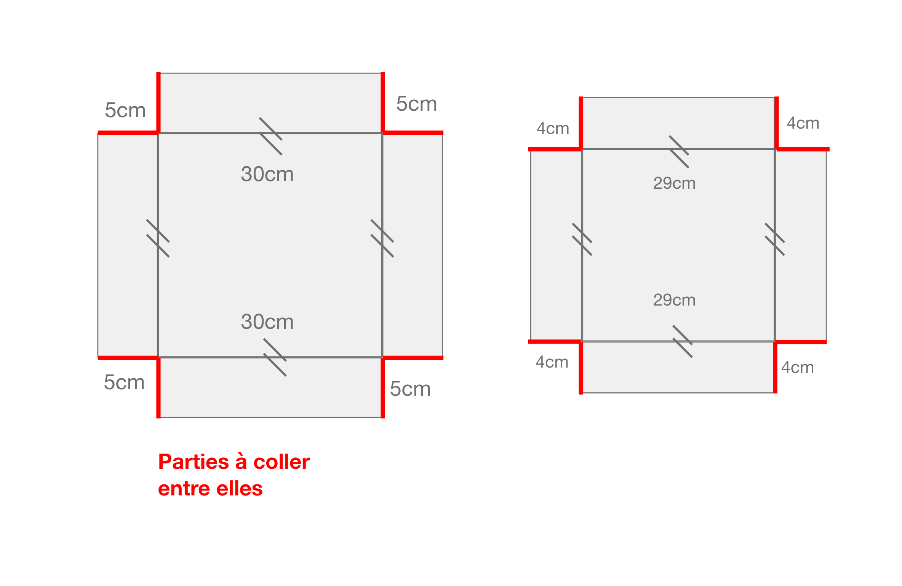


[**home**](../README.MD)
