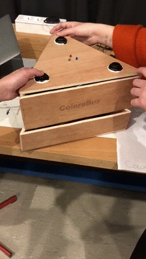

# ColorBuzz - Réalisation d’un jeu en Arduino

*Andrews Kimbembe, Salomé Gloanec, Justine Viot*

En groupe de trois personnes nous avons réfléchi à un concept de **jeu intéractif**. Nous souhaitions que celui-ci puisse se jouer à plusieurs, en particulier à trois puisque nous étions ce nombre. 

Nous voulions que notre jeu soit à composé de **LED et de buzzer** ainsi vous avons commencé une veille sur les jeux comportant ce type de matériel. 
Nous nous sommes rappelé du jeu “Super Simon”, emblématique de nos enfances et nous avons décidé de nous en inspirer. A l’inverse du jeu classique, le ColorBuzz (nom de notre jeu) se joue à trois, chaque joueur à un Buzzer et une LED qui lui est attribuée. 
ColorBuzz est un jeu en bois, de forme triangulaire composé de trois LEDs (bleu, rouge, vert) et de trois buzzers, nous avons également installé un moteur afin que le jeu puisse tourner. 
Nous avons ainsi placé le moteur de sorte qu’il puisse faire tourner la partie supérieur de la structure. Ce dispositif devait permettre que le jeu tourne à 180°, ainsi les joueurs n’auraient pas que leur LED à mémoriser mais également les LED des autres. Pour autant, lors du montage de la boîte de jeu le moteur ne faisait pas tourner celle-ci du fait que les hélices n’aient pas assez de prise sur le bois.

## Règles du jeu :
Répéter la séquence des Led lumineuse à l’aide des boutons aux couleurs correspondantes, en **équipe de 3**. Chaque personne a le contrôle d’un bouton. Une Led s’allume, appuyez sur le bouton Cette même Led s’allume suivi d’une autre, appuyez sur les boutons correspondants dans le même ordre Vous perdez lorsque vous vous trompez Pour plus de difficulté, le plateau de jeu du Colorbuzz **tourne en permanence**. Les joueurs, ne bougent pas de places mais devront pour autant continuer à ne contrôler qu’un seul bouton. C’est là que l’**esprit d’équipe** entre en jeu et devient même indispensable pour gagner !

## Le code :

### Initialisation des entrées et sorties

### Initialisation des Leds et buzzers

### Rotation du moteur pour faire tourner la boite

### Lancement du jeu

### Fin du jeu

## Le montage électronique : 

Par le biais d’Arduino, nous avons monté notre jeu en suivant plusieurs étapes. Dans un premier temps nous avons installé nos led. Nous avons choisi de mettre en place 3 led de manière à ce qu’elles s’allument aléatoirement et que le joueur doit appuyer sur le bouton associé à la led pour la jouer. Nous avons branché la led bleue à 55v, la rouge à 44v et la verte à 32v. Nous avons ensuite relié l’autre extrémité des led au côté + de la Board. Nous avons ensuite connecté nos boutons pour qu’ils soient rattachés à leur led attitrée. Puis nous avons mis en place le Piezo Speaker, rattaché en B4 et B5. De manière à faire fonctionner correctement notre projet nous avons ensuite connecté la carte Arduino Uno. Pour se faire, nous avons relié les ports 3V3, 5V, GND, ~11, ETHCS, 9, 8, ~6, ~5, SDCS, ~3, 2 ET TX1 à la board. La carte Arduino Uno a également été reliée à un Servo Moteur qui lui même est relié à la Board et à une batterie de manière à éviter de consommer trop d’énergie. Enfin, nous avons installé des résistances de 5v sur la board pour connecter les parties de la carte. Après les installations techniques, nous avons porté un intérêt au jeu en lui même. 

## Le montage du jeu :

Construction du jeu

Nous avons pensé créer une boite de forme triangulaire qui pourrait tourner sur elle même. Le principe était que la boite triangulaire soit en deux parties : La **partie supérieure** serait une boite de forme triangulaire comportant les leds, et les boutons sur la partie supérieure et dans la boite seraient cachés la carte Arduino et la Board. Cette partie supérieure repose sur une **seconde boite** de forme triangulaire qui contient le Servo Moteur, permettant ainsi de faire tourner la boite supérieure pour ainsi permettre aux joueurs d’échanger leurs boutons. Nous avons choisi de construire la boite dans du bois de manière à donner un côté esthétique et rustique, presque vintage à notre jeu. Nous aimions bien la confrontation qui se fait entre le bois très brut et très naturel face à l’électronique. Nous avons donc coupé des planches de bois de manière à créer nos **deux boites triangulaires**.

Nous avons ensuite gravé au laser la boite supérieure avec le nom de notre jeu : ColorBuz. Sur une autre face du triangle supérieur, nous avons gravé à la **découpe laser** également les règles de notre jeu. Enfin, pour l’assemblage nous avons eu l’occasion d’utiliser de la colle principalement pour sa robustesse, enfermant ainsi nos ressources électroniques dans la boite.

Rendu final du laser

Règle du jeu gravé sur la boite (pdf envoyé à l'atelier numérique)

Nom du jeu gravé sur la boite (pdf envoyé à l'atelier numérique)

## Problèmes rencontrés :
Ce projet fut pour à la fois **enrichissant et difficile**. En effet, nous avons rencontré quelques problèmes au niveau du montage, surtout le jour où nous avons construit la boite et mit la carte arduino dans celle-ci.
De nombreux fils se sont débranchés lors de la manipulation malgré que nous avions collé les branchements. 

## Ressentis du projet :
Nous avons aimé faire ce projet puisque nous avons **appris** beaucoup de choses au niveau codage et montage au niveau de la carte arduino. Nous sommes satisfait de notre rendu malgré notre **déception** que la boite ne tourne pas. Ce n’est pourtant pas un problème de code mais un problème de produit. 

Andrews Kimbembe, Salomé Gloanec, Justine Viot I3B
