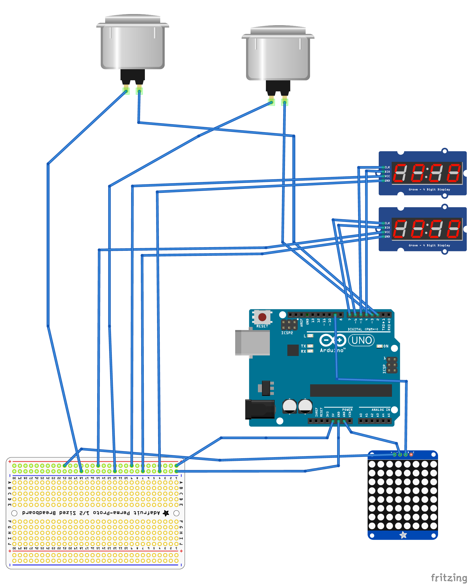
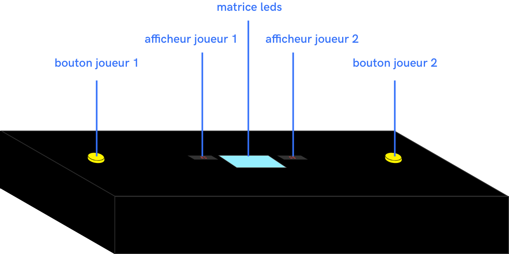

# ColorFight.ino
Jeu électronique réalisé sur Arduino par Samuel Lefevbre, Baptiste Deroche et Anna Rabeony 


## Le principe
Color Fight est un jeu électronique qui se joue à deux. Chacun des joueurs dispose d'un bouton et d'un afficheur pour visualiser son score. Le but du jeu est d'appuyer le plus de fois possible sur son bouton pour faire augmenter son score. Les joueurs gagne ainsi 1pt par clic tant que la matrice de leds affiche bleu. Cependant, lorsque celle-ci passe au rouge, les joueurs perdent 10pts s'ils appuyent sur leur bouton pendant ce moment-là. Le gagnant est le premier à atteindre 50pts.

## Le matériel :
- une carte Arduino
- une breadboard
- une poignée de cable
- un cable USB
- deux afficheurs 7 segments
- deux boutons poussoirs
- une matrice de 64 leds
- 4 pinces crocodile
- du papier cuisson
- une grande boite en contre-plaqué

## Le montage arduino :




## Le montage maquette :




## Les bibliothèques utilisées
Pour ce projet, nous avons utilisés deux bibliothèques : Easy Button et SevenSegmentTM1637

### Easy Button
La bibliothèque Easy Button nous permet d'écouter l'état du bouton. Il est utile dans notre jeu pour ajouter un point au compteur à chaque clic du bouton.

On commence par déclarer la positon des boutons :
```
EasyButton btn1(2);  //position du bouton 1 sur la pin 2
EasyButton btn2(3);
```

Ensuite on initialise et lorsque le bouton est actionné, on lance la fonction onPressed :
```
btn1.begin();
btn1.onPressed(jePresse);
```

Dans le void loop(), on lit en boucle l'état du bouton :
````
 btn1.read();
 ````

### SevenSegmentTM1637
Nous avons utilisé cette bibliothèque pour l'associer aux broches de l'afficheur à celles de la carte arduino

On associe les broches de l'afficheur aux broches de la carte arduino :
```
#define BROCHE_CLK1    5 //position de la broche CLK de l'afficheur1
#define BROCHE_DIO1    4
```

Puis on associe la librairie aux broches :
````
SevenSegmentTM1637 afficheur1(BROCHE_CLK1, BROCHE_DIO1);
```


