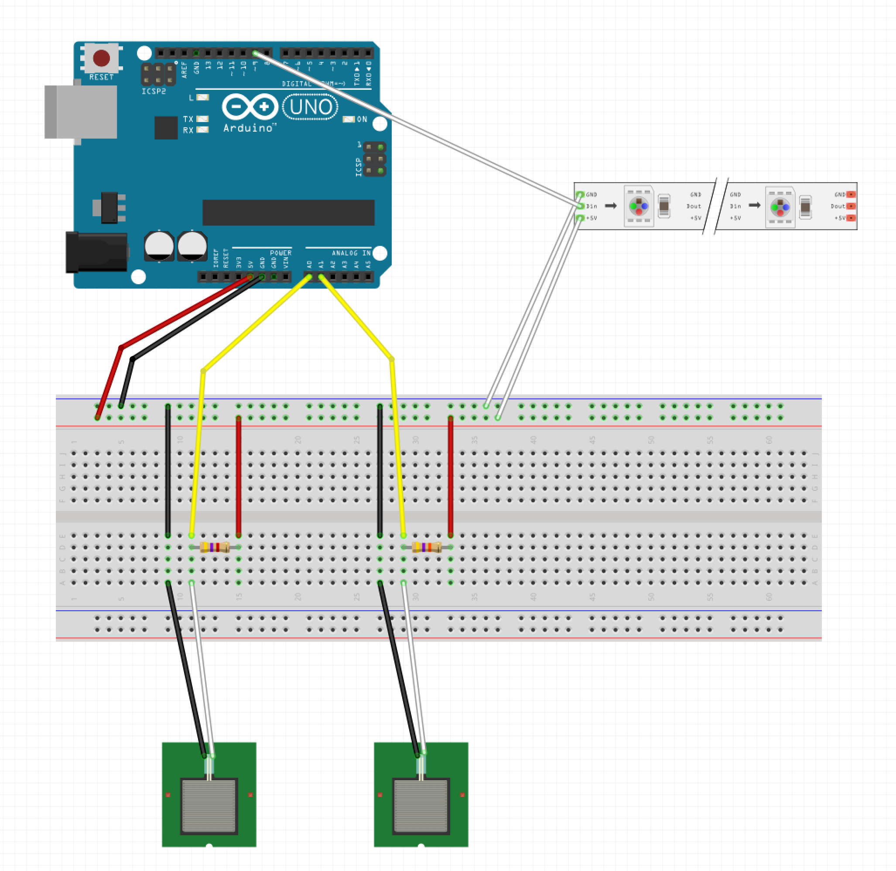
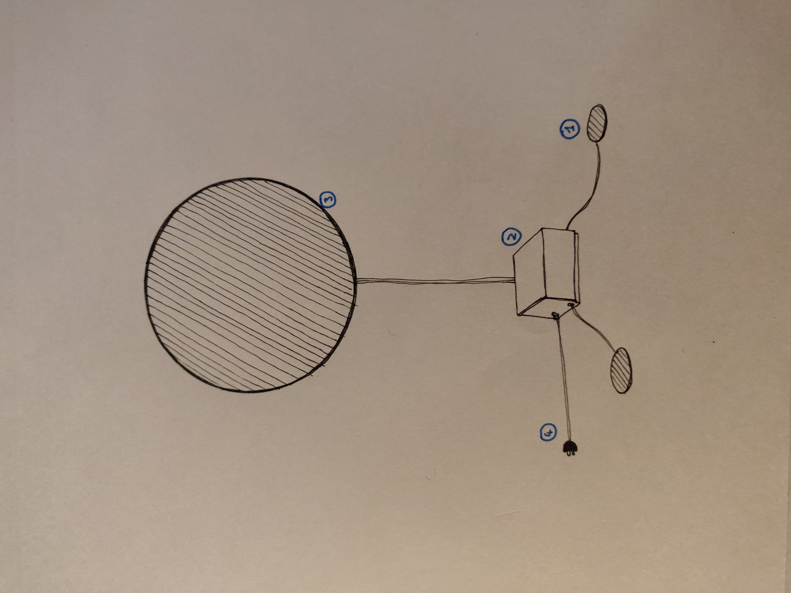

[**home**](../README.md)

# Eclipse : An arduino based game

The game eclipse is a game develloped during the arduino class at L'école de design de Nantes Atlantique.  It features a verry simple but extansible gameplay.  You will find below instruction to reproduce this experiments as well as the research process wich lead to the creation of this game.

**built by :** 
_Christophe Le Conte_
_Simon Renault_


## Gameplay & definitions

**Pad/pads :**  Presure sensors used to controle the movement of the avatars on the display.
**Display :** The circular led strip on wich the avatars are moving.
**Avatar/avatars :**  Strop of colored leds moving round the display and controled by the player. There are two avatars.

To start a new game both player have to press their pads simultaneously, this will put the device in play mode where each avatar navigate in the same direction on the display thus keeping the same distance between them. Passed this point the speed will continously increas till it reaches game's max speed.

The goal of the game is different for each player, the chaser represented by the orange avatar will have to try to colide with the blue avatar. For the chased player represented by the blue avatar the goal is to escape the chaser for the maximum amount of time.

Each player can only influence the direction of his avatar by pressing or not his pad.  While the pad is pressed the avatar move anti-clockwise, otherwise while the pas is not pressed it move clockwise.

The game end when the chased player is caught by the chaser, to restart a new game just press both pas again.

Please note that there is a default state encountered at the first start of the game or after a few seconds of inactivity where the display change to both side been lit in the avatars colors. (orange at right and blue at left ).  Feel free to customize this state to fit your need, such as turning of the led strip for energy consuption reasons.

## The story of this game

This game has been build during two weeks folowing the Arduino class at L'école de design Nantes Atlantique.  Our goal was to build a simple yet enjoyable game out of an arduino uni and limited pieces of ardware.

We wanted to use the bare minimum of cables and sensors as the game has to be easily craftable. Limiting the amount of electronic ardware was also making it easier to debug the circuit. Also for a designer point of view it is important to get the most out of what we have, and we still hav'nt figured out all the possible interaction we can build with just a circular led strip and two pressure sensors.  So we prefer to keep it minimalistic and use the ardware we have at it's maximum.

## Hardware of the device

As said before we tried to build this game with a minimum of ardware. In  our version we used :
 - One arduino uno
 - Two presure sensors
 - One adressable led strip
 - One breadboard
 - Cables
 - Two 47kh resistors
 - Long cables 
 - electric or usb alimentation for the arduino board
 - Cardboard circle 35cm in diameter and as thick as the led strip is wide.
 - 2 circles 40cm in diameter

Feel free to replace the presure sensors with other types of sensor.



#### How to build ?

1) Cut one or multiple circles in cardboard so that they are as thick as the led strip is wide. They should be 35cm in diameter or at least smaller than the outer circles.
2) Buy or cut in some steady material two circles, 40cm of diameter.  Paint them in the color of your choice.
3) Solder long cables to the pressure sensors.
4) Sold long cables to the led strip.
5) Mount the circuit as shown on the schema.
6) Make or boy a box wich will contain the arduino uno and eventualy the breadboard.  Cut holes to alow to plug the electic alimentation, the sensors cables and the led strip cables.

@todo : building schema



## Software of the device

The software of the game make use of the arduino programing languages.

We also used the Fastled library to control the led strip.
[Fastled website](http://fastled.io/)

```c


```


## Future releases and impovements

We wish to improve the gameplay for the chased player as for now he can only end up losing the game.  To fit this goal we plan to add a simple "max-score" system to the game. It would compute at each end of a game the time elapsed wich will be the score of the chased player, then it would display it on the circle 
  
Upgrading the hardware to hide the cables 

Using wireless comunication to gather data from the game from a computer.  This would alow us to do video maping on the white side of the divice for a different playing experience.

## Copyright and further use
 
This game is completely open source so feel free to use it, reproduce it or modify it as you want. A credit to the original project is not mandatory but would be highly apreciated, so feel free to talk with us about ideas of improvement or modifications.

**built by :** 
_Christophe Le Conte_
_Simon Renault_


[**home**](../README.md)
