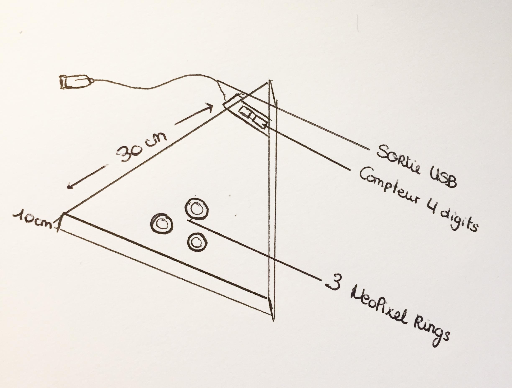
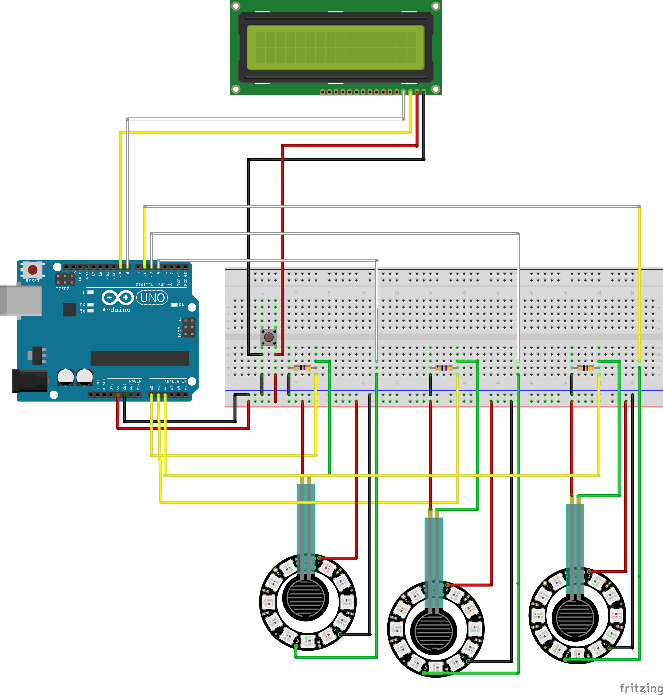

[**home**](../README.md)

## Projet Arduino : Dance Fingers

###### Jeu réalisé par Alia Elkayar - Sophie Le Gallo - Virginie Souffoy

 

### Principe du jeu  
> Jeux de danse pour doigts, à chaque fois qu'une ou plusieurs led(s) s'allume(nt) le joueur doit cliquer au centre de la led afin de rester ne vie le plus longtemps possible.
> Au départ ce dernier possède 5 vies. S'il ne touche pas au bon moment il perd une vie et s'il touche au bon moment il en gagne une.

#### Matériels utilisés 
> 3 Néopixel Rings     
> 1 compteur 4 digits   
> Carte arduino uno  
> 3 capteurs de pression  
> 1 bouton  
> 3 résistances  
> Des fils conducteurs
> 

#### Notice de montage 
 
> Pour réaliser le montage vous aurez besoin :
> De **carton** afin de créer une boite assez grande pour pouvoir y placer le circuit arduino à l'intérieur. 
> 
> Notre boite en forme de triangle fait  **30 cm** de côté pour le couvercle et de côté nous avons fait des rectangles de **30cm** de longueur et **10cm** de largeur.
> 
> Ici, nous avons utilisé en plus de la structure de base en **carton** du **miroir** pour l'ensemble ainsi que du scotch coloré. 

##### Code 
> Cf : **JustDanceFingers_I3A** dans le dossier Ekayar_LeGallo_Souffoy 

#### Notice d'utilisation
1. Enfilez l'anneau autour de votre pouce et orriculaire
2. Ouvrez Youtube et mettez de la Tecktonik !
3. Appuyez sur le bouton gris pour lancer la partie
4. Touchez le centre des leds lorsqu'elles s'allument afin de maintenir vos vies le plus longtemps possible
5. Inscrivez votre nom sur une feuille avec votre temps et défiez les personnes autour de vous ! 

#### Schéma de montage
 

[**home**](../README.md)

>
>

