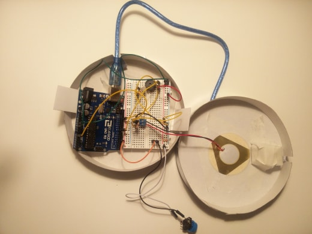
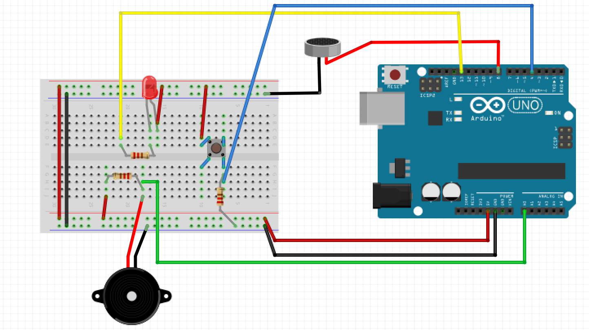

## Le jeu de l'espace

###### Réalisé par Lucie Marécaille et Manon Leverrier

### Le principe
*Le jeu de l'espace* est un jeu musical, avec un seul joueur qui doit répéter le rythme joué par la machine. Si le rythme est le bon, la difficulté augmente.

### Le matériel :
- 1 carte Arduino Uno
- 1 cable USB
- 1 breadbord et des câbles
- 1 boutons poussoir
- 1 led
- 1 buzzer
- 1 capteur piezo
- 3 résistances (220 Omhs, 120k Ohms et 10k Ohms)



### Le montage


La carte arduino est relié à travers une board à une led qui est caché dans la boîte, mais aussi à un buzzer qui donne le rythme et à un piezo qui capte le rythme que le joueur tape sur la boîte. 

### Le code

Le jeu commence par l'appuie sur le bouton, lançant la mélodie sur le buzzer. Ensuite, une fois que la mélodie est finie, la détection (= le rythme joué par la led caché, simultané ou non à celui du joueur).

Une partie du code sert à detecter le rythme du joueur et déclare qu'une valeur du piezo supérieur à un nombre donné (`seuilMinimum`, ici 80) correspond bel et bien à un tapotement du joueur, lançant la détection.

Une autre partie importante est celle qui déclare les rythmes, pour les 3 niveaux de difficultés du jeu, dans un tableau à trois dimensions (correspondant respectivement aux niveaux, valeurs des notes et durées des notes).

````
int melody2[3][2][5] = {
  {
    { NOTE_DO4, NOTE_MI4, NOTE_SOL4, NOTE_SI4, NOTE_DO5 },
    { 4, 1, 2, 2, 4 },
  },
  {
    { NOTE_DO4, NOTE_MI4, NOTE_SOL4, NOTE_SI4, NOTE_DO5 },
    { 1, 4, 2, 2, 4 },
  },
  {
    { NOTE_DO4, NOTE_MI4, NOTE_SOL4, NOTE_SI4, NOTE_DO5 },
    { 4, 4, 4, 8, 4},
  }
};
````
Les rythmes sont implantés dans le buzzer mais aussi dans la LED, ce qui permet de valider ou non le niveau si les tapotements du rythme sont synchronisés avec l'état `HIGH` de la LED.  

````
void melodyLedOn() {
  digitalWrite(led, HIGH); 
  nextTime1 = 1000 / melody2[niveau][1][note];
  goTime = millis() + nextTime1; 
  if (analogRead(piezo) > seuilMinimum) {
    score++;
  }
}
````
Lorsque que les tapotements sont corrects à 80%, le niveau est validé, le buzzer émet le bruit de validation et passe au niveau suivant.  
 
````
if (score == nbNotes - 1) {
      playing = true;
      niveau++;
      score = 0;
      jouerWin(); 
  }
````

Sinon, le buzzer émet le bruit d'échec et rejoue le niveau.