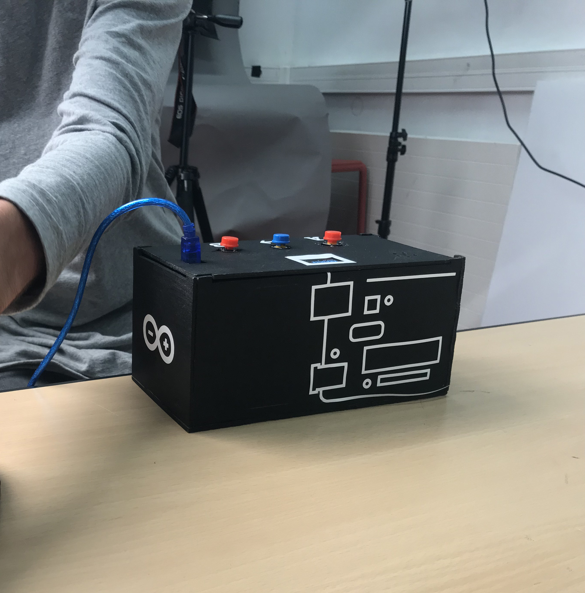
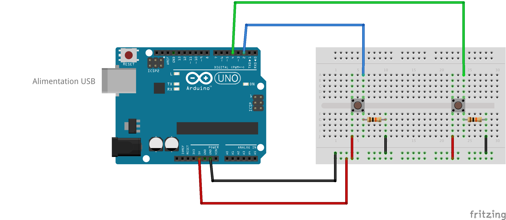
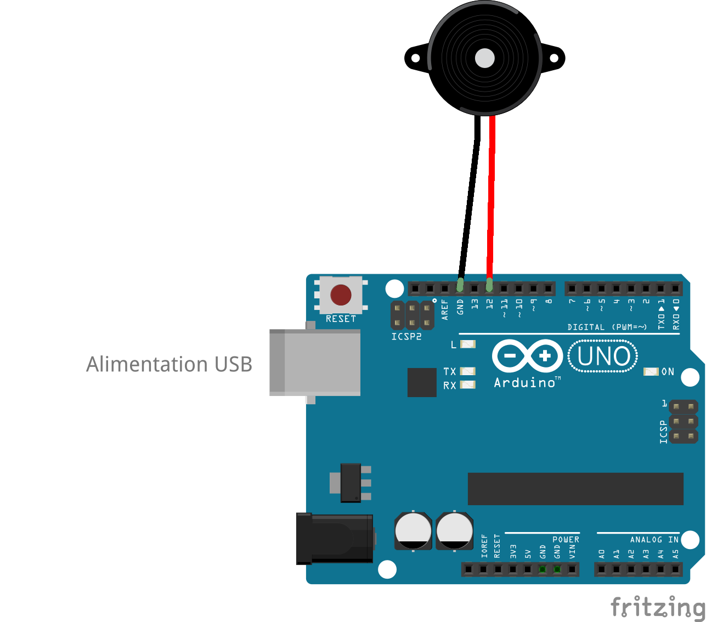
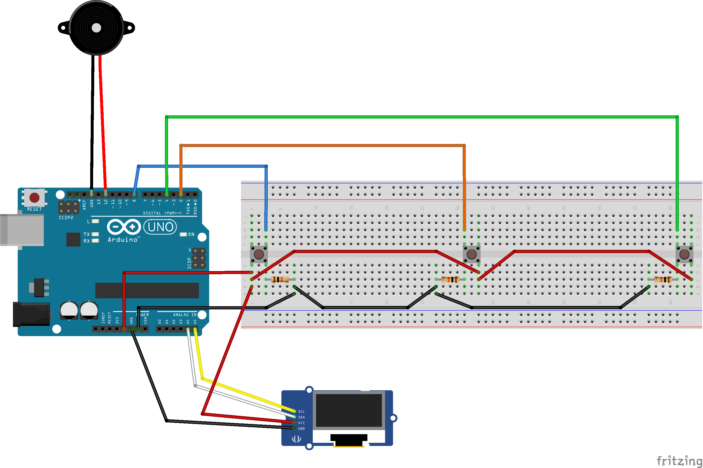
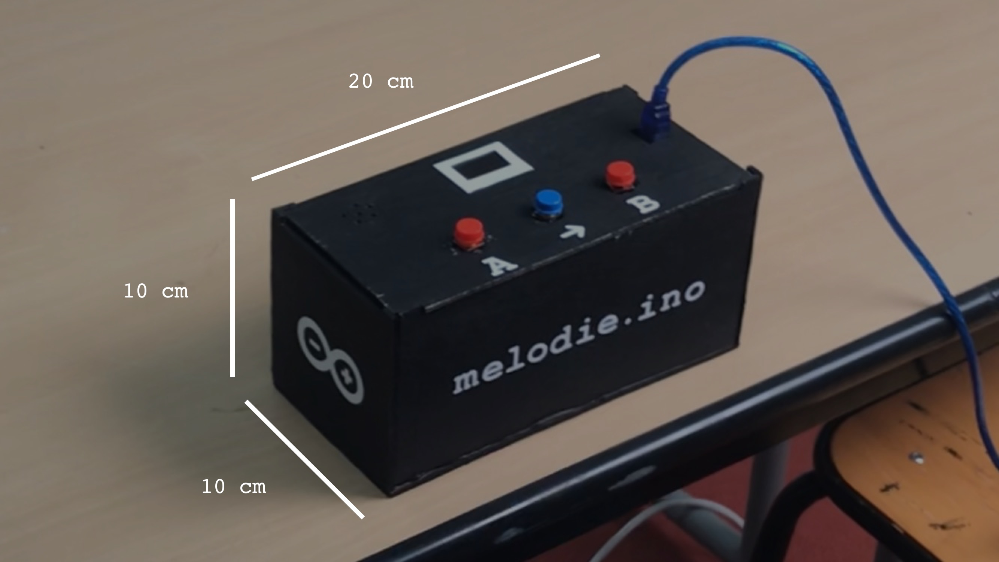
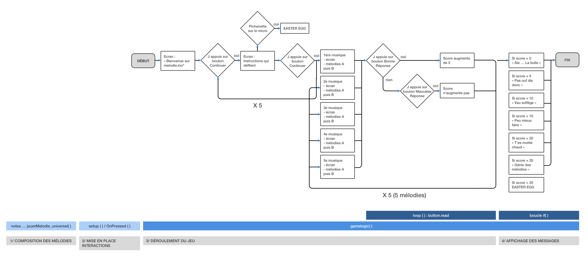

[**home**](../README.md)


# MELODIE.INO

###### Petit jeu électronique basé sur Arduino, réalisé par Antoine Cesbron, Mathis Freudenberger et Victor Ducrot, étudiants en I3B.



____

</br> 
## Le principe
</br>
Le joueur a devant lui une boîte avec un écran, 3 boutons et une mini enceinte. À chaque tour un titre de musique apparaît sur l'écran, il écoute 2 mélodies : la mélodie A et la mélodie B, puis il doit choisir laquelle correspond à la chanson affichée en appuyant sur le bouton correspondant.  

</br>  </br> 

(Voir également la vidéo (video-melodieino.mp4) fournie avec le code final dans le dossier "le doc" ou "melodieino", démontrant le déroulement d'une partie). 

</br> 
## Quelques codes de test
</br>
### LA BIBLIOTHÈQUE EASYBUTTON
>Pour l’utilisation des boutons, nous avons utilisé la bibliothèque EasyButton disponible dans le gestionnaire de bibliothèques Arduino. Cette bibliothèque permet de gérer des fonctions comme onPressed qui déclenche des évènements quand on appuie une fois sur le bouton. 

#### 1/ Le montage 
</br> 
 

#### 2/ Le code de deuxboutons.ino
Nous avons testé comment faire pour gérer 2 boutons grâce à cette bibliothèque, c’est à dire attribuer une valeur à chacun et les faire s’afficher dans le moniteur série. 

On commence par importer la bibliothèque dans le programme : </br> `#include <EasyButton.h>`

Ensuite on déclare les objets avec `EasyButton` en leur donnant un nom et en précisant la pin à laquelle est connectée le bouton :</br>

```
EasyButton button1(8);
EasyButton button2(4);
```
On met en place le **setup** avec l'initialisation des boutons `buttonA.begin();` et la fonction appelée quand ils sont pressés `buttonA.onPressed(onPressed_bon);`.

Puis on écrit la fonction qui sera appelée une fois le bouton pressé. 

```
void onPressed1() {   // Une fois le bouton pressé un message s'affiche dans le moniteur série. 
Serial.println("BOUTON 1");
}
```
Enfin dans le **loop** on lit en boucle l'état de notre bouton avec `button1.read();`.

</br>

### LE PIEZO
> Notre jeu étant basé sur un Blindtest, il doit donc passer de la musique, c'est pourquoi nous avons décidé d'utiliser le piezo, une mini enceinte qui permet à un Arduino de produire du son. Mais elle permet également de servir de micro et recevoir de l'information (c'est ce que nous verrons un peu plus tard dans cette documentation). 

#### 1/ Le montage
</br>


####2/ Le code de piezo.ino

On compose tout d'abord la mélodie en rentrant le **nombre de notes**, **quelles notes sont jouées** et **leurs durées**. Quand on téléverse, la mélodie se joue. 

Nombre de notes : `int nombre_notes_melo1vraie = 13;`

Définition des notes : 

```
int melodie_1vraie[] = {

NOTE_MI6, NOTE_RE6, NOTE_FAD5, NOTE_SOLD5, NOTE_DOD6, NOTE_SI5, NOTE_RE5, NOTE_MI5, NOTE_SI5, NOTE_LA5, NOTE_DOD5, NOTE_MI5, NOTE_LA5, };
```

Durées des notes : 

```
int duree_note_melo1vraie[] = {
8, 8, 4, 4, 8, 8, 4, 4, 8, 8, 4, 4, 4, };
```

Puis on écrit la fonction `jouerMelodie()` (vue en cours) qui permet de jouer cette mélodie.

Et enfin on fait jouer la mélodie dans le **loop**, en appelant cette dernière fonction : 

```
void loop() {   jouerMelodie();
}
```

</br>
### L'ECRAN OLED + SYSTÈME EN INDEX

> Notre jeu étant basé sur le fait de deviner la bonne mélodie parmi deux, nous voulions donc que le joueur soit informé du titre de la mélodie qu'il doit deviner. Nous avons tout d'abord pensé à l'affiche sur une feuille, mais ce n'était pas très interactif. Nous avons alors appris qu'il était possible d'afficher des choses sur un mini écran OLED grâce à une carte Arduino, nous avons donc choisi cette solution. 

#### 1/ Le montage 
Montage très simple avec 4 fils (GMD, 5V, SCL, SDA). Nous n'avons pas vu cela en cours alors nous avons commencé avec la librairie Adafruit pour finalement utiliser la librairie U8G2.

 </br>

</br>
####2/ La librairie 

> Nous n'avons pas vu les écrans en cours, alors nous avons commencé avec la librairie Adafruit pour finalement utiliser la librairie U8G2 qui est bien plus simple pour du texte. Au niveau des 2 polices utilisées, elles sont téléchargeables sur github [via ce lien.](https://github.com/olikraus/u8g2/wiki/fntlist8x8.)
> 
> Pour faire défiler les textes avec un bouton, nous avons utilisé la librairie EasyButton.

On importe donc la librairie dans le fichier avec `U8X8_SSD1306_128X64_NONAME_HW_I2C ecran(/* reset=*/ U8X8_PIN_NONE);`

</br>
####3/ le code de oled_changement.ino

> Ce code est notre première expérimentation pour faire apparaître un texte après l'autre lorsqu'on appuie sur ce bouton. C'est sur ce principe que nous avons ensuite développé notre code final avec les index qui augmentent.

Tout d'abord dans le **setup**, on initialise le bouton ainsi que l'écran : 

```
button.begin();
ecran.begin();
```
On instaure également la fonction appelée quand un bouton sera pressé : `  button.onPressed(onPressed);`.

Puis on écrit cette dernière fonction, on indique ce qu'elle fait, en l'occurrence elle augmente l'index de 1 : 

```
void onPressed() {   index += 1;
}
```
Enfin dans le **loop**, on lie l'état du bouton avec ` button.read();`, et on indique ce qui s'affiche sur l'écran pour chaque valeur de l'index avec une boucle `if`. 

```
if (index == 0) {  // On importe la font  ecran.setFont(u8x8_font_chroma48medium8_r);

// On compose le message affiché sur l'écran en indiquant sa taille et ses coordonnées. 

ecran.drawString(0, 0, "Bienvenue au blind test");
}
```

Nous avons ainsi créé logique de jeu en étape. C'est autour de ceci que nous allons développer notre projet de mini-jeu. 

</br> 
## melodie.ino

### LE MATÉRIEL
* 1 carte Arduino
* 1 câble USB
* 1 Bredbord
* Des câbles
* 1 piezo
* 2 boutons poussoirs
* 1 résistance

### LE MONTAGE

</br>  </br>

### LA MAQUETTE
</br>


</br>
### LE CODE
Le code est découpé en 4 parties : 

* La composition des mélodies
* La mise en place des interactions
* Le déroulement du jeu
* L'affichage des messages de fin en fonction du score

Le principe du programme est résumé dans ce diagramme :

</br>  </br>

(Excusez-nous pour la taille, vous pouvez le retrouver en grand dans le dossier "melodie" ou "le doc/visuels", au nom de diagramme_melodieino.png)

</br> 
### 1/ La composition des mélodies (ligne 29)

>Durant cette partie, on rentre le **nombre de notes**, **quelles notes** et **leurs durées** pour chaque chanson. 2 fois pour chaque chanson du coup, car il y a à chaque fois une vraie et une fausse. </br> >Exemple avec la vraie mélodie de Nokia :

Pour cela on reprend simplement le code présenté plus haut qui permet de composer les mélodies. Et on compose donc 10 mélodies, une vraie et une fausse pour chaque musique, ainsi que 2 sons pour les bonnes et mauvaises réponses. 

</br> 
### 2/ Mise en place des interactions (ligne 236)

>On met en place le setup avec l'initialisation des boutons,les fonctions appelées quand ils sont pressés et l'initialisation de l'écran. 

**À la ligne 243**, on initialise donc tout d'abord les boutons ainsi que l'écran : 

``` 
buttonA.begin();
buttonB.begin();
button3.begin();
ecran.begin();
```

Puis **à la ligne 261**, on définit les fonctions de bonnes et mauvaises réponses, exemple avec la fonction de bonne réponse `void onPressed_bon() { ... }`: 

On augmente le score dès que le bouton est pressé : 

```
score = score + 5;
```

On compose le message affiché pour indiquer la bonne réponse, avec les coordonnées et la taille : 

```
ecran.draw2x2String(0, 0, "BONNE");
ecran.draw2x2String(0, 2, "REPONSE");
```

On affiche ensuite le score en affichant la variable `score`, pour tenir le joueur informer à chaque tour : 

```
ecran.drawString(0, 5, "Score=");
ecran.setCursor(200, 300);
ecran.print(score);
```

En même temps on joue la mélodie de bonne réponse : 

```
jouerMelodie_universel( nombre_notes_victoire, melodie_victoire, duree_note_victoire );
```
Puis on attend 4 secondes, on augmente `index`et le jeu continue, en appelant `gamelogic()`. 

</br> 
### 3/ Le déroulement du jeu 

>Le jeu se compose en plusieurs étapes, en effet on commence pour l'explication pour on écoute les mélodies les unes après les autres. Pour cela on a donc structuré le jeu avec un `index`que l'on déclare au début en -1. Puis à chaque fois qu'un bouton est pressé, l'index augmente et on passe à l'étape d'après. 

Le `gamelogic`se décompose donc en 12 étapes. Chaque étape est définie ainsi avec une condition : `if (index == 0) { ... }`. </br></br>

* **Il y a les étapes d'explication où on lit seulement ce qu'il y a sur l'écran. (ligne 318)**

**À la ligne 324**, reset de l'écran pour afficher un nouveau message :

```
ecran.clearDisplay();
```
**À la ligne 327**, importation de la font :

```
ecran.setFont(u8x8_font_chroma48medium8_r);

```
**À la ligne 329**, composition du message avec sa taille et ses coordonnées :

```
ecran.drawString(0, 2, "BIENVENUE SUR");
ecran.drawString(0, 4, "MELODIE.INO");
```
</br>

* **Puis les étapes d'écoute de mélodie, où l'on doit à chaque fois joueur les deux mélodies puis changer les fonctions appelées par chacun des boutons, en effet les bonnes réponses ne pouvaient pas tout le temps être sur le bouton A. (ligne 400)** 

On commence comme de la même manière en faisant un reset de l'écran puis en important la font. </br>

Puis **à la ligne 411**, on compose le message qui indique le nom de la mélodie : 

```
ecran.drawString(0, 0, "2/LETTRE A");
ecran.drawString(0, 1, "ELISE");
```
**À la ligne 415**, on attend 1 seconde, puis la mélodie A est jouée en même temps que l'affichage du message "Mélodie A" : 

```  
delay(1000);
ecran.drawString(0, 4, "Melodie A");
// On appelle le fonction jouerMelodie_universel en lui indiquant quels paramètres appliquer pour chaque mélodie jouerMelodie_universel(nombre_notes_melo2fausse, melodie_2fausse, duree_note_melo2fausse );
```

**À la ligne 421** pareil pour la mélodie B : 

```
delay(1000);
ecran.drawString(0, 6, "Melodie B");
jouerMelodie_universel(nombre_notes_melo2vraie, melodie_2vraie, duree_note_melo2vraie );
```
Enfin **à la ligne 426**, on attribue les bonnes et mauvaises réponses aux boutons : 

```
buttonA.onPressed(onPressed_mauvais);
buttonB.onPressed(onPressed_bon);
```

</br> 
### 4/ Affichage des messages de fin (ligne 480)

En fonction du score un message différent s'affichera à la fin de la partie. 

Pour cela **à la ligne 485** on a introduit une autre boucle `if` dans l'index qui correspond à la fin de la partie. On affiche le score ainsi qu'un message personnalisé en fonction de ce dernier : 

```
if ( score == 0) {    // Affichage du score    ecran.drawString(0, 0, "Score=");
// Affichage d'une variable sur l'écran : le score     ecran.setCursor(200, 0);
ecran.print(score);

// Composition du message personnalisé avec sa taille et ses coordonnées    ecran.draw2x2String(0, 2, "AIE ...");
ecran.draw2x2String(0, 4, "LA");
ecran.draw2x2String(0, 6, "BULLE");
}
```

On fait ensuite pareil pour les autres scores : 

`if ( score == 5) { ... }` `if ( score == 10) { ... }` ... 

Nous avons donc composé un message personnalisé pour chaque score : 

* 0 = Aïe ... la bulle
* 5 = Pas ouf dis donc
* 10 = Peu mieux faire 
* 15 = Va au solfège
* 20 = T'es moitié chaud
* 25 = Génie des mélodies

Puis **à la ligne 582**, quand on appuie une fois de plus sur le bouton suivant on recommence la partie, l'index et le score reviennent à 0 : 

```
else if (index == 12) {     index = 0;
score = 0;
...
}
```

</br>
## BONUS / L'EASTER EGG

En faisant tester le jeu par des camarades nous nous sommes rendu compte qu'il était possible de "hacker" le jeu, du moins débloquer une situation initialement pas prévue. En effet si, pendant le didacticiel, le joueur appuie sur le bouton de bonne réponse son score pourra à la fin être plus élevé que 25. Aucun des messages de fin ne correspond à cela, il ne passait donc rien dans ce cas là. 
</br> 
Nous avons alors pensé à ajouter quelque chose qui est typique de la culture "geek" / jeux vidéo / développement : un Easter Egg. C'est une fonction cachée accessible grâce à une combinaison de touches ou de clics. 
</br></br>

###1/ Le score plus élevé que 25 (ligne 532)
Il suffit donc d'afficher quelque chose de spécial quand cette condition (score plus élevé que 25) était remplie :  

```
if (score > 25) {   ecran.setFont(u8x8_font_chroma48medium8_r);
ecran.drawString(0, 0, "EASTER");
ecran.drawString(0, 1, "EGG      oooo   ");
ecran.drawString(0, 2, "        o     o ");
ecran.drawString(0, 3, "       o       o");
ecran.drawString(0, 4, "       o       o");
ecran.drawString(0, 5, "       o       o");
ecran.drawString(0, 6, "        o     o ");
ecran.drawString(0, 7, "         oooo   ");
}
```
Mais ce bout de code créant des problèmes de stabilité pour des raisons inexpliquées (le programme cessait de fonctionner totalement après la 3e mélodie), nous l'avons changé avec `if ((score == 30) && (score == 35) && (score == 40) && (score == 45))` La condition est moins optimisée, mais cela semblait marcher plus. 
</br></br>
Mais nous nous sommes rendu compte que même avec ce nouveau code, le programme buggait une fois sur trois. Nous en avons parlé avec Béranger pour essayer de trouver une autre solution. Il nous a parlé d'utiliser d'autres boutons ou d'utiliser la fonction `INPUT` du piezo.

</br>
###2/ Mettre une pichenette sur le micro (ligne 604)

Nous avons donc essayé d'exploiter cela. À présent pour déclencher l'Easter Egg le joueur doit mettre une pichenette sur le micro. 
Pour rendre cela possible, nous avons déclaré le piezo en tant qu'input dans le `setup` :  `pinMode(BROCHE_HP, INPUT);`. 
Puis nous avons ajouté la lecture de l'input du piezo dans le `loop` (le tout en affichant la même chose sur l'écran) : 

```
buttonState = digitalRead(BROCHE_HP);
if (buttonState == HIGH) {  ...
}
```

Nous avons réalisé que cela marchait, mais créait d'autres bugs, notamment sur le comptage du score dans la variable du même nom, le score pouvait être égale à 1 alors que normalement il augmente de 5 à chaque bonne réponse, plus des bugs d'affichage sur l'écran. 
</br> </br>
Nous avons donc préféré ne pas inclure l'Easter Egg dans le programme pour la présentation finale, car craignant des bugs, nous voulons que l'expérience des joueurs ne soit pas gâchée. </br>
Mais nous avons tout de même voulu vous présenter cette partie de notre projet, car nous pensons que cela a pu tout de même vous intéresser. 
</br> </br>


</br>
____

###Merci de votre lecture

</br>
Antoine Cesbron </br>
Mathis Freudenberger </br>
Victor Ducrot </br>
I3B

[**home**](../README.md)
