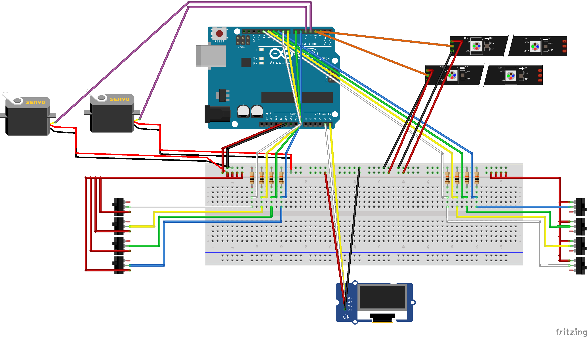
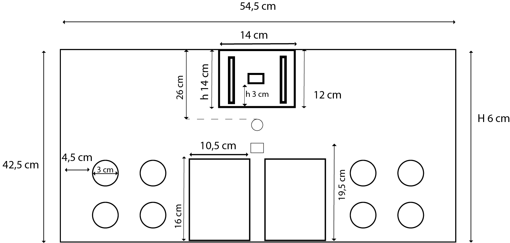
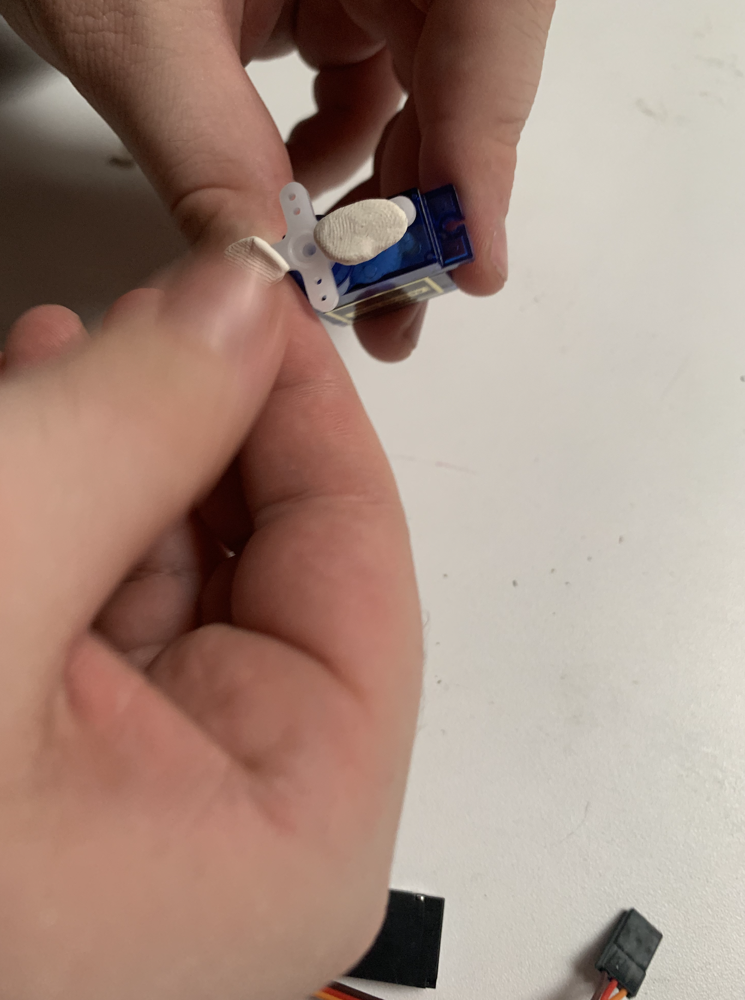
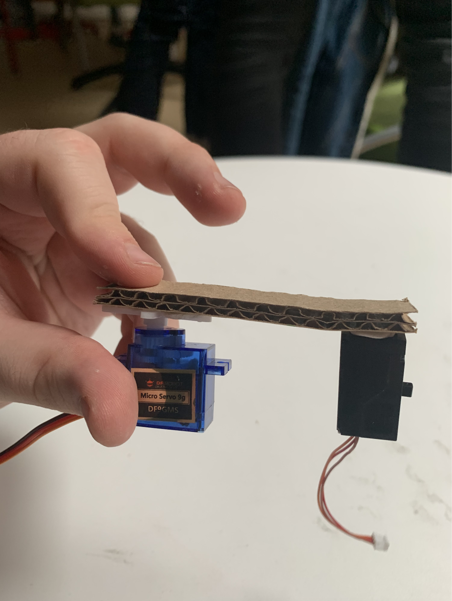
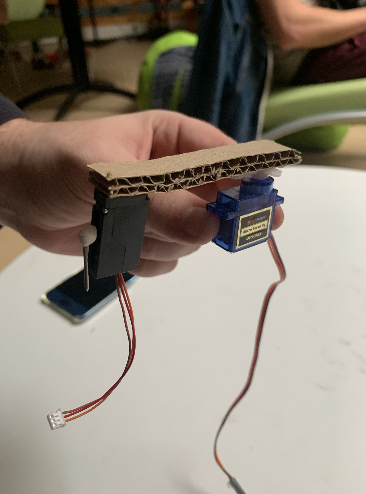
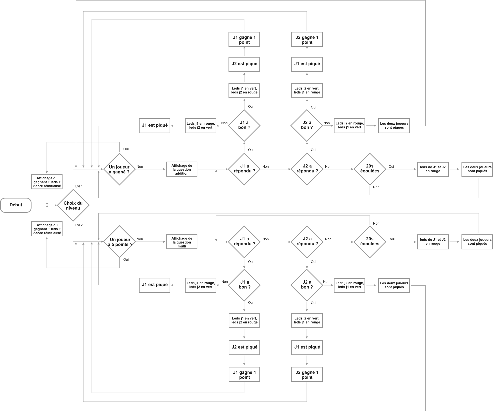
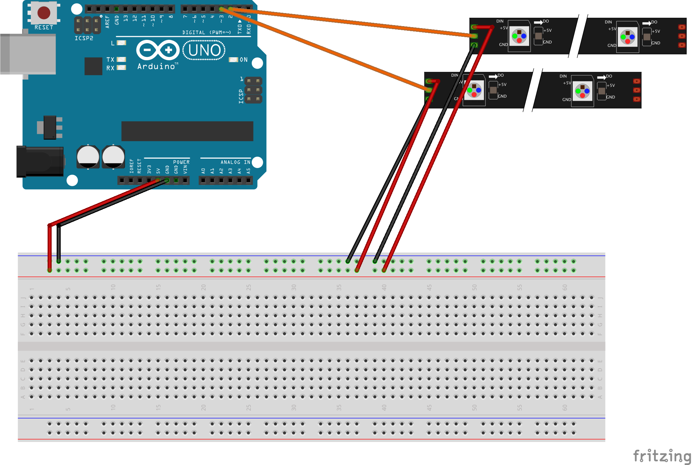
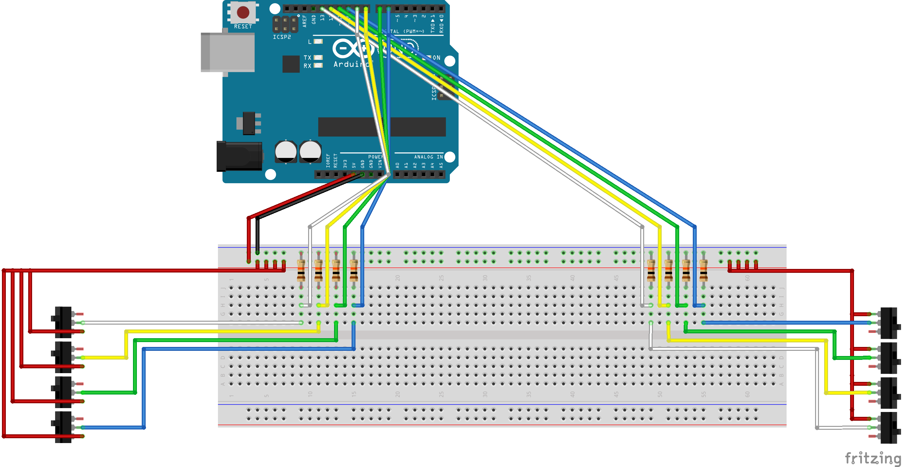
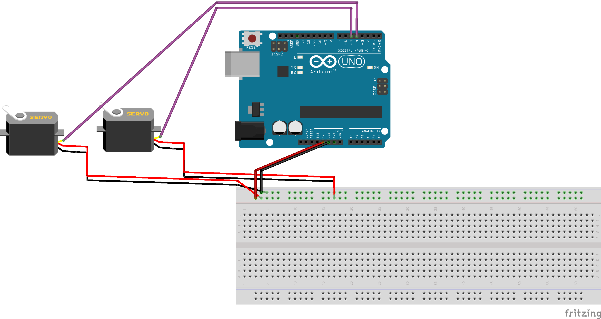
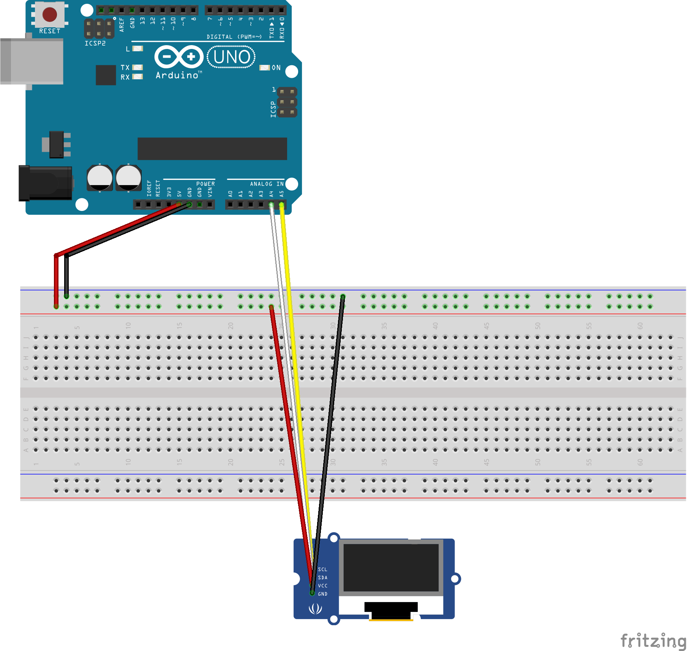

[**home**](../README.md)

# MysterMaths
---
**Ce petit jeu éléctronique est basé sur du arduino.**

Réalisé par **Quentin Hamon** et **Auriane Pouzin**.

---
### Le principe
*MysterMaths* est un jeu qui s'inspire de notre enfance. Nous nous souvenons tous de nous en tant que Shelock Holmes à résoudre les calculs mathématiques et à apprendre difficilement les tables de multiplications. Ainsi nous nous sommes posé la question de comment apprendre et être rapide au calcul mental de manière ludique ?

Le but du jeu est de répondre à une formule mathématique et répondre le plus vite possible. Avant de jouer, les deux joueurs doivent placer une main sur une plaque. L'écran LCD affiche de niveau: le premier ce sont des additions, le deuxième des multiplications. Pour jouer, les joueurs doivent répondre à la question en cliquant sur la bonne réponse. Si le joueur a juste, il gagne 1 point émit par la lumière verte et par l'afficheur si non il se fait piquer par la "massu" indiqué par la lumière rouge. Il ne gagne aucun point. Cependant si aucun des joueurs ne répondent à la question au bout de 20 secondes, ils se font piquer tous les deux. Les adversaires ont 5 manches pour se défier.

---

###Le montage du Jeu

#### Matériels

##### Matériels électroniques:
- 1 carte Arduino Uno
- 1 cable USB
- 1 breadbord et des câbles
- 8 résistances 10K ohm
- 1 alimentation 5v
- servomoteur classique
- servomoteur linéaire
- 2 rubans à 3 leds RGB neopixels
- 8 boutons de type arcade
- Afficheur grove oled 0.96 inch

#### Matériels pour la maquette:
- carton 
- boîte de 42,5 x 54,5 x 6
- boîte de 14 x 14 x 12
- un clou
- colle

#### Plan du Montage
Plan de montage du jeu MysterMaths

#### Plan de la maquette 
Plan de la maquette MysterMaths

#### Les étapes du montage des servomoteurs:
- Prendre les matériaux: servomoteur classique, servomoteur linéaire, un clou, du carton et de la colle ( pour les représentation la colle a été remplacé par la pate à fixe) 
- Mettre de la pate à fixe sur le palonnier en croix du servomoteur classique

- Attacher un morceau carton sur le palonnier en croix du servomoteur

- Coller le servomoteur linéaire sur la deuxième extrémité du carton 

-Coller le clou sur le servomoteur linéaire

-Connecter le tout sur la carte arduino

#### Le code
Diagramme simplifié du code:

Nous allons maintenant vous expliquez comment réaliser les éléments de la maquette.

Pour réaliser ce jeux, certaines librairies sont nécessaires. [Servo.h](https://github.com/arduino-libraries/Servo/blob/master/src/Servo.h) pour les servo moteurs, [Adafruit_NeoPixel.h](https://github.com/adafruit/Adafruit_NeoPixel) pour les rubans leds et [SeeedOLED.h](https://github.com/Seeed-Studio/OLED_Display_128X64/blob/master/SeeedOLED.h) pour l'affichage de l'écran oled.
Ces différentes librairies sont déclarées avant la partie setup. 

    #include <Wire.h> 
    #include <SeeedOLED.h> // bibliothèque écran oled
    #include <Servo.h> // bibliothèque servo moteur
    #include <Adafruit_NeoPixel.h> // bibliothèque rubans led
    #ifdef __AVR__
    #include <avr/power.h>
    #endif

Nous allons ensuite déclarer les variables et indiquer à quelles pins les relier. Pour les leds ils faut commencer par indiquer le nombre de leds sur chaque ruban.

    // Sur quel pin est branché le ruban leds
    #define PIN            3
    #define PIN2            2

    // Indication du nombre de leds par rubans
    #define NUMPIXELS      3
    #define NUMPIXELS2      3
    
    // initialisation pour la librairie neopixel, prend en paramètre le nombre de leds et le pin sur lequel envoyer le signal
    Adafruit_NeoPixel pixels = Adafruit_NeoPixel(NUMPIXELS, PIN, NEO_GRB + NEO_KHZ800);
    Adafruit_NeoPixel pixels2 = Adafruit_NeoPixel(NUMPIXELS2, PIN2, NEO_GRB + NEO_KHZ800);
    
#####Le montage des leds:    
  
    
    
    
Nous déclarons ensuite les boutons, quatre boutons pour le joueur 1 (boutonA,boutonB,boutonC,boutonD) et quatre autres pour le joueur 2 (boutonA2,boutonB2,boutonC2,boutonD2)

    //definition des pins pour les boutons. les boutonX2 sont les boutons du joueur 2.
    #define BROCHE_BOUTONA  6
    #define BROCHE_BOUTONB  7
    #define BROCHE_BOUTONC  8
    #define BROCHE_BOUTOND  9
    #define BROCHE_BOUTONA2  10
    #define BROCHE_BOUTONB2  11
    #define BROCHE_BOUTONC2  12
    #define BROCHE_BOUTOND2  13
   
#####Le montage des boutons:     
 
 
 
Il nous reste à déclarer les servomoteurs ainsi que plusieurs variables nécéssaires à la suite du programme. Ainsi on annonce les variables aléatoires, les variables pour gérer le temps ou encore les booléens.

    //définition des servomoteurs
    Servo myservo;
    Servo myservo2;

    int lvl; // variable pour le choix du niveau (1 addition, 2 multiplication)
    boolean bResult; //bouléen pour tester la validité d'une réponse.
    int j=0; // variable jouer
    int etape = 0; // initialisation des étapes
    boolean start_etape = false; // initialisation début d'étape
    long etape_debut = 0; // variable pour délais non bloquant
    long maintenant; // variable pour délais non bloquant
    int compteur = 0; // compteur pour affichage retour temps
    int rnd; // initialisation pour une variable aléatoire
    int ScoreJ1=0; // score joueur1
    int ScoreJ2=0; // score joueur2
    int delayval = 1000; // delay pour l'allumage des leds
   
#####Le montage des servomoteurs et de l'écran oled:     
 
 
    
Nous pouvons maintenant passer au setup() dans lequel nous allons définir les "pinMode". Puis initialiser les différentes librairies et une variable qui nous permettra de démarrer une étape lorsque nous les aurons créers.

    void setup() {
        Wire.begin();
        pixels.begin(); //initialisation led 1
        pixels2.begin(); //initialisation led 2
        SeeedOled.init();  //initialisation écran oled
        pinMode(4, OUTPUT); // pin définie en sortie
        myservo.attach(4);  // servomoteur attaché à la pin 4
        pinMode(5, OUTPUT);  // pin définie en sortie
        myservo2.attach(5); // servomoteur attaché à la pin 5

        SeeedOled.clearDisplay();           //(ré)initialise l'écran oled
        SeeedOled.setNormalDisplay();       //Set display to Normal mode
        SeeedOled.setPageMode();            //Set addressing mode to Page Mode
        pinMode(BROCHE_BOUTONA, INPUT);   // pin définie en entrée
          pinMode(BROCHE_BOUTONB, INPUT);
          pinMode(BROCHE_BOUTONC, INPUT);
          pinMode(BROCHE_BOUTOND, INPUT);
          pinMode(BROCHE_BOUTONA2, INPUT);
          pinMode(BROCHE_BOUTONB2, INPUT);
          pinMode(BROCHE_BOUTONC2, INPUT);
          pinMode(BROCHE_BOUTOND2, INPUT);
          Serial.begin(9600);
          start_etape = true; //start_etape initialisé
    }
    
    
Nous passons au loop qui commence par initialiser la variable "maintenant" qui servira de décompte non bloquant.
    
    void loop() {
    maintenant = millis() - etape_debut; // initialisation variable maintenant
    
Par la suite nous allons suivres 4 étapes pour programmer le loop().
- L'étape 0 sert d'initialisation du jeu avec un choix de niveau. 
- L'étape 1 vérifie si une nouvelle manche doit être lancée (et donc si quelqu'un a gagné). 
- L'étape 2 affiche les réponses et les vérifie.
- L'étape 3 affiche le gagnant de la manche et relance l'étape 1.

À présent commençons à coder:

Pour lancer l'étape 0 on affiche dans la console depuis combien de temps elle a commencée.

    if (etape == 0){ // étape d'initialisation du jeu
    if (compteur % 100 == 0) Serial.print("étape 0 démarrée depuis ");  // retour sur le temps passé dans cette étape
    if (compteur % 100 == 0) Serial.println(maintenant);
    
On affiche le choix des niveaux grâce à la librairie SeedOled. 

    // affichage du choix des deux niveaux
    SeeedOled.setTextXY(0, 0);      // affiche sur la première ligne colonne 1
    SeeedOled.putString("Press A"); // la chaine de caractère "Press A"
    SeeedOled.setTextXY(1, 0);
    SeeedOled.putString("for lvl 1");
    SeeedOled.setTextXY(3, 0);
    SeeedOled.putString("Press B");
    SeeedOled.setTextXY(4, 0);
    SeeedOled.putString("for lvl 2");

Puis on choisit le niveau : le bouton A pour les additions et le bouton B pour les multiplications.

    if ((digitalRead(BROCHE_BOUTONA) == HIGH )||(digitalRead(BROCHE_BOUTONA2) == HIGH )){ // si l'on choisit le niveau 1
      randomSeed(millis()); // millis() est utilisé pour que la clé soit aléatoire et que le random ne soit pas prévisible.
      etape = 1; // passage à l'étape 1
      lvl=1; // le  niveau addition est choisi
      start_etape = true;
    }
    if ((digitalRead(BROCHE_BOUTONB) == HIGH )||(digitalRead(BROCHE_BOUTONB2) == HIGH )){ // si l'on choisit le niveau 2
      randomSeed(millis()); // millis() est utilisé pour que la clé soit aléatoire et que le random ne soit pas prévisible.
      etape = 1; // passage à l'étape 1
      lvl=2; // le  niveau multiplication est choisi
      start_etape = true;
      
   
Passons à l'étape 1 qui à la même initialisation que l'étape 0

    if (etape == 1) { // dans cette étape on vérifie que personne n'a gagné et on lance une nouvelle manche
    if (start_etape) {
      Serial.print("initialisation étape 1 démarrée à ");
      etape_debut = millis();
      Serial.println(etape_debut);
      start_etape = false;
    }
    if (compteur % 100 == 0) Serial.print("étape 1 démarrée depuis ");
    if (compteur % 100 == 0) Serial.println(maintenant);
    
On teste si un des joueur a gagné: exemple avec le joueur 1

    if (ScoreJ1==5){ // si le joueur 1 a gagné
    SeeedOled.clearDisplay();
    SeeedOled.setTextXY(1, 0);
    SeeedOled.putString("felicitation");
    SeeedOled.setTextXY(2, 0);
    SeeedOled.putString("J1 gagne !");
    for (int i = 0; i < NUMPIXELS; i++) {
      pixels2.setPixelColor(i, pixels.Color(150, 0, 0)); // on allume en rouge les leds de joueur 2
      pixels.setPixelColor(i, pixels.Color(0, 150, 0)); // on allume en vert les leds de joueur 1
      pixels.show(); 
      pixels2.show();
      delay(delayval); 

    }
    for (int i = 0; i < NUMPIXELS; i++) {

     
      pixels.setPixelColor(i, pixels.Color(0, 0, 0)); // on éteint les leds de joueur 1
      pixels2.setPixelColor(i, pixels.Color(0, 0, 0)); // on éteint les leds de joueur 2
      pixels.show(); 
      pixels2.show();

    }

Si 10 secondes ce sont écoulées alors la partie est terminée. On réinitialise les paramètres et une nouvelle manche peut à présent etre lancée .

    if (maintenant >= 10000){ // si 10 secondes se sont écoulées on réinitialise le jeu
      ScoreJ1=0;
      ScoreJ2=0;
      etape=0;
      SeeedOled.clearDisplay();
    }
    }
    }
  
Si personne n'a encore gagné alors une manche peut commencer et l'étape 2 est lancée

     if ((maintenant >= 1000)&&(ScoreJ1<5)&&(ScoreJ2<5)) { // si personne n'a encore gagné on lance l'étape 2
      etape = 2;
      start_etape = true;
    }
 
    
Après avoir initialisé l'étape 2 comme les précédentes. On lance une variable aléatoire qui influe sur le placement de la bonne réponse dans l'affichage

    rnd = random(1, 4); // tirage aléatoire entre 1 et 4.
    
On lance le programme affichant les questions et les réponses en fonction du niveau choisi à l'étape  0

    if (lvl==1){
      affichage_addition(); // lancement de la fonction affichage_addition
      }
       if (lvl==2){
      affichage_multi(); // lancement de la fonction affichage_multi
      }
      start_etape = false;
    }
    
Pour l'addition :

    void affichage_addition() { // fonction affichage_addition
        
        // partie initialisation des calculs pour les réponses et le tirage de l'addition
      int n1 = random(-20, 20); // initialisation variables
      int n2 = random(-20, 20);
    
      int result = n1 + n2; // calcul de la bonne réponse
      int rp1 = n1 + n2 + random(-5, 5); // calcul de la réponse proche du résultat
      if (rp1 == result) {
        while (rp1==result){ // tant que le résultat est égale à la bonne réponse le calcul recommence
        rp1 = n1 + n2 + random(-5, 5);
        }
      }
      int rp2 = n1 + n2 - random(-5, 5);
      if (rp2 == result) {
        while (rp2==result){
        rp2 = n1 + n2 - random(-5, 5);
        }
      }
      int rp3 = (n1 + random(-1, 1)) + (n2 + random(-1, 1));
      if (rp3 == result) {
        while (rp3==result){
        rp3 = (n1 + random(-1, 1)) + (n2 + random(-1, 1));
        }
      }

        // partie affichage de la question

    affichage_question(n1, n2); // fonction qui affiche les positions de result et des différentes autres réponses en fonction du rnd tiré

     if (rnd == 1) {
    affichage_reponses(rp3, rp1, result, rp2);
     }
      if (rnd == 2) {
        affichage_reponses(rp2, rp3, rp1, result);
      }
      if (rnd == 3) {
        affichage_reponses(result, rp2, rp3, rp1);
      }
      if (rnd == 4) {
        affichage_reponses(rp1, result, rp3, rp2);
      }
    }
    
Pour la multiplication :

    void affichage_multi(){ //fonction affichage_multi
      int n1 = random(1, 20); // initailisation des variable
      int n2 = random(1, 20);
      
      int result=n1*n2; // calcul du résultat
      int rp1 = (n1 - (n1 - random(20)))*n2; // calcul de la réponse proche du résultat
      if ((rp1==result)||(rp1==0)){ 
       while ((rp1==result)||(rp1==0)){ // tant que le résultat est égale à 0 ou à la bonne réponse le calcul recommence
        rp1 = (n1 - (n1 - random(20)))*n2;
       }}
      int rp2 = (n1+random(-10,10))*n2;
      if ((rp2==result)||(rp2==0)){
        while ((rp2==result)||(rp2==0)){
        rp2 = (n1+random(-10,10))*n2;
      }}
      int rp3 = (n1 * n2) + (random(-10, 10));
      if ((rp3==result)||(rp3==0)){
        while ((rp3==result)||(rp3==0)){
        rp3 = (n1 * n2) + (random(-10, 10));
      }}
      affichage_questionMult(n1,n2); // fonction qui affiche les positions de result et des différentes autres réponses en fonction du rnd tiré
      if (rnd == 1) {
        affichage_reponses(rp3, rp1, result, rp2);
      }
      if (rnd == 2) {
        affichage_reponses(rp2, rp3, rp1, result);
      }
      if (rnd == 3) {
        affichage_reponses(result, rp2, rp3, rp1);
      }
      if (rnd == 4) {
        affichage_reponses(rp1, result, rp3, rp2);
      }
    }
    
Les fonctions affichage_addition(), affichage_questionMult() et affichage_multi() utilisent les fonctions affichage_question(n1, n2) et affichage_reponses(int r1, int r2, int r3, int r4) pour économiser des lignes:

    void affichage_questionMult(int n1, int n2){ // affichage de la question version multiplication
      SeeedOled.clearDisplay();
      SeeedOled.setTextXY(0, 6);
      SeeedOled.putNumber(n1);
      SeeedOled.putString("x");
      SeeedOled.putNumber(n2);
    }
    
    void affichage_question(int n1, int n2) { // affichage de la question version addition
      SeeedOled.clearDisplay();
      SeeedOled.setTextXY(0, 3);
      SeeedOled.putString("(");
      SeeedOled.putNumber(n1);
      SeeedOled.putString(")");
      SeeedOled.putString("+");
      SeeedOled.putString("(");
      SeeedOled.putNumber(n2);
      SeeedOled.putString(")");
    }
    
    void affichage_reponses(int r1, int r2, int r3, int r4) { // affichage des propositions
      SeeedOled.setTextXY(3, 2);         
      SeeedOled.putString("a)");
      SeeedOled.putNumber(r1);   
      SeeedOled.setTextXY(3, 9);         
      SeeedOled.putString("b)");
      SeeedOled.putNumber(r2); 
      SeeedOled.setTextXY(5, 2);        
      SeeedOled.putString("c)");
      SeeedOled.putNumber(r3);      
      SeeedOled.setTextXY(5, 9);         
      SeeedOled.putString("d)");
      SeeedOled.putNumber(r4);
    }
    
Après avoir affiché nos questions et nos réponses, on regarde si un joueur appuie sur un bouton (exemple avec le joueur 1)

    // si le joueur 1 appuie sur un bouton
    if ((maintenant >= 20000) || (digitalRead(BROCHE_BOUTONA) == HIGH ) || (digitalRead(BROCHE_BOUTONB) == HIGH ) || (digitalRead(BROCHE_BOUTONC) == HIGH ) || (digitalRead(BROCHE_BOUTOND) == HIGH )) {
      j=1; // la variable j enregistre qu'il a appuyé en premier

Puis on regarde s'il a appuyé sur le bon bouton puisque qu'on connait son emplacement en fonction du rnd tiré

    if (rnd == 1) {
        if (digitalRead(BROCHE_BOUTONC) == HIGH) {
          bResult = true; // le résultat est bon
        } else{
          bResult = false; // le résultat est faux
        }
      }
      if (rnd == 2) {
        if (digitalRead(BROCHE_BOUTOND) == HIGH) {
          bResult = true;
        } else{
          bResult = false;
        }
      }
      if (rnd == 3) {
        if (digitalRead(BROCHE_BOUTONA) == HIGH) {
          bResult = true;
        } else{
          bResult = false;
        }
      }
      if (rnd == 4) {
        if (digitalRead(BROCHE_BOUTONB) == HIGH) {
          bResult = true;
        } 
      }
      etape = 3; // on passent à l'étape 3
      start_etape = true;
    }
    
enfin si personne n'a appuyé après 20 secondes, on passe à l'étape 3 avec J=0;

    else if (maintenant >= 20000){ // si personne n'appuie avant 20 seconde
      bResult = false; // le résultat est faux
      j=0; // personne n'a appuyé
    }
    
Nous sommes maintenant à l'étape 3 ou nous allons afficher le gagnant et "punir" le perdant.
L'étape a la même initialisation que les précédentes.Puis on appelle la fonction test().
Cette fonction teste si un joueur à appuyer et si il a bon. Si c'est le cas, le ruban allume ses leds en verts toutes les secondes. Si le joueur à faux alors les leds adverses clignottent en rouge. Le perdant active la fonction piquej1() ou piquej2().
Si personne n'appuie alors toutes les leds passent en rouges et les deux joueurs se font piquer.

    if ((bResult) && (j==1)) { // si le joueur 1 a appuyé et a bon
  
    SeeedOled.setTextXY(0, 0);
    SeeedOled.putString("j1 gagne"); // ont affiche qu'il gagne 
    for (int i = 0; i < NUMPIXELS; i++) {

      // on allume les leds en conséquence 
      pixels.setPixelColor(i, pixels.Color(0, 150, 0)); 
      pixels2.setPixelColor(i, pixels.Color(150, 0, 0));
      pixels.show(); 
      pixels2.show();
      
      delay(delayval); 
      

    }
    piquej2(); // on lance le programme piquej2
    for (int i = 0; i < NUMPIXELS; i++) {

      // on éteint les leds 
      pixels.setPixelColor(i, pixels.Color(0, 0, 0));
      pixels2.setPixelColor(i, pixels.Color(0, 0, 0));
      pixels.show();
      pixels2.show();
    }
    ScoreJ1=ScoreJ1+1; // le score de j1 est incrémenté de 1
    } 

si personne n'appuie:

     if (j==0){ // si personne n'a appuyé
    SeeedOled.setTextXY(0, 0);
    SeeedOled.putString("bande de nuls"); //ont les insultent
    for (int i = 0; i < NUMPIXELS; i++) {

      // tout le monde passe au rouge
      pixels2.setPixelColor(i, pixels.Color(150, 0, 0)); 
      pixels.setPixelColor(i, pixels.Color(150, 0, 0));
      pixels.show(); 
      pixels2.show();

      delay(delayval); 
      
    }
    piques();// tout le monde est piqué
    for (int i = 0; i < NUMPIXELS; i++) {

     
      pixels.setPixelColor(i, pixels.Color(0, 0, 0));
      pixels2.setPixelColor(i, pixels.Color(0, 0, 0));
      pixels.show(); 
      pixels2.show();

    }
    
Exemple pour la fonction pique() où les deux joueurs ont perdu. Les servomotueurs piquent le j2 puis le J1. La fonction pique() est composée de la fonction piquej2() + piquej1().

    void piques(){
       myservo2.write(130); // piquej1()
        delay(1500);
       myservo.write(180); 
        delay(1500);
        myservo.write(20); 
        delay(1500);
        myservo2.write(90); 
        delay(1500);
         myservo2.write(50); //piquej2()
        delay(1500);
       myservo.write(180); 
        delay(1500);
        myservo.write(20); 
        delay(1500);
        myservo2.write(90); 
        delay(1500);
    }

[**home**](../README.md)
