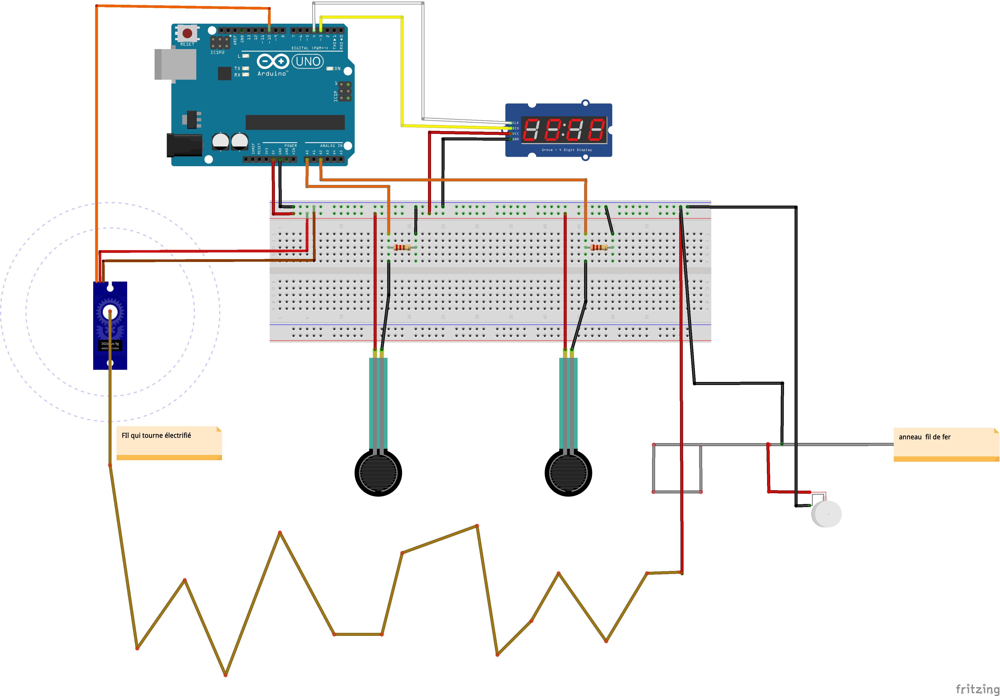

# JEU ARDUINO CONNECTIVITE 
### Alix Gora / Enzo Wattebled I3A 

 
 
## "Patouche.ino"

 
 
**Principe du jeu :** 
Patouche.ino est inspiré du jeu d'adresse électrique que l'on peut retrouver sur des stands de foire. Le but est simple : le joueur possède un manche se terminant avec un anneau; cette pièce est faite avec un matériau conducteur. A l'intérieur de cet anneau se trouve un fil en métal electrifié. Le joueur doit donc suivre un parcours définit par le fil sans le toucher, sous peine de se prendre une chataigne. Nous avons repris ce principe et lui avons ajouté quelques fonctionnalités grâce à une carte arduino et ses composants.  
Maintenant, le fil définisant le parcours est relié à un servo moteur continu faisant tourner le parcours aléatoirement. Au lieu de recevoir une décharge lorqu'il touche le fil, son manche se met à vibrer. Nous avons également rajouté un timer créant un découpe et affichant le temps de parcours final. 

**Conception :** 
Le jeu se présente sous la forme de deux tours servant de support pour le fil électrifié. Le servo moteur est positionné dans l'une d'elle et fait tourner le fil. La carte arduino et la breadboard sont positionnées en dessous du support en bois, les fils alimentent le moteur et les capteurs de pression en passant par des trous situés sous les tours. 

## Les composants
1 Arduino  
1 Breadboard  
1 Servo moteur continu  
1 Afficheur 7 segments  
2 Capteurs de pression  
Beaucoup de fils et de pinces crocodiles  

## Notice de montage 

