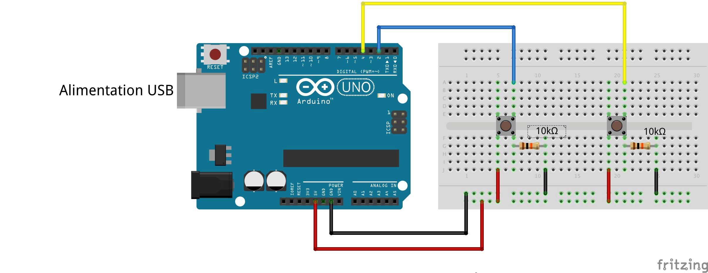
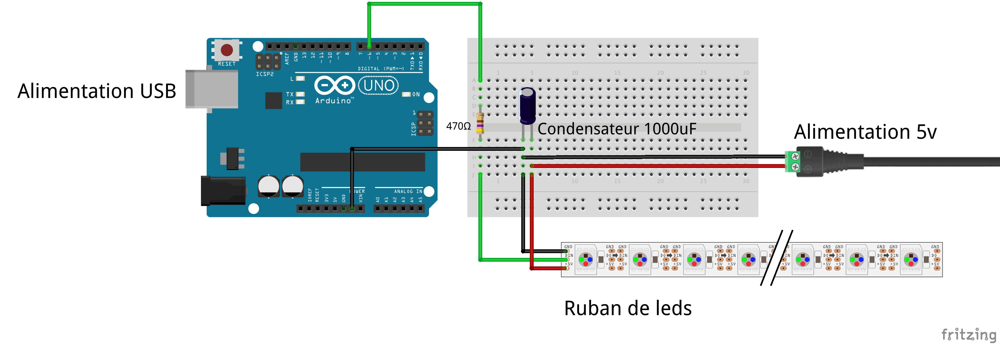
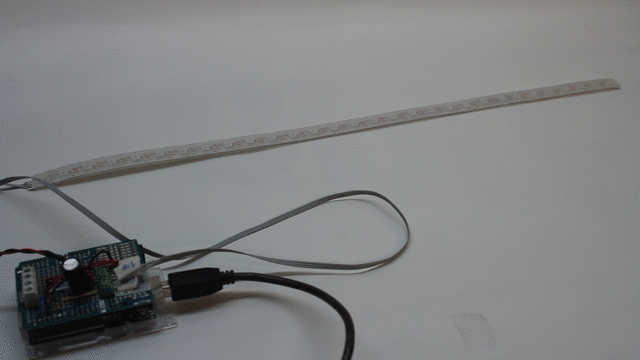
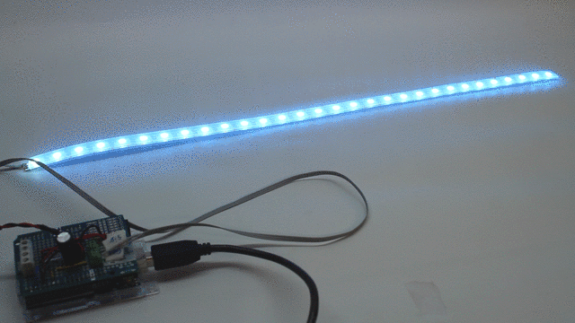
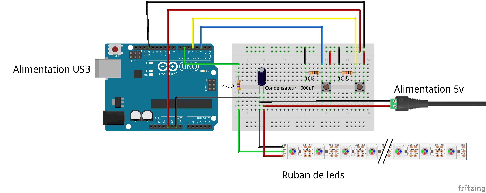
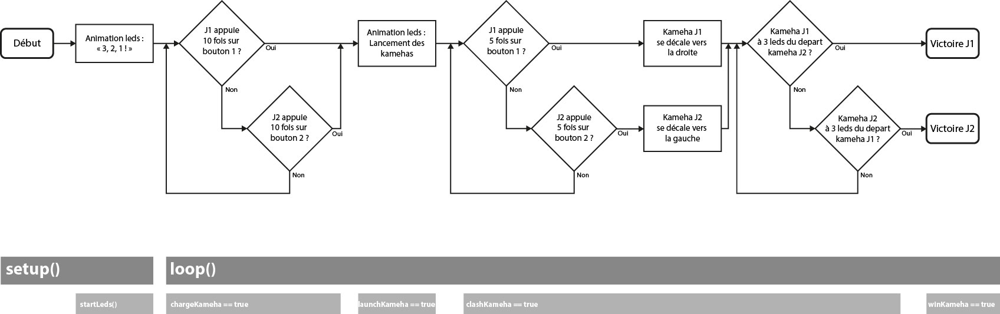

[**home**](../README.md)


# Kameha ! (かめはめ波)
#### Petit jeu électronique basé sur Arduino
###### Réalisé par les *Ateliers Numériques* de L'Ecole de Design Nantes Atlantique
----
### Le principe :
*Kameha !* est un jeu électronique inspiré d'un célèbre manga dramatique d'origine japonaise où des guerriers peroxidés en sarouel défendent la Terre d'envahisseurs béliqueux.    
Deux joueurs s'affrontent en lançant chacun un rayon d'énergie, un "kameha", symbolisé par un ruban de leds. La puissance du rayon d'énergie est basé sur le principe d'appuyer de manière répétée et frénétique sur un bouton :

  

(Voir également la vidéo **Kameha.mp4** fournie avec le code final, dans le dossier *Kameha*).   
___
### Quelques codes de test :
Pour réaliser ce projet, on va employer deux bibliothèques qui vont nous faciliter l'usage des boutons et d'un ruban de leds.  

#### La bibliothèque EasyButton
Concernant les boutons, nous allons utiliser la bibliothèque [EasyButton](https://github.com/evert-arias/EasyButton) d'Evert Arias. Elle est disponible dans le gestionnaire de bibliothèques de l'IDE d'Arduino et incorpore des exemples de base. Elle permet entre autres de gérer facilement des méthodes comme `onPressed` (appuyer une fois sur le bouton) ou bien `OnPressedFor` (appuyer de manière prolongée).   
Pour se familiariser avec, nous allons écrire notre propre code de test :
  
#### DeuxBoutons.ino
>Quand on appuie une fois sur un bouton, cela incrémente une valeur propre à chaque bouton. Les valeurs s'affichent dans le moniteur série.   

##### Le montage :
  

##### Le code :

Comme toutes bibliothèques dans Arduino, on commence par l'inclure au début du programmme, donc avant le `setup()` :   
	
```
#include <EasyButton.h>
```

Puis toujours avant le `setup()`, on déclare un objet `EasyButton` en lui donnant un nom et en précisant la pin à laquelle est connectée le bouton :  
  
```
EasyButton button1(2); // button1 est en pin 2
```

Dans le `setup()`, on initialise l'objet, puis on précise la méthode employée : 
 
```
button1(); // Initialisation
// Quand on appuie, ça appelle la fonction onPressed1() : 
button1(onPressed1);
```

Dans le `loop()`, on lit en boucle l'état de notre objet `button1 ` :
 
```
button1.read();
```

Enfin, après le `loop()`, on écrit la fonction `onPressed1()` qui sera appelée une fois lorsqu'on appuie sur le bouton :

```
void onPressed1() {
  // On incrémente le compteur pour button1 :
  n1++; // n1 est déclarée en tête du programme
}
```
**DeuxBoutons.ino** est disponible dans le dossier *Codes de test*.

#### La bibliothèque NeoPixel

Concernant le ruban de leds, nous allons utiliser un ruban *NeoPixel* proposé à la vente par Adafruit. Le produit et la bibliothèque sont abondamment documentés sur [learn.adafruit.com](https://learn.adafruit.com/adafruit-neopixel-uberguide/the-magic-of-neopixels) : on y trouve des indications de montage et des explications concernant l'usage de la biliothèque. Celle-ci est également disponible dans le gestionnaire de bibliothèques.   

##### Le montage du ruban de leds :
    

Dans l'absolu, si on choisit de piloter seulement quelques leds, la pin 5v de la carte est suffisante. A partir d'un certains nombres de leds, et/ou si on les allume toutes en même temps, la carte ne pourra pas délivrer suffisament de courant et risquerait d'endommager la carte et les leds, d'où l'emploi d'une alimentation externe. Pour plus d'info consulter la [documentation](https://learn.adafruit.com/adafruit-neopixel-uberguide/powering-neopixels) rédigée par Adafruit.   

##### Le code :  
Comme toujours, on commence par l'inclure au début du programmme, donc avant le `setup()` :   
	
```
#include <Adafruit_NeoPixel.h>
```

Puis toujours avant le `setup()`, on déclare un objet `Adafruit_NeoPixel`  nommé `strip `en précisant le nombre de leds et la pin à laquelle elle est connectée : 
  
```
Adafruit_NeoPixel strip = Adafruit_NeoPixel(30, 6, NEO_GRB + NEO_KHZ800); // Ici 30 leds en pin 6

```
Dans le `setup()` :
 
```
strip.begin(); // Initialisation du ruban
strip.setBrightness(255); // Configuration de la luminosité (entre 0 et 255)
```
Attention, il est vivement déconseillé de jouer avec `setBrightness()` pour faire varier l'intensité lumineuse de led dans le `loop()`. La luminosité est à définir une seule fois, dans le `setup()`.

Le principe pour par exemple allumer une blanc :

```
strip.setpixelColor(0, 255, 255, 255); // La 1ère led (n°0) en blanc
strip.show(); // Envoi des données dans le ruban 
```

Ou encore, pour toutes les allumer en rouge :

```
//strip.numPixels() renvoie le nb de leds dans le ruban :
for (int i = 0; i < strip.numPixels(); i++) {
	strip.setPixelColor(i, 255, 0, 0);
}
strip.show(); // Envoi des données dans le ruban 
```

Et pour toutes les éteindre :

```
strip.clear();
strip.show(); // Envoi des données dans le ruban 
```

Par défaut, on essaye d'employer le moins possible `strip.show`, généralement on le place tout à la fin du `loop()`.   

Deux programmes sont fournis dans le dossier *Codes de test*, il est basé sur le montage de base présenté plus haut :

#### LedsTest.ino
>Un décompte lumineux : "3, 2, 1 !"   
>Le code comprend un onglet avec la fonction dédiée (startLeds)   

  

#### LedsWave.ino
>Les leds s'allument les unes après les autres d'une couleur données aléatoirement.    
>On n'utilise pas de fonction de delay() mais un timer. 

  
____
### Kameha.ino :

##### Le matériel :
* 1 carte Arduino Uno
* 1 cable USB
* 1 breadbord et des câbles
* 2 boutons poussoir
* 2 résistances 10kΩ
* 1 ruban de leds NeoPixel (30 leds voir plus)
* 1 résistance 470Ω
* 1 condensateur 1000uF
* 1 alimentation 5v


##### Le montage :
  

##### Le code :

Le programme est découpée en **4 parties**, chacune accessible par une **variable `boolean`** dans une structure `if()`. Pour celà on initialise 4 variables :

```
boolean chargeKameha = true; // Chargement des kamehas
boolean launchKameha = false; // Lancement des kamehas des joueurs
boolean clashKameha = false; // Affrontement des kamehas (coeur du jeu)
boolean winKameha = false; // Animation de fin de partie
```
Le principe du programme est résumé dans ce diagramme :
  
  
  
  

**A la fin du `setup()`**, donc lu une seule fois au lancement du programme, on trouve l'animation lumineuse "3, 2, 1 !". On reprend simplement ce qui a déjà été écrit dans *LedsTest.ino* :

```
startLeds(strip.numPixels(), 1000); // 1000 => delai en ms entre le 3, 2 et 1
```

**Au tout début du `loop()`**, on lit l'état des deux boutons qui vont appeler les fonctions correspondantes (`onPressed1()`et `onPressed2()`) :

```
button1.read();
button2.read();
```

**Tout à la fin du `loop()`**, on envoie les données dans le ruban :

```
strip.show(); 
```

**A la ligne 88**, dans `if (chargeKameha == true)`, on va charger le *kameha* de chaque joueur : dès qu'un joueur appuie `sc` fois (10 fois) sur son bouton, le programme passe à l'état suivante (`chargeKameha = false;` et `launchKameha = true;` dans `onPressed1()` et `onPressed2()`).

**A la ligne 98**, dans `if (launchKameha == true)`, les deux *kamehas* vont aller vers l'autre. Leur vitesse dépend du score atteint précédement pendant l'étape de charge. Simplement le joueur le plus rapide aura un *kameha* plus rapide est arrivera plus vite sur l'autre. Quand les deux *kameha* sont touche-touche, le programme passe à l'état suivant (`launchKameha = false;` et `clashchKameha = true;` en ligne 109 et 110).  

**A la ligne 130**, dans `if (clashKameha == true)`, dès qu'un joueur appuie `sc/2` fois (5 fois) sur son bouton, son *kameha* se déplace vers le joueur adverse.   
  
**A la ligne 162**, on vérifie la condition de victoire, c'est à dire si le *kameha* d'un joueur est à moins de 4 leds d'un joueur adverse (`clashchKameha = false;` et `winKameha = true;`).

**A la ligne 168**, dans `if (winKameha == true)`, animation lumineuse qui indique quel joueur a gagné.


[**home**](../README.md)
