[**home**](../README.md)

# PUNCHERS

#### Petit jeu électronique basé sur Arduino
Réalisé par Théotim AUGER et Guillaume LE MENÉ - I3A

## Principe
Punchers est un jeu électronique et tangible multijoueur reprenant le principe des combats de robots.

Pour marquer un point, le joueur doit toucher le torse du robot adverse. Pour remporter la partie, chaque joueur doit faire 5 touches de plus que son adversaire. 

Les robots ont deux interactions électroniques possibles (successive ou simultanée). Les robots peuvent se pencher de gauche à droite pour esquiver les coups et ils peuvent donner un coup de poing. 

Les robots sont enfermés dans une arène de laquelle, ils ne peuvent s’enfuir et sont montés sur des plateformes qui permettent un mouvement en 2 dimensions sur le plateau de jeu.

## Histoire

Plusieurs choses expliquent notre motivation dans ce projet ambitieux de conception d'un jeu de combat de robot IRL avec une carte arduino. D’abord l’idée de réussir à améliorer un jeu de combat (mécanique) de notre enfance : [Karate fighters](https://www.youtube.com/watch?v=qv5N53zp2dM). Plus individuellement Guillaume est depuis un certain temps attiré par la création de robots pour les faire combattre. Théotim entretient lui une proximité avec le design produit, il était donc emballé par le défi technique et mécanique de ce projet. Pour finir, Guillaume possède une imprimante 3D et ayant tous les deux des notions de modélisation, le projet nous semblait être un beau challenge tout en restant accessible à nos compétence, moyen et moyens. 

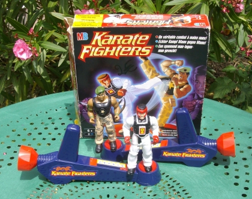

### Composants
Nous avons utilisé 6 composants électroniques et 3 composants tangibles pour créer l'interaction : 

- 2 boutons poussoirs
- 2 joysticks (double potentiomètre)
- 1 bandeau 5 leds
- 4 Servomoteurs 9 grammes -180°
- 2 Interrupteurs fin de course
- Des fils (minimum 40cm)
- 1 carte arduino uno

Composants tangibles :

- Pièces imprimés en 3D
- Panneau de bois contreplaqué 10mm
- Carton plume 10mm
- Colle à bois

## Conception

- Définition des mécanismes de jeu.
- Modélisation et impression 3D des personnages
- Conception du plateau.
- Création du code

## L’assemblage 

### LA PARTIE TANGIBLE

La partie mécanique ou tangible de "PUNCHERS" est composée de 2 parties ont été conçues séparément mais sont indissociables de par l'assemblage et le fonctionnement du jeu.

#### Les personnages

Concernant les personnages, nous souhaitions nous rapprocher des mouvements des boxers et nous éloigner des mouvements anarchiques et aléatoires des personnages du jeu Karate Fighters. L’idée étant de centrer le gameplay du jeu autour des réflexes et d’une stratégie de combat propre au joueur. Chaque joueur a donc, grâce à sa manette un contrôle précis sur l’inclinaison droite-gauche de son personnage pour esquiver les coups de son adversaire et frapper avec son bras robot selon des angles surprenants ce dernier. 
Limité par le nombre de composants maximums pour réaliser ce projet, nous avons fait le choix de ne doter chaque robot que d’un seul bras, et d’utiliser des interactions mécaniques pour ses déplacements dans le ring.

##### Les pièces
- le bas : Impression 3D (16x46x20mm)
- le torse : Impression 3D (37 x 90 x 35mm)
- le bras (humérus) : Impression 3D (70 x 20 x 10 mm)
- l'avant-bras  : Impression 3D (6 x 7 x 10mm)
- la liaison : Impression 3D ( 15 x  10 x 3 mm)

Le bloc jambes: cette pièce fixée dans le bois contient 1 servomoteur qui soutient la partie “torse” du robot et permet à celui-ci de s’incliner de droite à gauche.

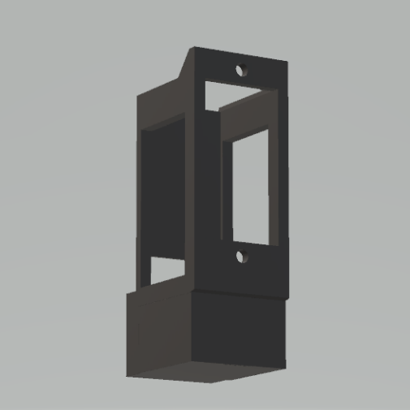

Le bloc torse: Assemblée sur la pièce jambes et animée par le servomoteur de cette dernière, la pièce torse contient un servomoteur qui servira de support et animera le bras du robot. 

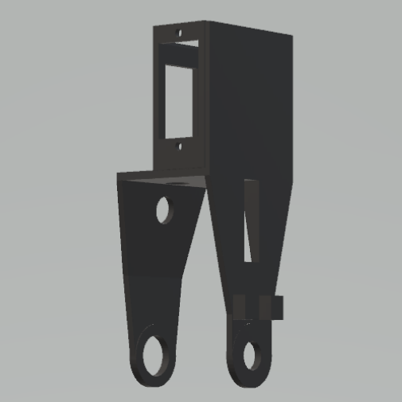

Le bloc bras: Composé de 3 pièces distinctes, cet assemblage fixé sur le servomoteur du torse permet au robot de donner des coups vers l’avant.
Un creux au niveau de la pièce épaule permettra de coller facilement cette partie du bras au support du servo-moteur.
Cette pièce est alors reliée à l’avant bras par une liaison pivot qu’il est nécessaire de verrouiller à l’aide d’un rivet, réalisé en faisant fondre l'excédent de plastique au niveau de ce pivot.
La plus petite pièce sera alors collée sur le servomoteur en faisant en sorte que le trou s’y trouvant soit à 1cm à gauche et 1cm plus bas que l’axe de rotation du moteur.

Inspiré des crayons “boxers”, le mécanisme du bras nécessite une tige rigide en forme “d'agrafe” d’une longueur de 5cm faisant levier et permettant de tendre et de plier le bras à l’aide d’un forme de parallélépipède. 

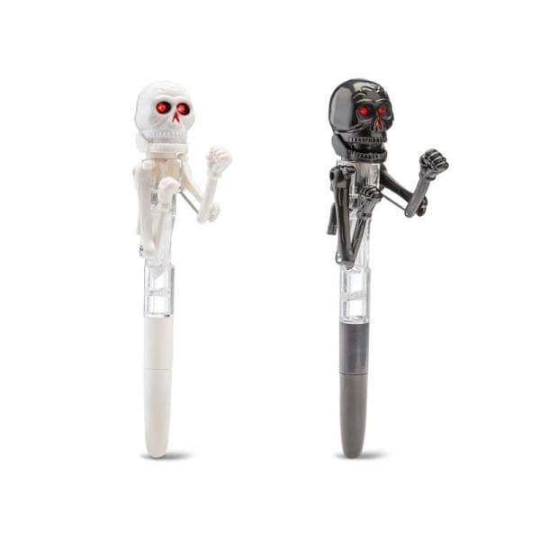
---
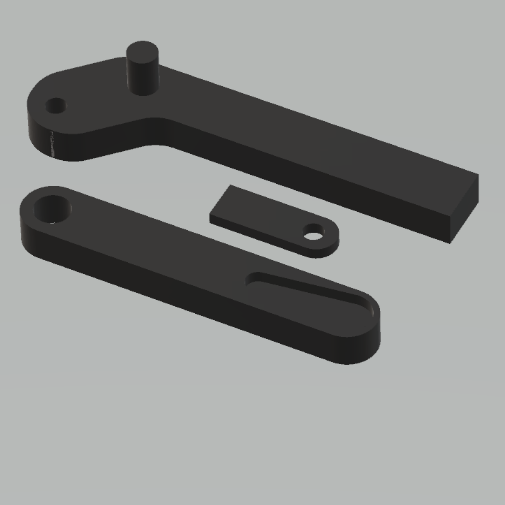
---
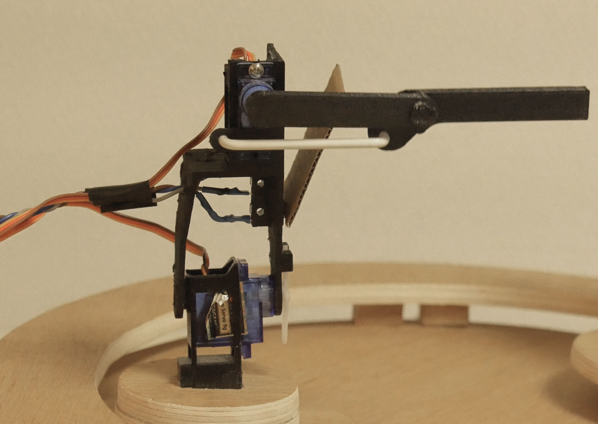

#### La plateforme

L'aire de jeu est entièrement conçue en contreplaqué et composée de 4 éléments majeurs. 

##### Les pièces
- le socle : contreplaqué 10mm, octogone (côtés : 150mm)
- la boite : contreplaqué 10mm, rectangle (180 x 50mm)x2 et (200 x 50mm)x2
- le plateau : contreplaqué 10mm, disque (rayon : 160mm)
- l'anneau : contreplaqué 10mm, disque (rayon extérieur : 175 mm ; rayon intérieur : 150mm)
- les cales : contreplaqué 10mm, rectangle (20 x 12mm)

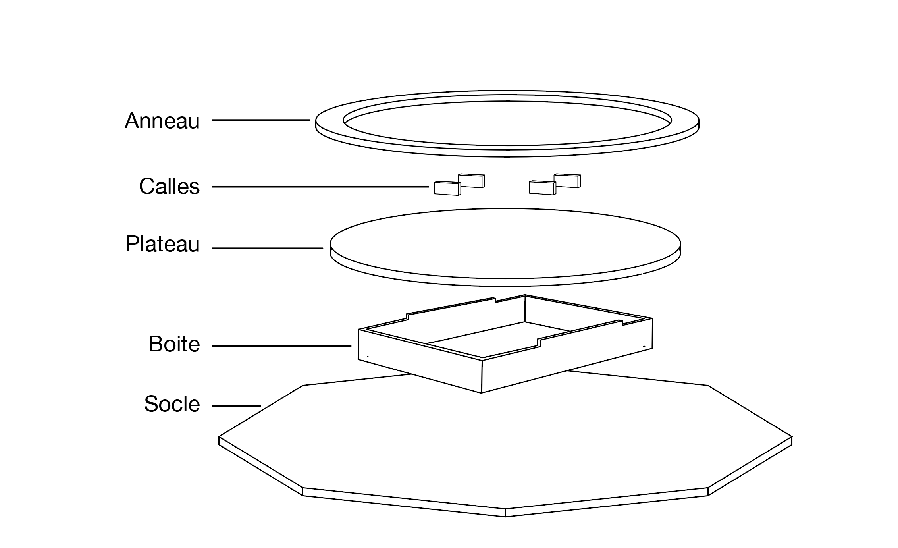

D'abord le socle de forme octogonal permet de maintenir un équilibre à la plateforme durant une partie. 

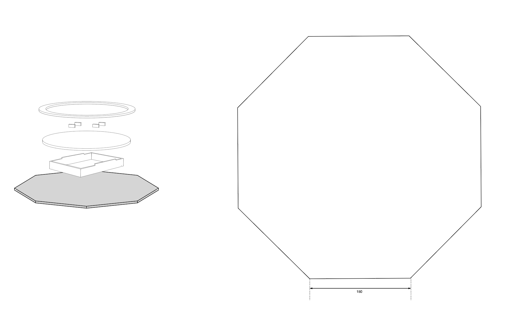

Le plateau est surélevée pour pouvoir ranger les fils, la carte arduino et la breadboard. Les côtés de la boîte sont dotés d'une grande encoche pour permettre une libre circulation des fils de la manette durant les mouvements. 

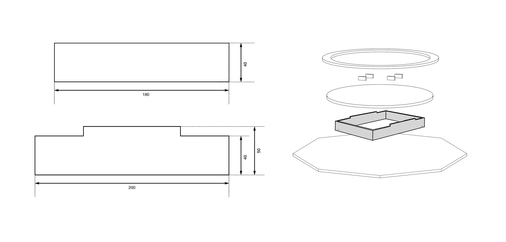

Le plateau sur lequel posent et de déplacent les personnages est de forme circulaire. 

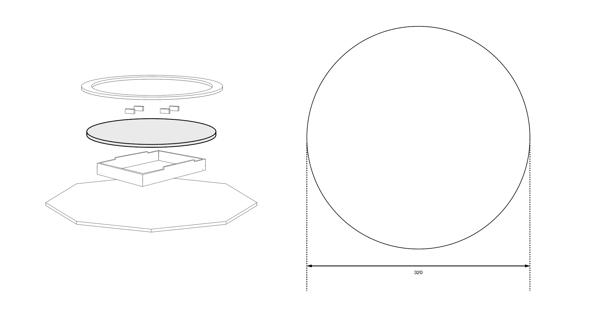

Enfin l'anneau supérieur est un cercle évidé d'un cercle. Il permet d'enfermer les robots physiquement (et visuellement). Il est surélevé par rapport au plateau inférieur, pour permettre une fluidité dans le mouvement de la manette, grâce à 4 pièces de bois disposées face à face dans la zone médiane.

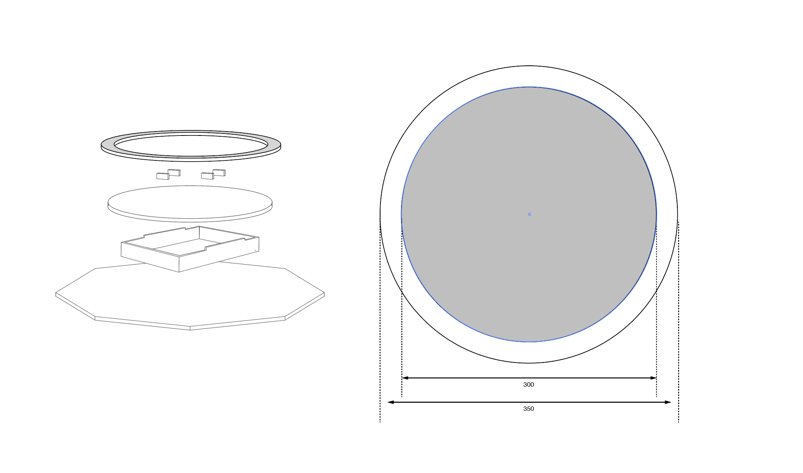

Le choix d'un plateau circulaire fut motivé par la volonté de permettre un déplacement homogène aux joueurs sur l'aire de jeu. De plus l'univers que les anneaux évidés dégagent est un univers minimaliste et futuriste qui nous correspond et correspond à l'univers du projet.

#### La manette

La manette est elle aussi presque entièrement faite de bois. Elle est composée de 5 pièces de bois différentes.

##### Les pièces
- la base : contreplaqué 10mm (voir schéma)
- le disque socle : contreplaqué 10mm, disque (rayon : mm)
- le disque guide : contreplaqué 10mm, disque (rayon : mm)
- la calle : contreplaqué 10mm, rectangle (20 x 10mm)
- la pièce centrale de la manette : contreplaqué 10mm, (voir le schéma)
- les pièces extérieur de la manette : carton plume 10mm x2 (voir le schéma)

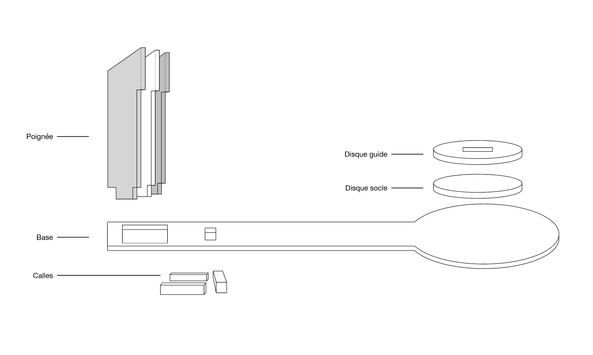

La base est un planche de bois qui permet de faire le lien entre la poignée et le personnages. Elle glisse sur le plateau de la plateforme. Elle est affublée d'un disque de 100mm de diamètre à une extrémité, ce qui permet de créer une distance de sécurité et d'allonge suffisante entre les personnages durant le combat.

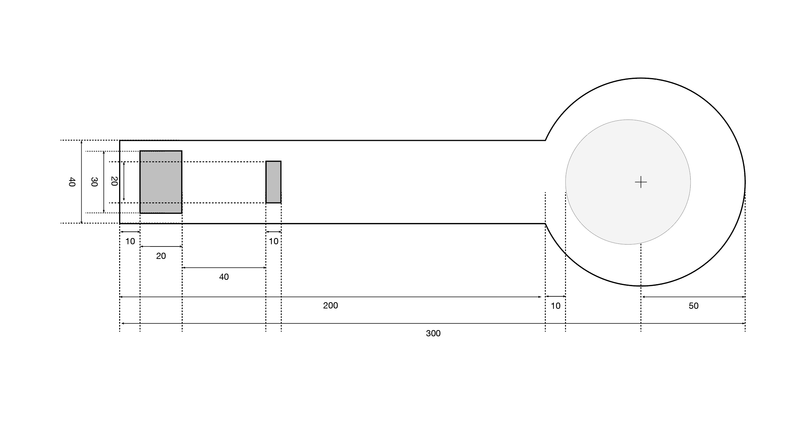

Sur ce disque est fixé le socle des personnages, c'est à dire le disque plein, et le disque guide qui est totalement traversé par la pièce “bas” du personnage.

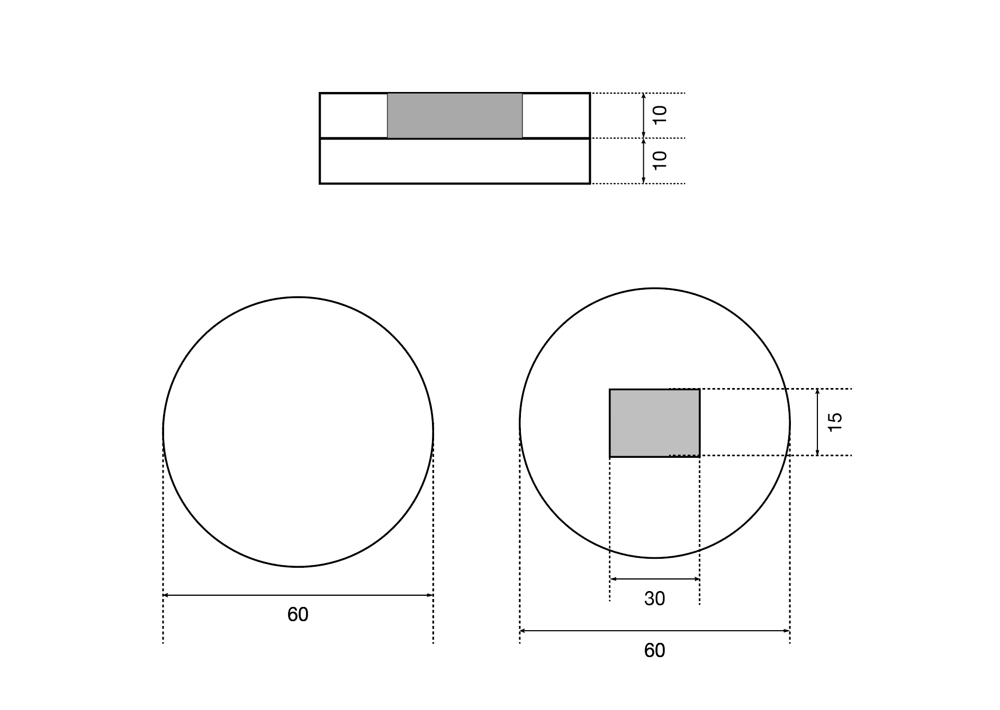

La calle est fixée sous la base, sert à  stopper “la course vers l'avant” du personnage. Cela permet d’une part, d’éviter des pincements de la main du joueur entre la poignée et la plateforme et d’autre part, la création de stratégies défensives aux joueurs.

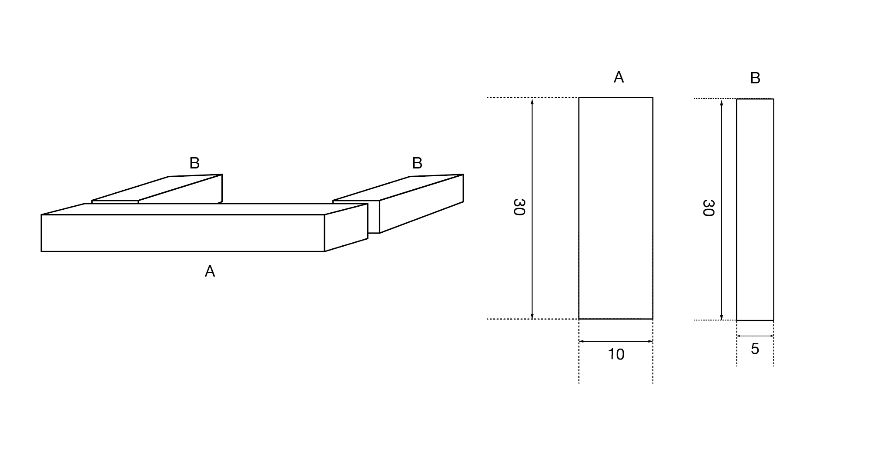

Enfin la poignée est composée, en sandwich, d'une tranche de carton plume, une tranche de bois et une autre couche de carton plume. Sur la poignée nous trouvons les deux composants servant à l'interaction. 

Le bouton poussoir est placé à l'arrière de la poignée, prévu pour tomber sous l'index, il permet de déclencher un coup. 

Le joystick à double potentiomètre est placé sur le dessus de la poignée, prévu pour tomber sous le pouce, il permet le mouvement d’esquive. 

L'ergonomie de la poignée reprend la forme de manche à balai d'avion ou de pistolet. 

Tout le travail du bois, pour la plateforme et la manette est faite à la main, avec la scie à ruban, la scie à champ-tourné, la perceuse à colonne, la dremelle et du papier à poncer. Nous n'avons jamais été assisté par découpe laser.

### Montage électronique

## Les interactions

Après s'être longtemps questionné sur les interactions à proposer aux l'utilisateurs, nous nous sommes arrêté sur 3 interactions, en reprenant les 3 techniques de base de la boxe : le déplacement, l'esquive et bien sur le coups de poing. 

Le déplacement est une interaction tangible, les deux autres sont électroniques via les servomoteurs en utilisant le bouton (coups) et le joystick (esquive) de la manette.

#### Déplacements

#### Esquives

#### Coups

[**home**](../README.MD)