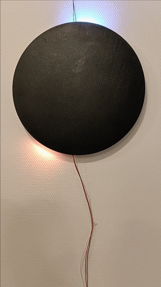

# projet_jeu_electronique_1819
Code and documentation for the electronic game project by interaction students @l'école_de_design_Nantes

# Punchers par Théotim Auger et Guillaume Le Méné

Punchers est un jeu électronique et tangible multijoueur reprenant le principe des combats de robots.

Pour marquer un point, le joueur doit toucher le torse du robot adverse. Pour remporter la partie, chaque joueur doit faire 5 touches de plus que son adversaire. 

Les robots ont deux interactions électroniques possibles (successive ou simultanée). Les robots peuvent se pencher de gauche à droite pour esquiver les coups et ils peuvent donner un coup de poing. 

Les robots sont enfermés dans une arène de laquelle, ils ne peuvent s’enfuir et sont montés sur des plateformes qui permettent un mouvement en 2 dimensions sur le plateau de jeu.

La documentation est disponible [ici](https://github.com/AtelierNum/projet_jeu_electronique_1819/tree/master/Punchers)

# Duel par Lengliang Li et Morgane Thomas

**Duel** est un jeu opposant deux joueurs, ou plutôt deux cowboys. Ils se regardent de loin en plissant les yeux. Une musique du far west se joue.
Nyanyanyan Nayn Nyan Nyan …
Dès que la musique s’arrête, les cowboys dégainent leur arme et tirent le plus vite possible. Le plus rapide gagne la manche, au bout de trois manches gagnée, c’est la victoire.

La documentation est disponible [ici](https://github.com/AtelierNum/projet_jeu_electronique_1819/tree/master/Duel)

# BLOW par Martin Lamire et François Arnaud* 

2 joueurs, l’un en face de l’autre. Le but est de se renvoyer un projectile grâce au souffle, le projectile étant figuré par une LED sur un bandeau. À chaque échange le projectile prend de la vitesse. Si le projectile touche la dernière LED (« la base ») de l'un des deux joueurs celui-ci a perdu la manche. Le joueur qui gagne la manche emporte autant de points qu’il y a eu d’échanges ; s'il y a eu 20 échanges à cette manche le joueur emporte 20 points. Le premier joueur à X points emporte la partie. Pour renvoyer le projectile des joueurs doivent souffler dans un réceptacle. Il y a une marge de 9 LEDs pour renvoyer le projectile. Au-delà de cette zone, soufflé n’aura aucun effet, si le projectile touche la dernière LED le joueur à perdu la manche. 

La documentation est disponible [ici](https://github.com/AtelierNum/projet_jeu_electronique_1819/tree/master/Blow)

# ARKAD'BASKET par Bastien Adam et Théo Monnin

Arkad'Basket est un jeu inspiré des bornes de basket-ball aussi appelées hoops que l'on peut trouver dans les salles d'arcade et qui sont notamment très populaire aux USA. Nous avons choisi un gameplay impliquant une action physique et non virtuelle de la part du joueur afin d'offrir un gameplay compréhensible et de pouvoir se concentrer sur l'expérience de jeu en elle-même.

La documentation est disponible [ici](https://github.com/AtelierNum/projet_jeu_electronique_1819/tree/master/ArkadBasket)

# Eclipse parChristophe Le Conte et Simon Renault

The game eclipse is a game develloped during the arduino class at L'école de design de Nantes Atlantique.  It features a verry simple but extensible gameplay.  You will find below instruction to reproduce this experiments as well as the research process wich lead to the creation of this game.

La documentation est disponible [ici](https://github.com/AtelierNum/projet_jeu_electronique_1819/tree/master/Eclipse)

# Rabbit Hunt par Armand Lemaitre et Aurélie Caré 

Vous allez chasser, et vous apercevez des lapins dans votre foin! Tuez les  avec votre pistolet avant qu'ils s'en aillent !
Vous avez trois vies, vous perdez une vie quand un lapin s'échappe...

La documentation est disponible [ici](https://github.com/AtelierNum/projet_jeu_electronique_1819/tree/master/RabbitHunt)

# ColorFight par Samuel Lefevbre, Baptiste Deroche et Anna Rabeony 

Color Fight est un jeu électronique qui se joue à deux. Chacun des joueurs dispose d'un bouton et d'un afficheur pour visualiser son score. Le but du jeu est d'appuyer le plus de fois possible sur son bouton pour faire augmenter son score. Les joueurs gagne ainsi 1pt par clic tant que la matrice de leds affiche bleu. Cependant, lorsque celle-ci passe au rouge, les joueurs perdent 10pts s'ils appuyent sur leur bouton pendant ce moment-là. Le gagnant est le premier à atteindre 50pts.

La documentation est disponible [ici](https://github.com/AtelierNum/projet_jeu_electronique_1819/tree/master/ColorFight)

# ASTRO par Maxime Thureau et Noé Martineau

ASTRO est un jeu électronique principalement inspiré des jeux Flappy bird ou le gameplay repose sur l'agilité du joueur, qui doit faire avancer un oiseau dans un environnement à défilement horizontal en tapotant sur l'écran tactile, tout en évitant des tuyaux présents en haut et en bas de l'écran. Le but est donc d’éviter les tuyaux et d’aller le plus loin possible. L’autre inspiration qui nous a également servi est un jeu plus ancien qui se prénomme Space Invaders ou le principe du jeu est de détruire des vagues d'Aliens au moyen d'un canon laser en se déplaçant horizontalement sur l’écran qui descende petit à petit.  Il y a également le jeu Frogger qui a pour but de diriger des grenouilles jusqu'à leurs maisons. Pour cela, le joueur doit d'abord traverser une route en évitant des voitures qui roulent à différentes vitesses puis une rivière aux courants changeants en passant d'objets en objets. La grenouille meurt si elle touche une voiture ou si elle tombe dans la rivière.

Votre planète est sur le point d'exploser. Vous devez vous enfuir à bord de votre vaisseau spacial mais un gros obstacle vous fait face... En effet la ceinture d'astéroïdes ne vous laissera pas passer si facilement. Visiteur de l'espace je vous souhaite bonne chance. Over.

Ici le joueur doit déplacer son vaisseau horizontalement grâce à deux boutons (droite et gauche) et doit éviter des murs d’astéroïdes en passant par le ou les trous disponibles. Le but est donc de bien réfléchir à son déplacement qui sera de plus en plus dynamique pour passer dans l’entrée des murs. Il faudra faire preuve d’agilité et de bon raisonnement. Le vaisseau a 2 barrières de bouclier s'il est touché une troisième fois par un astéroïde, il explose, ce qui arrivera inéluctablement.

La documentation est disponible [ici](https://github.com/AtelierNum/projet_jeu_electronique_1819/tree/master/Astro)

# BattleStar Galacticat par Paul Poirier et Seohee Park

BattleStar Gallacticat est un jeu de flipper inspiré d'un fameux pinball game Full Tilt!. Mais Ici, l'expérience est augmentée, BattleStar Galacticat vous permet de jouer au Pinball en 1V1 !

Un joueur lance une bille oeil de chat pour démarrer la partie. L'objectif est de mettre l'oeil de chat dans le but adverse, en utilisant les pattes en bois et de le faire plus souvent que l'autre joueur. Le bouton pour manipuler le Servo moteur camouflé en mode souris est à votre disposition ! Utilisez-le à votre avantage pour détourner la trajectoire de la balle. A vous de jouer !

La documentation est disponible [ici](https://github.com/AtelierNum/projet_jeu_electronique_1819/tree/master/BattleStarGalacticat)

# MysterMaths par **Quentin Hamon** et **Auriane Pouzin**.

*MysterMaths* est un jeu qui s'inspire de notre enfance. Nous nous souvenons tous de nous en tant que Shelock Holmes à résoudre les calculs mathématiques et à apprendre difficilement les tables de multiplications. Ainsi nous nous sommes posé la question de comment apprendre et être rapide au calcul mental de manière ludique ?

Le but du jeu est de répondre à une formule mathématique et répondre le plus vite possible. Avant de jouer, les deux joueurs doivent placer une main sur une plaque. L'écran LCD affiche de niveau: le premier ce sont des additions, le deuxième des multiplications. Pour jouer, les joueurs doivent répondre à la question en cliquant sur la bonne réponse. Si le joueur a juste, il gagne 1 point émit par la lumière verte et par l'afficheur si non il se fait piquer par la "massu" indiqué par la lumière rouge. Il ne gagne aucun point. Cependant si aucun des joueurs ne répondent à la question au bout de 20 secondes, ils se font piquer tous les deux. Les adversaires ont 5 manches pour se défier.

La documentation est disponible [ici](https://github.com/AtelierNum/projet_jeu_electronique_1819/tree/master/MysterMath)

# CIRCLE SPEED par Camille Campo & Raphaëlle Gorenbouh

Le principe de notre jeu se base sur la rapidité, et la reconnaissance de motifs et de formes. Le but étant d'être plus rapide que ses adversaires. Le jeu peut se jouer jusqu'à 3 joueurs. Jouer seul avec les 3 cercles est possible, randant ainsi le challenge plus complexe.

Chaque joueur a un anneau de led. Un anneau supplémentaire est disposé de sorte à servir de référence. 

* Les leds des anneaux s'allument pour former différents motifs colorés.
* Dès qu'un joueur a le même motif de la même couleur que celui de l'anneau de référence, il doit appuyer sur un bouton pour venir marquer un point. 
* Si celui-ci s'est trompé, il perd un point (-1). 
* Si la personne a juste, elle marque un point (+1). 
* L'objectif du jeu étant d'obtenir plus de points que ses adversaires.

La documentation est disponible [ici](https://github.com/AtelierNum/projet_jeu_electronique_1819/tree/master/Circle_Speed)

# Patouche par Alix Gora et Enzo Wattebled  

Patouche.ino est inspiré du jeu d'adresse électrique que l'on peut retrouver sur des stands de foire. Le but est simple : le joueur possède un manche se terminant avec un anneau; cette pièce est faite avec un matériau conducteur. A l'intérieur de cet anneau se trouve un fil en métal electrifié. Le joueur doit donc suivre un parcours définit par le fil sans le toucher, sous peine de se prendre une chataigne. Nous avons repris ce principe et lui avons ajouté quelques fonctionnalités grâce à une carte arduino et ses composants. 

Maintenant, le fil définisant le parcours est relié à un servo moteur continu faisant tourner le parcours aléatoirement. Au lieu de recevoir une décharge lorqu'il touche le fil, son manche se met à vibrer. Nous avons également rajouté un timer créant un découpe et affichant le temps de parcours final. 

La documentation est disponible [ici](https://github.com/AtelierNum/projet_jeu_electronique_1819/tree/master/Patouche)

## Dance Fingers par Alia Elkayar - Sophie Le Gallo - Virginie Souffoy

 

Jeux de danse pour doigts, à chaque fois qu'une ou plusieurs led(s) s'allume(nt) le joueur doit cliquer au centre de la led afin de rester ne vie le plus longtemps possible.

Au départ ce dernier possède 5 vies. S'il ne touche pas au bon moment il perd une vie et s'il touche au bon moment il en gagne une.

La documentation est disponible [ici](https://github.com/AtelierNum/projet_jeu_electronique_1819/tree/master/JustDanceFinger)

# MELODIE.INO par Antoine Cesbron, Mathis Freudenberger et Victor Ducrot

 

Le joueur a devant lui une boîte avec un écran, 3 boutons et une mini enceinte. À chaque tour un titre de musique apparaît sur l'écran, il écoute 2 mélodies : la mélodie A et la mélodie B, puis il doit choisir laquelle correspond à la chanson affichée en appuyant sur le bouton correspondant.  

La documentation est disponible [ici](https://github.com/AtelierNum/projet_jeu_electronique_1819/tree/master/Melodie.ino)

# Bipper par Lúna Azibeiro et Giulia Savelli 

Un boitier avec trois lumières, chacunes reliées à un bouton. Les lumières s'allument aléatoirement chacune leur tour. Dès qu'une lumière s'allume, il faut appuyer le plus rapidement possible sur le bouton correspondant pour éteindre la led en question. Pour gagner la partie, le but est de parvenir à éteindre plus de 25 fois les lumières en moins de 5 secondes. Si on gagne la partie, toutes les leds s'éteignent. Mais si on se trompe de bouton, on perd la partie et toutes les leds s'allument, le jeu s'arrête. Le résultat s'affiche sur l'ordinateur. Pour recommencer une partie, il suffit d'appuyer sur le bouton reset.

La documentation est disponible [ici](https://github.com/AtelierNum/projet_jeu_electronique_1819/tree/master/Bipper)

# ColorBuzz par Andrews Kimbembe, Salomé Gloanec, Justine Viot*

Nous voulions que notre jeu soit à composé de **LED et de buzzer** ainsi vous avons commencé une veille sur les jeux comportant ce type de matériel. 
Nous nous sommes rappelé du jeu “Super Simon”, emblématique de nos enfances et nous avons décidé de nous en inspirer. A l’inverse du jeu classique, le ColorBuzz (nom de notre jeu) se joue à trois, chaque joueur à un Buzzer et une LED qui lui est attribuée. 
ColorBuzz est un jeu en bois, de forme triangulaire composé de trois LEDs (bleu, rouge, vert) et de trois buzzers, nous avons également installé un moteur afin que le jeu puisse tourner. 
Nous avons ainsi placé le moteur de sorte qu’il puisse faire tourner la partie supérieur de la structure. Ce dispositif devait permettre que le jeu tourne à 180°, ainsi les joueurs n’auraient pas que leur LED à mémoriser mais également les LED des autres. Pour autant, lors du montage de la boîte de jeu le moteur ne faisait pas tourner celle-ci du fait que les hélices n’aient pas assez de prise sur le bois.

Répéter la séquence des Led lumineuse à l’aide des boutons aux couleurs correspondantes, en **équipe de 3**. Chaque personne a le contrôle d’un bouton. Une Led s’allume, appuyez sur le bouton Cette même Led s’allume suivi d’une autre, appuyez sur les boutons correspondants dans le même ordre Vous perdez lorsque vous vous trompez Pour plus de difficulté, le plateau de jeu du Colorbuzz **tourne en permanence**. Les joueurs, ne bougent pas de places mais devront pour autant continuer à ne contrôler qu’un seul bouton. C’est là que l’**esprit d’équipe** entre en jeu et devient même indispensable pour gagner !

La documentation est disponible [ici](https://github.com/AtelierNum/projet_jeu_electronique_1819/tree/master/ColorBuzz)

# Le jeu de l'espace par Lucie Marécaille et Manon Leverrier

*Le jeu de l'espace* est un jeu musical, avec un seul joueur qui doit répéter le rythme joué par la machine. Si le rythme est le bon, la difficulté augmente.

La documentation est disponible [ici](https://github.com/AtelierNum/projet_jeu_electronique_1819/tree/master/LeJeuDeLespace)

# Projet référence par [Clément Gault](http://www.koikoi.design/)

Kameha ! est un jeu électronique inspiré d'un célèbre manga dramatique d'origine japonaise où des guerriers peroxidés en sarouel défendent la Terre d'envahisseurs béliqueux.
Deux joueurs s'affrontent en lançant chacun un rayon d'énergie, un "kameha", symbolisé par un ruban de leds. La puissance du rayon d'énergie est basé sur le principe d'appuyer de manière répétée et frénétique sur un bouton :

La documentation est disponible [ici](https://github.com/AtelierNum/projet_jeu_electronique_1819/tree/master/Projet_exemple)
