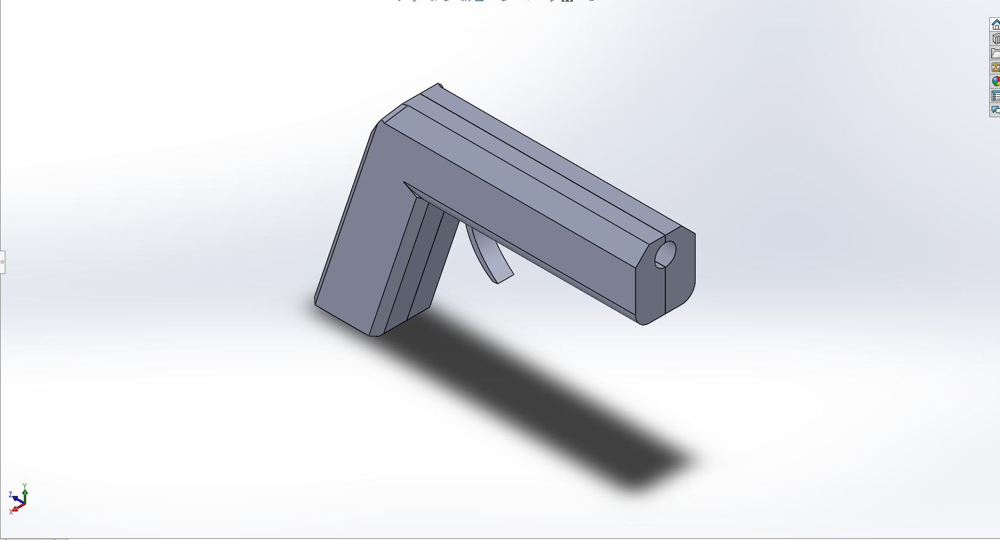

[**home**](../README.md)

# Rabbit Hunt
*créé et imaginé par Armand Lemaitre & Aurélie Caré I3A*

## Principe du jeu et son histoire:

Vous allez chasser, et vous apercevez des lapins dans votre foin! Tuez les  avec votre pistolet avant qu'ils s'en aillent !
Vous avez trois vies, vous perdez une vie quand un lapin s'échappe...

**Pour commencer le jeu:**

Attendez que les lapins montent, et tirez sur le lapin de gauche pour commencer la partie.
Attendez 3 secondes, et le jeu commence !

## Notice de montage:
**Les matériaux**

Pour ce jeu on a besoin:
- 1 carte Arduino
- 1 plaquette Arduino
- 3 servomoteurs
- 3 photorésistances
- 3 résistances de 10K
- 1 digit
- 1 laser
- 3 adaptateurs imprimés pour les servomoteurs (afin de devenir des servomoteurs linéaires)
- 3 têtes de lapin imprimés

**Montage**

**0)** Pour le pistolet: Mettre le laser au bout du pistolet et brancher le + directement à la plaquette Arduino. Le - est branché sur une surface près de la gachette.

**1)** Monter les servomoteurs avec leurs supports. Coller les photorésistances au dessus des supports imprimés.

**2)** Mettre la tête des lapins sur le support imprimé afin que la photorésistance soit dans le "noir" afin de capter quand le lapin est touché.

**3)** Coller les lapins sur la boîte. Souder et brancher les photorésistance à la paquette Arduino. Chaque lapin ont été branché à une digital pin, au 5V et à la masse.

**4)** Brancher le pistolet, avec digital pin et à la masse.

**5)** Brancher le digit à la plaquette, et le mettre sur le bord de la boîte.

 

 **6)** Brancher tout, et mettre un plastique afin de proteger le branchement.

  

  **7)** Mettre la paille pour décorer !

   

   [**home**](../README.md)

